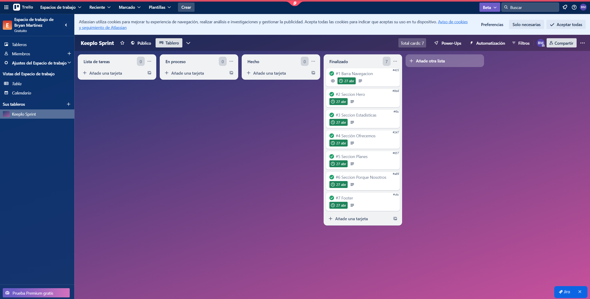

<h1 align="center">
  <strong style="font-size:25px;">Informe de Trabajo Final</strong>
</h1>

---

<p align="center"><strong>Universidad Peruana de Ciencias Aplicadas</strong></p>

<p align="center">
  
</p>

<p align="center">Ingenieria de Software</p>
<p align="center">5to ciclo</p>

---

<p align="center"><strong>Código: </strong>1ASI0729</p>
<p align="center"><strong>Curso:</strong> Desarrollo de Aplicaciones Open Source</p>
<p align="center"><strong>Sección:</strong> 4289</p>

<p align="center"><strong>Docente:</strong> Efraín Ricardo Bautista Ubillús</p>

<p align="center"><strong>StartUp: </strong>KeepTeam</p>
<p align="center"><strong>Proyecto:</strong> Keeplio</p>


## Integrantes:
<div align="center">

| Nombres y Apellidos                  | Código      |
| ----------------------------------- | ----------- |
| George Arturo Aliaga Pimentel       |U20211c273|
| Bryan Felix Martinez Ramos          |U202316246 |
| Maria Elena Muñoz Machuca           |U202317442|
| Luis Miguel Rojas Piñero            |U202220864 |
| Sanchez Gonzales                    | U202310609  |

</div>


<p align="center">Abril 2025</p>

# Contenido

[Capítulo I: Introducción](#capítulo-i-introducción)
- [1.1. Startup Profile](#11-startup-profile)
  - [1.1.1. Descripción de la Startup](#111-descripción-de-la-startup)
  - [1.1.2. Perfiles de integrantes del equipo](#112-perfiles-de-integrantes-del-equipo)
- [1.2. Solution Profile](#12-solution-profile)
  - [1.2.1. Antecedentes y problemática](#121-antecedentes-y-problemática)
  - [1.2.2. Lean UX Process](#122-lean-ux-process)
    - [1.2.2.1. Lean UX Problem Statements](#1221-lean-ux-problem-statements)
    - [1.2.2.2. Lean UX Assumptions](#1222-lean-ux-assumptions)
    - [1.2.2.3. Lean UX Hypothesis Statements](#1223-lean-ux-hypothesis-statements)
    - [1.2.2.4. Lean UX Canvas](#1224-lean-ux-canvas)
- [1.3. Segmentos objetivo](#13-segmentos-objetivo)

[Capítulo V: Product Implementation, Validation & Deployment](#capítulo-v-product-implementation-validation--deployment)
- [5.1. Software Configuration Management](#51-software-configuration-management)
  - [5.1.1. Software Development Environment Configuration](#511-software-development-environment-configuration)
  - [5.1.2. Source Code Management](#512-source-code-management)
  - [5.1.3. Source Code Style Guide & Conventions](#513-source-code-style-guide--conventions)
  - [5.1.4. Software Deployment Configuration](#514-software-deployment-configuration)
- [5.2. Landing Page, Services & Applications Implementation](#52-landing-page-services--applications-implementation)
  - [5.2.1. Sprint 1](#521-sprint-1)
    - [5.2.1.1. Sprint Planning 1](#5211-sprint-planning-1)
    - [5.2.1.2. Aspect Leaders and Collaborators](#5212-aspect-leaders-and-collaborators)
    - [5.2.1.3. Sprint Backlog 1](#5213-sprint-backlog-1)
    - [5.2.1.4. Development Evidence for Sprint Review](#5214-development-evidence-for-sprint-review)
    - [5.2.1.5. Execution Evidence for Sprint Review](#5215-execution-evidence-for-sprint-review)
    - [5.2.1.6. Services Documentation Evidence for Sprint Review](#5216-services-documentation-evidence-for-sprint-review)
    - [5.2.1.7. Software Deployment Evidence for Sprint Review](#5217-software-deployment-evidence-for-sprint-review)
    - [5.2.1.8. Team Collaboration Insights during Sprint](#5218-team-collaboration-insights-during-sprint)

# Capítulo I: Introducción   
## 1.1. Startup Profile
### 1.1.1. Descripción de la Startup
Somos Keeplo, un equipo de estudiantes de la universidad peruana de ciencias aplicadas, enfocado en desarrollar soluciones digitales que simplifiquen la organización de ideas, referencias y descubrimientos personales. Inspirados por la combinación de “keep” y “portfolio”, buscamos ofrecer a los usuarios una experiencia intuitiva y versátil para gestionar sus intereses cotidianos.
Nuestra misión es brindar una herramienta práctica y visualmente atractiva que permita a cualquier persona guardar, organizar y compartir elementos de interés, como productos, ideas y más, en colecciones personalizadas y fácilmente accesibles.
Nuestra visión es posicionarnos como la aplicación líder en organización personal en Latinoamérica, facilitando a nuestros usuarios la creación de catálogos digitales que se adapten a sus estilos de vida, proyectos creativos o rutinas profesionales.
Nuestro producto principal es Keeplo, una aplicación que permite a los usuarios guardar cualquier elemento que deseen en colecciones personalizadas. Cada ítem puede contener un nombre, una descripción, una imagen, un enlace web y puede ser compartido mediante un código QR y enlace. Esta funcionalidad permite no solo la organización personal, sino también la difusión rápida y efectiva de ideas, listas o recomendaciones entre amigos, colegas o comunidades.
Keeplo no solo ayuda a las personas a tener un espacio centralizado para sus intereses, sino que también promueve la creatividad, la planificación y el intercambio de contenido valioso. Es ideal para estudiantes, profesionales, creadores de contenido o cualquier persona que busque capturar y dar seguimiento a lo que les inspira o necesitan recordar.


### 1.1.2. Perfiles de integrantes del equipo
#### 1.1.2.1 Sanchez Gonzales
Soy estudiante en la Universidad Peruana de Ciencias Aplicadas (UPC) cursando el 5to ciclo de la carrera de Ingeniería de Software. Soy una persona comprometida con mi desarrollo académico y profesional. Con esa responsabilidad, aspiro a proveer soluciones tecnológicas a aquellos que las requieran para facilitar su área de trabajo. Junto con mi equipo de trabajo tendré la oportunidad de poner mis conocimientos y habilidades en uso con el proyecto “Keeplo” con el fin de disminuir la problemática identificada.


#### 1.1.2.2 Aliaga Pimentel George Arturo
Soy estudiante en la Universidad Peruana de Ciencias Aplicadas y soy de la carrera de Ingeniería de Software. Me considero una persona cooperativa y responsable, lo cual es requerido para un proyecto grupal. Junto a mis compañeros de grupo espero desarrollar un buen proyecto con las tecnologías que se aprenderán dentro del curso

#### 1.1.2.3 Martinez Ramos Bryan Felix
Soy estudiante de la la Universidad Peruana de Ciencias aplicadas, UPC, de la carrera de ingeniería de Software, actualmente estoy en el quinto ciclo de carrera, soy una persona muy proactiva, además de colaborativa, soy responsable con los trabajos y tiempos de entrega durante los proyectos, me emociona mucho el curso y la realización de manera exitosa del proyecto Keeplo

#### 1.1.2.4 Muñoz Machuca Maria Elena
Soy estudiante de la Universidad Peruana de Ciencias Aplicadas (UPC) y soy de la carrera de Ingeniería de Software cursando el quinto ciclo de la carrera. Me considero una persona responsable, ya que me gusta cumplir con las tareas encargadas. Asimismo, me considero perseverante, lo cual es importante para ir mejorando en cada entrega de nuestro proyecto. Junto a mis compañeros espero poder realizar nuestro proyecto con éxito.

#### 1.1.2.4 Rojas Piñero Luis Miguel
Soy estudiante de la Universidad Peruana de Ciencias Aplicadas de la carrera de Ingeniería de Software, actualmente estoy cursando mi 5to ciclo de la carrera y tengo expectativas de los cursos que llevo y lo que puedo lograr con mi esfuerzo. Me considero una persona que se desenvuelve bien trabajando en grupos ya que soy muy comunicativo con mis compañeros, de igual forma me motivan los proyectos actuales relacionados con el desarrollo de tecnologías útiles para el futuro. Junto a mi equipo estoy seguro de que lograremos realizar un gran proyecto este ciclo.


## 1.2. Solution Profile

### 1.2.1. Antecedentes y problemática

### What (¿Qué?)
La forma en que los usuarios guardan ideas o productos de interés está fragmentada entre notas del celular, capturas de pantalla y apps de tiendas específicas. Esta dispersión complica la organización y el seguimiento de deseos personales o futuros planes de compra. La incorporación de funcionalidades como listas de deseos digitales mejora significativamente la experiencia del usuario al permitirle guardar lo que le interesa para revisarlo más adelante, sin repetir búsquedas ni perder tiempo navegando (Sell Emprendepyme, 2023).

### Who (¿Quién?)
Este problema afecta principalmente a personas jóvenes y adultas que utilizan tecnología de manera cotidiana, en especial usuarios activos en redes sociales y plataformas de comercio electrónico. También impacta a quienes valoran la productividad y desean integrar herramientas como asistentes virtuales (Alexa, Google Assistant) para facilitar la gestión de sus intereses y decisiones de compra.

### Where (¿Dónde?)
La problemática se manifiesta sobre todo en contextos urbanos y digitalizados, donde existe un alto acceso a smartphones e internet. En estas zonas, los usuarios están expuestos a gran cantidad de información y productos, lo que aumenta la necesidad de herramientas eficientes que les permitan organizar y retomar decisiones en cualquier momento.

### When (¿Cuándo?)
Esta necesidad se ha intensificado desde la pandemia de COVID-19, momento en el que muchas personas empezaron a digitalizar sus rutinas y a depender más de herramientas móviles para planificar, comprar y tomar decisiones. La cantidad de estímulos visuales, ofertas y opciones en línea ha hecho más difícil la toma de decisiones rápida y eficaz.

### Why (¿Por qué?)
La falta de plataformas integradas que permitan agregar ítems desde diferentes canales, personalizar colecciones y utilizar herramientas modernas como escaneo QR o comandos de voz, limita la funcionalidad de las apps actuales. Además, tecnologías como el Internet de las Cosas (IoT) ofrecen posibilidades para conectar dispositivos y facilitar tareas cotidianas, pero su integración en este tipo de soluciones aún es limitada. Estas tecnologías, al ser bien implementadas, pueden mejorar significativamente la calidad de vida del usuario al automatizar procesos y facilitar la interacción con su entorno digital (Salinas Anaya et al., 2022).

### How (¿Cómo?)
Actualmente, los usuarios deben utilizar múltiples medios para guardar lo que desean: apps de notas, listas en papel o mensajes a sí mismos. Esta falta de unificación no solo reduce la eficiencia, sino que también impide compartir fácilmente listas con otras personas o retomarlas desde diferentes dispositivos. La ausencia de funcionalidades modernas como el agregado por voz o la organización inteligente limita el potencial de las herramientas existentes.

### How much (¿Cuánto?)
El impacto es funcional, emocional y económico. Los usuarios pierden tiempo y energía reubicando información o tomando decisiones de compra repetidas veces. Desde una perspectiva de negocio, esta brecha representa una oportunidad clara para monetizar a través de modelos freemium, mejorar la fidelización y aumentar el tiempo de navegación en plataformas digitales.


### 1.2.2. Lean UX Process

#### 1.2.2.1. Lean UX Problem Statements
Nuestra solución busca proveer al usuario con una organización de sus “Wishes” o cosas que desea a través de categorías y colecciones personalizables. Buscamos que los usuarios no sufran al tener que buscar entre diferentes plataformas un producto en concreto, facilitando exponencialmente el tiempo de búsqueda al categorizarlas tal y como el usuario prefiera, en especial, cuando este es un contenido que se desea compartir con un público como amigos y familiares, en el cual, al ser compartido a través de un código QR facilita la navegación para los observadores.
Hemos observado que nuestros usuarios al no tener una plataforma en la cual puedan organizar correctamente los links, productos, diseños u otros objetos digitales de interés, tienen un problema al poder estructurar el contenido y guardarlo en un solo lugar, causando que a través de diferentes plataformas guarden sus diferentes recursos, causando además un desorden e incluso pérdida de algunos de estos.
¿Cómo podemos ofrecer un modelo de estructuración para que los usuarios puedan guardar sus ideas de forma organizada?
Hemos notado que los usuarios desean compartir ideas con otros usuarios externos, ya sean amigos, familiares o colegas del trabajo, con el fin de distribuir un conjunto de ideas a la vez. Esta necesidad se presencia normalmente en trabajos o proyectos colaborativos donde el usuario requiere compartir una idea general hecha a partir de pequeños recursos encontrados en el internet.
¿Cómo podemos crear una aplicación que mejore la eficiencia de colaboración entre usuarios?
Hemos notado que las plataformas que usan los usuarios para guardar contenido, no están diseñadas hacia esa función, tienen un diseño poco atractivo y cuentan con interfaces poco intuitivas o limitan las acciones que se pueden realizar dentro de la misma para algunos usuarios.
¿Cómo podemos diseñar una aplicación que sea intuitiva y fácil de usar?

#### 1.2.2.2. Lean UX Assumptions
Los usuarios desean guardar cosas distintas del internet en un solo lugar
Los usuarios valoran un sistema de organización personalizada, donde tengan el control de cómo se ordenan las cosas
Los usuarios estan familiriaziados con el uso de links y QR’s
Los usuarios constantemente están encontrando nuevos items en internet
Los usuarios están dispuestos a pagar por un servicio que les ayude a organizar sus ideas e items
#### 1.2.2.3. Lean UX Hypothesis Statements
##### Hypothesis 1
Creemos que los usuarios necesitan de una plataforma para guardar y organizar diversos ítems de internet que requieran usar en un futuro, puesto que sus actuales métodos de organización están dispersos a través de diferentes aplicaciones. Sabremos que estamos en lo correcto cuando más usuarios usen más la aplicación diariamente en un 30% y tengamos reseñas positivas.
##### Hypothesis 2
Creemos que aumentará la organización de los usuarios sobre sus ítems guardados porque tendrán acceso a una estructura adecuada y fácil de usar, por ende mejorando el orden de sus colecciones. Sabremos que estamos en lo correcto cuando el tiempo de búsqueda de un ítem en específico disminuya en un 40%.
##### Hypothesis 3
Creemos  que los usuarios valorarán la forma rápida y eficiente que ofrece la plataforma al momento de compartir sus colecciones con otros usuarios o personas externas a través de un QR pues es una forma mas rapida y limpia que copiar un enlace. Sabremos que estamos en lo correcto cuando la cantidad de usuarios que comparten sus colecciones aumentarán en un 30%
##### Hypothesis 4
Creemos que al ofrecer un filtro a través de palabras claves o etiquetas mejorará la organización y la búsqueda de los usuarios hacia sus ítems puesto que podrán clasificar colecciones entre sí. Sabremos que estamos en lo correcto cuando alrededor de un 40% de nuestros usuarios usen las etiquetas para clasificar sus colecciones.
##### Hypothesis 5
Creemos que los usuarios apreciarán la diferencia que hace el agregar items a través de elementos como el asistente de voz de Alexa o Google. Sabemos que estamos en lo correcto cuando un 70% de los usuarios use esta funcionalidad por lo menos una vez para añadir objetos a sus colecciones

#### 1.2.2.4. Lean UX Canvas
| Business Problem | Solution Ideas | Business Outcomes |
| :---- | :---- | :---- |
| Nuestra solución busca proveer al usuario con una organización de sus items que desea a través de categorías y colecciones personalizables. Buscamos que los usuarios no sufran al tener que buscar entre diferentes plataformas un producto en concreto, facilitando exponencialmente el tiempo de búsqueda al categorizarlas tal y como el usuario prefiera, en especial, cuando este es un contenido que se desea compartir con un público como amigos y familiares, en el cual, al ser compartido a través de un código QR facilita la navegación para los observadores. Hemos observado que nuestros usuarios al no tener una plataforma en la cual puedan organizar correctamente los links, productos, diseños u otros objetos digitales de interés, tienen un problema al poder estructurar el contenido y guardarlo en un solo lugar, causando que a través de diferentes plataformas guarden sus diferentes recursos, causando además un desorden e incluso pérdida de algunos de estos. ¿Cómo podemos ofrecer un modelo de estructuración para que los usuarios puedan guardar sus ideas de forma organizada? Hemos notado que los usuarios desean compartir ideas con otros usuarios externos, ya sean amigos, familiares o colegas del trabajo, con el fin de distribuir un conjunto de ideas a la vez. Esta necesidad se presencia normalmente en trabajos o proyectos colaborativos donde el usuario requiere compartir una idea general hecha a partir de pequeños recursos encontrados en el internet. ¿Cómo podemos crear una aplicación que mejore la eficiencia de colaboración entre usuarios? Hemos notado que las plataformas que usan los usuarios para guardar contenido, no están diseñadas hacia esa función, tienen un diseño poco atractivo y cuentan con interfaces poco intuitivas o limitan las acciones que se pueden realizar dentro de la misma para algunos usuarios. ¿Cómo podemos diseñar una aplicación que sea intuitiva y fácil de usar? | Crear un plataforma donde los usuarios puedan guardar sus ideas de cualquier tipo de ítem. Integrar un sistema de generación y lectura de QR para compartir colecciones con otros usuario Permitir que los ítems tengan un nombre, imagen, descripción y enlace web para facilitar su referencia. Funciones de búsqueda por nombre o descripción Integrar sistema de IoT para conectar asistentes de voz | Aumento en organización de ítems virtuales de los usuarios Más de 50 colecciones compartidas entre usuarios y externos semanalmente Retención de usuarios en un 50% después del primer mes Aumento de visibilidad de la plataforma en un 40% por los usuarios que la comparten  |
| Hypothesis | Users & Customers | User Benefits |
| Creemos que los usuarios necesitan de una plataforma para guardar y organizar diversos ítems de internet que requieran usar en un futuro, puesto que sus actuales métodos de organización están dispersos a través de diferentes aplicaciones. Sabremos que estamos en lo correcto cuando más usuarios usen más la aplicación diariamente en un 30% y tengamos reseñas positivas. Creemos que aumentará la organización de los usuarios sobre sus ítems guardados porque tendrán acceso a una estructura adecuada y fácil de usar, por ende mejorando el orden de sus colecciones. Sabremos que estamos en lo correcto cuando el tiempo de búsqueda de un ítem en específico disminuya en un 40%. Creemos  que los usuarios valorarán la forma rápida y eficiente que ofrece la plataforma al momento de compartir sus colecciones con otros usuarios o personas externas a través de un QR pues es una forma mas rapida y limpia que copiar un enlace. Sabremos que estamos en lo correcto cuando la cantidad de usuarios que comparten sus colecciones aumentarán en un 30% Creemos que al ofrecer un filtro a través de palabras claves o etiquetas mejorará la organización y la búsqueda de los usuarios hacia sus ítems puesto que podrán clasificar colecciones entre sí. Sabremos que estamos en lo correcto cuando alrededor de un 40% de nuestros usuarios usen las etiquetas para clasificar sus colecciones. Creemos que los usuarios apreciarán la diferencia que hace el agregar items a través de elementos como el asistente de voz de Alexa o Google. Sabemos que estamos en lo correcto cuando un 70% de los usuarios use esta funcionalidad por lo menos una vez para añadir objetos a sus colecciones | Diseñadores que necesiten guardar inspiraciones de diferentes páginas en un solo lugar Profesionales de Marketing Digital  | Centralizar en un solo lugar ítems de interés fácilmente Categorizar colecciones de ítems para encontrarlos más rápido Mejorar la eficiencia de busqueda de algun item en específico para un proyecto o trabajo Compartir con usuarios externos como amigos o familiares una colección de interes Mejorar la productividad y bajar las probabilidades de pérdida de información. |
|  | What’s the most important thing we need to learn first?  | What’s the least amount of work we need to learn the next most important thing?    |
|  | Crear colecciones personalizadas Agregar items a las colecciones Compartir colecciones mediante generación de QR Etiquetas o categorías de colecciones | Diseñar de entrevista con preguntas concretas a una estadística Formulario de interés de la plataforma a usuarios  |
## 1.3. Segmentos objetivo

### 1.3.1 Segmento 1: Diseñadores  
     
Los diseñadores diariamente necesitan recopilar referencias visuales e ideas que los ayude a mejorar sus trabajos, estas ideas se pueden encontrar esparcidas por todo el internet y necesitan poder tener un lugar para guardarlas todas e incluso presentarlas como un moodboard para sus clientes.  
     
   **Caracteristicas:**  
   - **Edad:** Mayor a 18 años  
   - **Ubicación:** Lima, Peru  
   - **Nivel Socioeconomico:** Medio a alto

   

### 1.3.2 Segmento 2: Compradores  
        
Los compradores buscan un lugar en el cual puedan guardar todos los objetos de interés que tienen de distintos marketplace en un solo lugar, ya sea para compararlos o usarlo como una lista de compra entre plataformas marketplace o e-commerce.  
        
  **Caracteristicas:**  
  - **Edad:** Mayor a 18 años  
  - **Ubicación:** Lima, Peru  
  - **Nivel Socioeconomico:** Medio a alto


# Capítulo V: Product Implementation, Validation & Deployment

## 5.1. Software Configuration Management

### 5.1.1. Software Development Environment Configuration

Esta sección aborda la configuración de las herramientas necesarias para el desarrollo del software, organizadas de acuerdo con las distintas fases y actividades del proyecto.

| Categoría                   | Herramienta                  | Propósito                                                                                                            | Enlace                                                                                           |
|----------------------------|------------------------------|---------------------------------------------------------------------------------------------------------------------|--------------------------------------------------------------------------------------------------|
| Gestión de Proyectos       | Trello                       | Organización de tareas, seguimiento ágil y coordinación del equipo en tiempo real.                                 |                                                                                                  |
| Diseño UX/UI               | Figma                        | Diseño colaborativo de interfaces de usuario y prototipos funcionales.                                              | [https://www.figma.com/design/QmmzmtCb8pCD996oJcV43F/Open-Source---Keeplo](https://www.figma.com/design/QmmzmtCb8pCD996oJcV43F/Open-Source---Keeplo?node-id=0-1&t=mgNe6ddw6WXnW3yI-1) |
|                            | IntelliJ IDEA (PlantUML)     | Creación de diagramas UML directamente desde el entorno de desarrollo.                                              |                                                                                                  |
|                            | UXPressia                    | Desarrollo de User Personas, Empathy Maps, Journey Maps e Impact Maps para entender al usuario.                    |                                                                                                  |
| Desarrollo de Software     | IntelliJ IDEA                | IDE para programación en Java, depuración, testing y control de versiones.                                         |                                                                                                  |
|                            | Visual Studio Code           | Editor de código para el desarrollo frontend de la landing page (HTML, CSS, JS).                                   |                                 |
|                            | GitHub                       | Alojamiento del repositorio, control de versiones, colaboración y seguimiento de cambios.                          |  |
| Documentación de Software  | Markdown + GitHub            | Redacción clara y estructurada de documentación técnica accesible desde el repositorio.                            | [https://github.com/1ASI0729-2510-4289-G3-KeepTeam/report](https://github.com/1ASI0729-2510-4289-G3-KeepTeam/report)                                                                                                 |


### 5.1.2. Source Code Management

En los próximos sprints, aplicaremos **Git Flow** para manejar el desarrollo, correcciones y lanzamientos. Esta metodología brinda un flujo de trabajo claro y ordenado, lo que mejora la colaboración del equipo y asegura una integración eficiente de los cambios, contribuyendo a la calidad del producto final.

---

### Repositorios GitHub

- **Landing Page:** [https://github.com/1ASI0729-2510-4289-G3-KeepTeam/landing-page](https://github.com/1ASI0729-2510-4289-G3-KeepTeam/landing-page)  
- **Documentación:** [https://github.com/1ASI0729-2510-4289-G3-KeepTeam/report](https://github.com/1ASI0729-2510-4289-G3-KeepTeam/report)

---

### Implementación de Git Flow

**Git Flow** se implementará como el workflow principal de control de versiones para gestionar eficientemente el desarrollo del software.

#### Estructura de ramas:

##### Ramas Principales:
- `main`: Contiene el código estable y listo para producción.
- `develop`: Rama de integración donde se consolidan nuevas funcionalidades.

##### Ramas de Soporte:

- **Feature branches**: Para nuevas funcionalidades.  
  - Convención: `feature/[nombre-de-la-característica]`
  - Ejemplo:
    ```bash
    git checkout -b feature/autenticacion-usuario
    git add .
    git commit -m "feat: Implementa autenticación de usuario"
    git push -u origin feature/autenticacion-usuario
    ```

- **Release branches**: Para preparar una nueva versión antes del lanzamiento.  
  - Convención: `release/[version]`
  - Ejemplo:
    ```bash
    git checkout -b release/1.0.0
    ```

- **Hotfix branches**: Para corregir errores críticos directamente en `main`.  
  - Convención: `hotfix/[version-fix]`
  - Ejemplo:
    ```bash
    git checkout -b hotfix/1.0.1
    git add .
    git commit -m "fix: Corrige error crítico en autenticación"
    git push -u origin hotfix/1.0.1
    ```

---

### Flujo de Trabajo en Git Flow

**Desarrollo de Características (Feature):**
   - Se crean ramas desde `develop`.
   - Al finalizar, se fusionan de nuevo en `develop`.

   Ejemplo:
   ```bash
   git checkout -b feature/[nombre-de-la-caracteristica]
   git add .
   git commit -m "feat: [descripcion-de-la-caracteristica]"
   git push -u origin feature/[nombre-de-la-característica]
   ```

---

**Convenciones de Commits**

Para los nombres de los commits, usamos el estándar Conventional Commits, que proporciona una estructura clara para los mensajes en los commits, facilitando la colaboración y el seguimiento de cambios:

- feat: Nueva característica

```
git commit -m "feat: [descripcion de la caracteristica]"
```

- fix: Corrección de errores

```
git commit -m "fix: [descripcion del error]"
```

- docs: Cambios en la documentación

```
git commit -m "docs: [descripcion de los cambios en la documentacion]"
```

- style: Cambios en el estilo

```
git commit -m "style: [descripcion de los cambios en el estilo que no afectan a la logica del codigo]"
```

- refactor: Refactorización del código

```
git commit -m "refactor: [descripcion de la refactorizacion]"
```

- test: Cambios en las pruebas

```
git commit -m "test: [descripcion de los cambios en las pruebas]"
```

- chore: Cambios en la configuración

```
git commit -m "chore: [descripcion de los cambios en la configuracion]"
```

Este modelo proporciona una estructura organizada que ayuda a los desarrolladores a entender el flujo de trabajo y colaborar de manera efectiva.


### 5.1.3. Source Code Style Guide & Conventions

En el desarrollo del proyecto utilizaremos los siguientes lenguajes y tecnologías: **HTML**, **CSS**, **JavaScript** y **Angular**. A continuación se detallan las convenciones y guías de estilo:

---

## HTML

Utilizado para diseñar páginas web mediante etiquetas que definen el contenido de la página, como texto, imágenes, vídeos, etc.

---

## CSS

### Variables de Colores  
Los colores globales se definen en el archivo de estilos principal usando variables en el selector `:root`, facilitando la reutilización y mantenimiento de los estilos en toda la página.

### Convenciones

- **Nombres de Clases Compuestas**: Usar guiones (`-`) para unir las palabras.  
  ```css
  .box-container {}
  ```

- **Unidad de Medida `rem`**: Usar `rem` para mantener un diseño responsivo y consistente.  
  ```css
  font-size: 1rem;
  ```

---

## Angular

Framework para construir aplicaciones web modernas.

### Convenciones

- **Uso de Componentes**: Importar y utilizar componentes siguiendo la documentación oficial.  
  ```typescript
  import { Component } from '@angular/core';

  @Component({
    selector: 'app-root',
    template: `<button (click)="handleClick()">Click Me</button>`,
  })
  export class AppComponent {
    handleClick() {
      console.log('Button clicked');
    }
  }
  ```

- **Estructura del Proyecto**: Mantener una estructura clara y consistente para los módulos, componentes y servicios.

- **Nombres de Archivos**: Utilizar el formato `kebab-case` para nombres de archivos y carpetas.

- **Servicios**: Seguir el patrón de inyección de dependencias para gestionar servicios y mantener una alta cohesión y bajo acoplamiento.


### 5.1.4. Software Deployment Configuration

## 5.2. Landing Page, Services & Applications Implementation

### 5.2.1. Sprint 1

#### 5.2.1.1. Sprint Planning 1
<table>
  <tr>
    <th colspan="3">Sprint #1 - Sprint Planning Background</th>
  </tr>
<tr>
    <td colspan="2"><strong>Date</strong></td>
    <td>20/04/2025</td>
  </tr>
<tr>
    <td colspan="2"><strong>Time</strong></td>
    <td>8:00 PM</td>
  </tr>
<tr>
    <td colspan="2"><strong>Location</strong></td>
    <td>Discord</td>
  </tr>
  <tr>
    <td colspan="2"><strong>Prepared by:</strong></td>
    <td>George Aliaga</td>
  </tr>
  <tr>
    <td colspan="2"><strong>Attendees(to planning meeting)</strong></td>
    <td>George Aliaga, Gabriel Sanchez, Bryan Martinez, Luis Rojas, Maria Muñoz</td>
  </tr>
 <tr>
    <td colspan="2"><strong>Sprint 1-1 Retrospective Summary</strong></td>
    <td>- Buena coordinación del equipo a través de Discord <br> 
    - Mejor organización en la creación de carpetas para evitar conflictos al clonar el repositorio
    </td>
  </tr>
<tr>
    <td colspan="2"><strong>Sprint 1-1 Review Summary</strong></td>
    <td>Se completó el diseño y desarrollo inicial de la landing page de Keeplo</td>
  </tr>
<tr>
    <th colspan="3">Sprint Goal & User Stories</th>
  </tr>
<tr>
    <td colspan="2"><strong>Sprint 1 Goal</strong></td>
    <td>Desarrollar una landing page innovadora e informativa para la aplicación Keeplo</td>
  </tr>
  <tr>
    <td colspan="2"><strong>Sprint 1 Velocity</strong></td>
    <td>39</td>
  </tr>
 <tr>
    <td colspan="2"><strong>Sum of Story Points</strong></td>
    <td>39</td>
  </tr>
<tr>
</table>


#### 5.2.1.2. Aspect Leaders and Collaborators

| Team Member (Last Name, First Name) | GitHub Username | Visualización e iconos  Leader(L)/Colaborador(C) | Funcionalidades principales de la landing | Registro e inicio de sesión de usuarios | Navegación y estructura web | Accesibilidad y multi-idioma |
| :---- | ----- | :---- | :---- | :---- | :---- | :---- |
| Sanchez Gonzales | [yigabriel](https://github.com/yigabriel) |           L |       |       |             L |              L                |
| Martinez Ramos, Bryan Felix | [BryanMartinez123](https://github.com/BryanMartinez123) |  |  |  |             C  |              C                |
| Aliaga Pimentel, George Arturo  | [GeorAliaga](https://github.com/GeorAliaga) |  |          C |          C |  |                              |
| Muñoz Machuca, Maria Elena | [maria-mm0907](https://github.com/maria-mm0907) |  |          L |          L |  |            C                  |
| Rojas Piñero, Luis Miguel  | [Lucho0725](https://github.com/Lucho0725) |          C |          C |          C |  |                        |


#### 5.2.1.3. Sprint Backlog 1

El sprint Backlog 1 se enfocara en el desarrollo de las funcionalidades de Keeplo, la corrección de error y mejoras para la Landing Page, es fundamental que el equipo tome en cuenta la prioridad de la tarea para asegurar el éxito de nuestro proyecto



Link:  
[https://trello.com/invite/b/680c1b3707a0b63a2ed43576/ATTIc7a9db55a40cdcfa9c61daa30643a42e6F50E0CE/keeplo-sprint](https://trello.com/invite/b/680c1b3707a0b63a2ed43576/ATTIc7a9db55a40cdcfa9c61daa30643a42e6F50E0CE/keeplo-sprint)

| Sprint \# | Sprint 1 |  |  |  |  |  |  |
| :---: | :---: | :---: | :---: | :---: | :---: | ----- | :---: |
| User Story |  | Work-Item / Task |  |  |  |  |  |
| ID | Title | ID | Title | Description | Estimation (Hours) | Assigned To | Status |
| US43 | Header | US43-1 | Implementacion de Barra de Navegacion | Como visitante quiero acceder a la barra de navegación para moverse rápidamente a cualquier sección de la página. | 3 | Luis | Done |
| US44 | Section Hero | US44-1 | Implementacion de Seccion Hero | Como visitante quiero ver un mensaje llamativo y claro al entrar, para entender de inmediato el propósito de Keeplo. | 3 | George | Done |
| US45 | Stadistics | US45-1 | Implmenetacion de Seccion Estadisticas | Como visitante quiero ver estadísticas clave del uso de Keeplo para confiar más en el producto. | 4 | Bryan | Done |
| US46 | characteristics | US46-1 | Implementación Sección caracteristicas | Como visitante quiero conocer qué funcionalidades ofrece Keeplo para evaluar si cubre mis necesidades. | 2 | Maria | Done |
| US47 | Plan | US47-1 | Implementacion de planes | Como visitante quiero comparar los planes disponibles para decidir si debo suscribirme | 4 | Geroge | Done |
| US48 | Why-us | US48-1 | Implementacion del porque nosotros | Como visitante quiero saber por qué debería elegir Keeplo sobre otras opciones para tomar una decisión informada. | 2 | Maria | Done |
| US49 | Footer | US49-1 | Implementacion de Footer Keeplo | Como visitante quiero ver información útil en el footer de la página para acceder rápidamente a redes sociales. | 2 | Sanchez Gonzales | Done |


#### 5.2.1.4. Development Evidence for Sprint Review
| **Repository** | **Branch**              | **Commit Id**   | **Commit Message** | **Commit Message Body**        | **Commited on(Date)** |
|----------------|-------------------------|-----------------|--------------------|--------------------------------|-----------------------|
|  https://github.com/1ASI0729-2510-4289-G3-KeepTeam/landing-page              | feature/characteristics | 5d42e8d…0386864 |  feat: add why us styles css.css| feat: add why us styles css.css | 25/04/2025            |
|                | feature/characteristics | 2e82bbb…9becc29 | feat: add characteristics index html.html| feat: add characteristics index html.html| 25/04/2025            |
|                | feature/footer          | 99a47c0  | feat: add footer section in HTML and CSS |  feat: add footer section in HTML and CSS  | 21/04/2025            |
|                | feature/header          | 4714e01 |  feat: add header in HTML and CSS|  feat: add header in HTML and CSS| 24/04/2025            |
|                | feature/keeploUsers     |    030a423       |  feat: add users section to HTML and CSS                | feat: add users section to HTML and CSS | 20/04/2025            |
|                | feature/plans           |    e617f31       |  feat: add plans                  | feat: add plans                               | 24/04/2025            |
|                | feature/why-us          |    153d1a9       |  feat: add why us styles.css                  | feat: add why us styles.css                               | 25/04/2025            |
|                | feature/why-us          |    2e82bbb       |  feat: why us index html.html   | feat: why us index html.html | 25/04/2025            |
|                | landin-page/develop     |    e2d927a       |  feat: add favicon icon to website in HTML   | feat: add favicon icon to website in HTML | 20/04/2025            |
|                | landing-page/develop    |    e2d927a       |  feat: add script to connect translations JSON files to HTML   | feat: add script to connect translations JSON files to HTML | 20/04/2025            |


#### 5.2.1.5. Execution Evidence for Sprint Review

Para esta primera entrega el equipo de Keepteam llegó a la meta de implementar la landing page con ayudas visuales estratégicas que ayudan a la plataforma a interactuar mejor con nuestros usuarios. El objetivo principal de nuestra landing era lograr que el usuario entendiera quienes somos y qué ofrecemos, yendo de la mano el mostrar como somos diferentes a la competencia y mostrando como nos preocupamos por ellos y su organización. Ofreciendo nuestros planes disponibles. De esta manera buscamos que el usuario se sienta cómodo y atraído hacia nuestro proyecto.

[](https://postimg.cc/tYxsw5SW)

[](https://postimg.cc/Zvyqkbc4)

[](https://postimg.cc/nMsr92tg)

[](https://postimg.cc/dDz12Cs1)

[](https://postimg.cc/SJCKDKRG)

#### 5.2.1.6. Services Documentation Evidence for Sprint Review

Para este primer sprint nos enfocamos en el desarrollo de la landing page, esta fue nuestra tarea principal desde las decisiones de diseño hasta la elaboración de la misma. No utilizamos servicios web para elaborarla en este punto, ya que la implementación de estos servicios será evaluada en futuros sprints cuando nuestra landing page se encuentre óptima al 100%.


#### 5.2.1.7. Software Deployment Evidence for Sprint Review


- Git: Ha sido utilizado como sistema de control de versiones, nos ayudó en la colaboración entre los miembros del equipo durante el desarrollo.
- GitFlow: metodología implementada de trabajo, nos ayudó a gestionar de modo más eficiente los aportes de cada participante, así nos aseguramos un flujo de trabajo apto para el proyecto.
- GitHub: Plataforma esencial para organizar el trabajo de grupo, donde gestionamos y almacenamos todas las versiones que se fueron presentando en el proyecto, así aseguramos un control correcto de los cambios.
- GitHub Pages: lo utilizamos para el despliegue de la landing page de forma rápida y sencilla, permitiendo que la aplicación esté disponible públicamente desde un repositorio de GitHub.


#### 5.2.1.8. Team Collaboration Insights during Sprint

| Alumno                        | Actividad                                                               | 
|-------------------------------|-------------------------------------------------------------------------|
| George Arturo Aliaga Pimentel | Implementación de la sección hero y plans                               | 
| Bryan Felix Martinez Ramos    | Implementación de la sección statistics                                 | 
| Maria Elena Muñoz Machuca     | Implementación de la sección characteristics y why us de la landing page | 
| Luis Miguel Rojas Piñero      | Implementación de la sección header de la landing page                  |
| Gabriel Sanchez Gonzales      | Implementación de la sección Who Should Use This? y footer                       |
