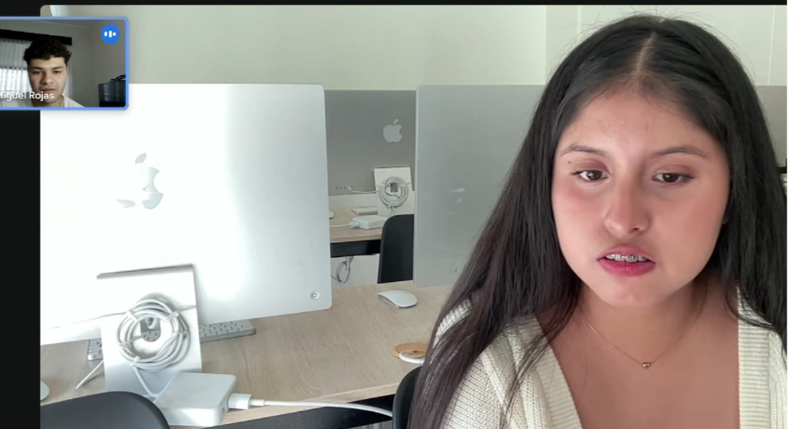
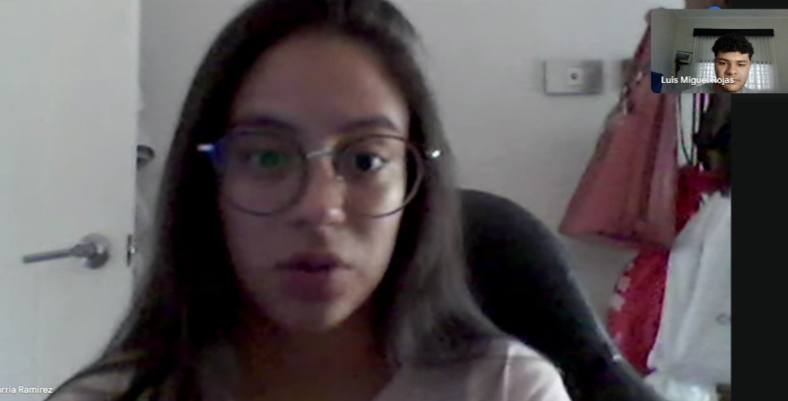

<h1 align="center">
  <strong style="font-size:25px;">Informe de Trabajo Final</strong>
</h1>

---

<strong>Universidad Peruana de Ciencias Aplicadas</strong>

  

Ingenieria de Software

5to ciclo

---

<strong>Código: </strong>1ASI0729

<strong>Curso:</strong> Desarrollo de Aplicaciones Open Source

<strong>Sección:</strong> 4289

<strong>Docente:</strong> Efraín Ricardo Bautista Ubillús

<strong>StartUp: </strong>KeepTeam

<strong>Proyecto:</strong> Keeplio

## Integrantes:

| Nombres y Apellidos                  | Código      |
| ----------------------------------- | ----------- |
| George Arturo Aliaga Pimentel       |U20211c273|
| Bryan Felix Martinez Ramos          |U202316246 |
| Maria Elena Muñoz Machuca           |U202317442|
| Luis Miguel Rojas Piñero            |U202220864 |
| Sanchez Gonzales                    | U202310609  |

Abril 2025

# Registro de Versiones del Informe

| Versión  | Fecha  | Autor  | Descripción de modificación |
| :---- | :---- | :---- | :---- |
| 1.0 | 25/04 | George Aliaga Bryan Martinez Maria Elena Muñoz Luis Miguel Rojas Sanchez Gonzales | Estructura del informe Capítulo I: Introducción Capítulo II: Requirements Elicitation & Analysis Capítulo III: Requirements Specification Capítulo IV: Product Design Capítulo V: Product Implementation & Deployment Conclusiones Recomendaciones Anexos Landing Page |

# Project Report Collaboration Insights

# Contenido

[Capítulo I: Introducción](#capítulo-i-introducción)
- [1.1. Startup Profile](#11-startup-profile)
  - [1.1.1. Descripción de la Startup](#111-descripción-de-la-startup)
  - [1.1.2. Perfiles de integrantes del equipo](#112-perfiles-de-integrantes-del-equipo)
- [1.2. Solution Profile](#12-solution-profile)
  - [1.2.1. Antecedentes y problemática](#121-antecedentes-y-problemática)
  - [1.2.2. Lean UX Process](#122-lean-ux-process)
    - [1.2.2.1. Lean UX Problem Statements](#1221-lean-ux-problem-statements)
    - [1.2.2.2. Lean UX Assumptions](#1222-lean-ux-assumptions)
    - [1.2.2.3. Lean UX Hypothesis Statements](#1223-lean-ux-hypothesis-statements)
    - [1.2.2.4. Lean UX Canvas](#1224-lean-ux-canvas)
- [1.3. Segmentos objetivo](#13-segmentos-objetivo)

[Capítulo II: Requirements Elicitation & Analysis](#capítulo-ii-requirements-elicitation--analysis)
- [2.1. Competidores](#21-competidores)
  - [2.1.1. Análisis competitivo](#211-análisis-competitivo)
  - [2.1.2. Estrategias y tácticas frente a competidores](#212-estrategias-y-tácticas-frente-a-competidores)
- [2.2. Entrevistas](#22-entrevistas)
  - [2.2.1. Diseño de entrevistas](#221-diseño-de-entrevistas)
  - [2.2.2. Registro de entrevistas](#222-registro-de-entrevistas)
  - [2.2.3. Análisis de entrevistas](#223-análisis-de-entrevistas)
- [2.3. Needfinding](#23-needfinding)
  - [2.3.1. User Personas](#231-user-personas)
  - [2.3.2. User Task Matrix](#232-user-task-matrix)
  - [2.3.3. User Journey Mapping](#233-user-journey-mapping)
  - [2.3.4. Empathy Mapping](#234-empathy-mapping)
  - [2.3.5. As-is Scenario Mapping](#235-as-is-scenario-mapping)
- [2.4. Ubiquitous Language](#24-ubiquitous-language)

# Capítulo I: Introducción   
## 1.1. Startup Profile
### 1.1.1. Descripción de la Startup
Somos Keeplo, un equipo de estudiantes de la universidad peruana de ciencias aplicadas, enfocado en desarrollar soluciones digitales que simplifiquen la organización de ideas, referencias y descubrimientos personales. Inspirados por la combinación de “keep” y “portfolio”, buscamos ofrecer a los usuarios una experiencia intuitiva y versátil para gestionar sus intereses cotidianos.
Nuestra misión es brindar una herramienta práctica y visualmente atractiva que permita a cualquier persona guardar, organizar y compartir elementos de interés, como productos, ideas y más, en colecciones personalizadas y fácilmente accesibles.
Nuestra visión es posicionarnos como la aplicación líder en organización personal en Latinoamérica, facilitando a nuestros usuarios la creación de catálogos digitales que se adapten a sus estilos de vida, proyectos creativos o rutinas profesionales.
Nuestro producto principal es Keeplo, una aplicación que permite a los usuarios guardar cualquier elemento que deseen en colecciones personalizadas. Cada ítem puede contener un nombre, una descripción, una imagen, un enlace web y puede ser compartido mediante un código QR y enlace. Esta funcionalidad permite no solo la organización personal, sino también la difusión rápida y efectiva de ideas, listas o recomendaciones entre amigos, colegas o comunidades.
Keeplo no solo ayuda a las personas a tener un espacio centralizado para sus intereses, sino que también promueve la creatividad, la planificación y el intercambio de contenido valioso. Es ideal para estudiantes, profesionales, creadores de contenido o cualquier persona que busque capturar y dar seguimiento a lo que les inspira o necesitan recordar.

### 1.1.2. Perfiles de integrantes del equipo
#### 1.1.2.1 Sanchez Gonzales
Soy estudiante en la Universidad Peruana de Ciencias Aplicadas (UPC) cursando el 5to ciclo de la carrera de Ingeniería de Software. Soy una persona comprometida con mi desarrollo académico y profesional. Con esa responsabilidad, aspiro a proveer soluciones tecnológicas a aquellos que las requieran para facilitar su área de trabajo. Junto con mi equipo de trabajo tendré la oportunidad de poner mis conocimientos y habilidades en uso con el proyecto “Keeplo” con el fin de disminuir la problemática identificada.

#### 1.1.2.2 Aliaga Pimentel George Arturo
Soy estudiante en la Universidad Peruana de Ciencias Aplicadas y soy de la carrera de Ingeniería de Software. Me considero una persona cooperativa y responsable, lo cual es requerido para un proyecto grupal. Junto a mis compañeros de grupo espero desarrollar un buen proyecto con las tecnologías que se aprenderán dentro del curso

#### 1.1.2.3 Martinez Ramos Bryan Felix
Soy estudiante de la la Universidad Peruana de Ciencias aplicadas, UPC, de la carrera de ingeniería de Software, actualmente estoy en el quinto ciclo de carrera, soy una persona muy proactiva, además de colaborativa, soy responsable con los trabajos y tiempos de entrega durante los proyectos, me emociona mucho el curso y la realización de manera exitosa del proyecto Keeplo

#### 1.1.2.4 Muñoz Machuca Maria Elena
Soy estudiante de la Universidad Peruana de Ciencias Aplicadas (UPC) y soy de la carrera de Ingeniería de Software cursando el quinto ciclo de la carrera. Me considero una persona responsable, ya que me gusta cumplir con las tareas encargadas. Asimismo, me considero perseverante, lo cual es importante para ir mejorando en cada entrega de nuestro proyecto. Junto a mis compañeros espero poder realizar nuestro proyecto con éxito.

#### 1.1.2.4 Rojas Piñero Luis Miguel
Soy estudiante de la Universidad Peruana de Ciencias Aplicadas de la carrera de Ingeniería de Software, actualmente estoy cursando mi 5to ciclo de la carrera y tengo expectativas de los cursos que llevo y lo que puedo lograr con mi esfuerzo. Me considero una persona que se desenvuelve bien trabajando en grupos ya que soy muy comunicativo con mis compañeros, de igual forma me motivan los proyectos actuales relacionados con el desarrollo de tecnologías útiles para el futuro. Junto a mi equipo estoy seguro de que lograremos realizar un gran proyecto este ciclo.

## 1.2. Solution Profile

### 1.2.1. Antecedentes y problemática

### What (¿Qué?)
La forma en que los usuarios guardan ideas o productos de interés está fragmentada entre notas del celular, capturas de pantalla y apps de tiendas específicas. Esta dispersión complica la organización y el seguimiento de deseos personales o futuros planes de compra. La incorporación de funcionalidades como listas de deseos digitales mejora significativamente la experiencia del usuario al permitirle guardar lo que le interesa para revisarlo más adelante, sin repetir búsquedas ni perder tiempo navegando (Sell Emprendepyme, 2023).

### Who (¿Quién?)
Este problema afecta principalmente a personas jóvenes y adultas que utilizan tecnología de manera cotidiana, en especial usuarios activos en redes sociales y plataformas de comercio electrónico. También impacta a quienes valoran la productividad y desean integrar herramientas como asistentes virtuales (Alexa, Google Assistant) para facilitar la gestión de sus intereses y decisiones de compra.

### Where (¿Dónde?)
La problemática se manifiesta sobre todo en contextos urbanos y digitalizados, donde existe un alto acceso a smartphones e internet. En estas zonas, los usuarios están expuestos a gran cantidad de información y productos, lo que aumenta la necesidad de herramientas eficientes que les permitan organizar y retomar decisiones en cualquier momento.

### When (¿Cuándo?)
Esta necesidad se ha intensificado desde la pandemia de COVID-19, momento en el que muchas personas empezaron a digitalizar sus rutinas y a depender más de herramientas móviles para planificar, comprar y tomar decisiones. La cantidad de estímulos visuales, ofertas y opciones en línea ha hecho más difícil la toma de decisiones rápida y eficaz.

### Why (¿Por qué?)
La falta de plataformas integradas que permitan agregar ítems desde diferentes canales, personalizar colecciones y utilizar herramientas modernas como escaneo QR o comandos de voz, limita la funcionalidad de las apps actuales. Además, tecnologías como el Internet de las Cosas (IoT) ofrecen posibilidades para conectar dispositivos y facilitar tareas cotidianas, pero su integración en este tipo de soluciones aún es limitada. Estas tecnologías, al ser bien implementadas, pueden mejorar significativamente la calidad de vida del usuario al automatizar procesos y facilitar la interacción con su entorno digital (Salinas Anaya et al., 2022).

### How (¿Cómo?)
Actualmente, los usuarios deben utilizar múltiples medios para guardar lo que desean: apps de notas, listas en papel o mensajes a sí mismos. Esta falta de unificación no solo reduce la eficiencia, sino que también impide compartir fácilmente listas con otras personas o retomarlas desde diferentes dispositivos. La ausencia de funcionalidades modernas como el agregado por voz o la organización inteligente limita el potencial de las herramientas existentes.

### How much (¿Cuánto?)
El impacto es funcional, emocional y económico. Los usuarios pierden tiempo y energía reubicando información o tomando decisiones de compra repetidas veces. Desde una perspectiva de negocio, esta brecha representa una oportunidad clara para monetizar a través de modelos freemium, mejorar la fidelización y aumentar el tiempo de navegación en plataformas digitales.

### 1.2.2. Lean UX Process

#### 1.2.2.1. Lean UX Problem Statements
Nuestra solución busca proveer al usuario con una organización de sus “Wishes” o cosas que desea a través de categorías y colecciones personalizables. Buscamos que los usuarios no sufran al tener que buscar entre diferentes plataformas un producto en concreto, facilitando exponencialmente el tiempo de búsqueda al categorizarlas tal y como el usuario prefiera, en especial, cuando este es un contenido que se desea compartir con un público como amigos y familiares, en el cual, al ser compartido a través de un código QR facilita la navegación para los observadores.
Hemos observado que nuestros usuarios al no tener una plataforma en la cual puedan organizar correctamente los links, productos, diseños u otros objetos digitales de interés, tienen un problema al poder estructurar el contenido y guardarlo en un solo lugar, causando que a través de diferentes plataformas guarden sus diferentes recursos, causando además un desorden e incluso pérdida de algunos de estos.
¿Cómo podemos ofrecer un modelo de estructuración para que los usuarios puedan guardar sus ideas de forma organizada?
Hemos notado que los usuarios desean compartir ideas con otros usuarios externos, ya sean amigos, familiares o colegas del trabajo, con el fin de distribuir un conjunto de ideas a la vez. Esta necesidad se presencia normalmente en trabajos o proyectos colaborativos donde el usuario requiere compartir una idea general hecha a partir de pequeños recursos encontrados en el internet.
¿Cómo podemos crear una aplicación que mejore la eficiencia de colaboración entre usuarios?
Hemos notado que las plataformas que usan los usuarios para guardar contenido, no están diseñadas hacia esa función, tienen un diseño poco atractivo y cuentan con interfaces poco intuitivas o limitan las acciones que se pueden realizar dentro de la misma para algunos usuarios.
¿Cómo podemos diseñar una aplicación que sea intuitiva y fácil de usar?

#### 1.2.2.2. Lean UX Assumptions
Los usuarios desean guardar cosas distintas del internet en un solo lugar
Los usuarios valoran un sistema de organización personalizada, donde tengan el control de cómo se ordenan las cosas
Los usuarios estan familiriaziados con el uso de links y QR’s
Los usuarios constantemente están encontrando nuevos items en internet
Los usuarios están dispuestos a pagar por un servicio que les ayude a organizar sus ideas e items
#### 1.2.2.3. Lean UX Hypothesis Statements
##### Hypothesis 1
Creemos que los usuarios necesitan de una plataforma para guardar y organizar diversos ítems de internet que requieran usar en un futuro, puesto que sus actuales métodos de organización están dispersos a través de diferentes aplicaciones. Sabremos que estamos en lo correcto cuando más usuarios usen más la aplicación diariamente en un 30% y tengamos reseñas positivas.
##### Hypothesis 2
Creemos que aumentará la organización de los usuarios sobre sus ítems guardados porque tendrán acceso a una estructura adecuada y fácil de usar, por ende mejorando el orden de sus colecciones. Sabremos que estamos en lo correcto cuando el tiempo de búsqueda de un ítem en específico disminuya en un 40%.
##### Hypothesis 3
Creemos  que los usuarios valorarán la forma rápida y eficiente que ofrece la plataforma al momento de compartir sus colecciones con otros usuarios o personas externas a través de un QR pues es una forma mas rapida y limpia que copiar un enlace. Sabremos que estamos en lo correcto cuando la cantidad de usuarios que comparten sus colecciones aumentarán en un 30%
##### Hypothesis 4
Creemos que al ofrecer un filtro a través de palabras claves o etiquetas mejorará la organización y la búsqueda de los usuarios hacia sus ítems puesto que podrán clasificar colecciones entre sí. Sabremos que estamos en lo correcto cuando alrededor de un 40% de nuestros usuarios usen las etiquetas para clasificar sus colecciones.

#### 1.2.2.4. Lean UX Canvas
| Business Problem | Solution Ideas | Business Outcomes |
| :---- | :---- | :---- |
| Nuestra solución busca proveer al usuario con una organización de sus items que desea a través de categorías y colecciones personalizables. Buscamos que los usuarios no sufran al tener que buscar entre diferentes plataformas un producto en concreto, facilitando exponencialmente el tiempo de búsqueda al categorizarlas tal y como el usuario prefiera, en especial, cuando este es un contenido que se desea compartir con un público como amigos y familiares, en el cual, al ser compartido a través de un código QR facilita la navegación para los observadores. Hemos observado que nuestros usuarios al no tener una plataforma en la cual puedan organizar correctamente los links, productos, diseños u otros objetos digitales de interés, tienen un problema al poder estructurar el contenido y guardarlo en un solo lugar, causando que a través de diferentes plataformas guarden sus diferentes recursos, causando además un desorden e incluso pérdida de algunos de estos.  ¿Cómo podemos ofrecer un modelo de estructuración para que los usuarios puedan guardar sus ideas de forma organizada?   Hemos notado que los usuarios desean compartir ideas con otros usuarios externos, ya sean amigos, familiares o colegas del trabajo, con el fin de distribuir un conjunto de ideas a la vez. Esta necesidad se presencia normalmente en trabajos o proyectos colaborativos donde el usuario requiere compartir una idea general hecha a partir de pequeños recursos encontrados en el internet. ¿Cómo podemos crear una aplicación que mejore la eficiencia de colaboración entre usuarios? Hemos notado que las plataformas que usan los usuarios para guardar contenido, no están diseñadas hacia esa función, tienen un diseño poco atractivo y cuentan con interfaces poco intuitivas o limitan las acciones que se pueden realizar dentro de la misma para algunos usuarios.  ¿Cómo podemos diseñar una aplicación que sea intuitiva y fácil de usar? | • Crear un plataforma donde los usuarios puedan guardar sus ideas de cualquier tipo de ítem.   • Integrar un sistema de generación y lectura de QR para compartir colecciones con otros usuario.   • Permitir que los ítems tengan un nombre, imagen, descripción y enlace web para facilitar su referencia. Funciones de búsqueda por nombre o descripción |• Aumento en organización de ítems virtuales de los usuarios   • Más de 50 colecciones compartidas entre usuarios y externos semanalmente Retención de usuarios en un 50% después del primer mes   • Aumento de visibilidad de la plataforma en un 40% por los usuarios que la comparten  |
| Hypothesis | Users & Customers | User Benefits |
| • Creemos que los usuarios necesitan de una plataforma para guardar y organizar diversos ítems de internet que requieran usar en un futuro, puesto que sus actuales métodos de organización están dispersos a través de diferentes aplicaciones. Sabremos que estamos en lo correcto cuando más usuarios usen más la aplicación diariamente en un 30% y tengamos reseñas positivas.   • Creemos que aumentará la organización de los usuarios sobre sus ítems guardados porque tendrán acceso a una estructura adecuada y fácil de usar, por ende mejorando el orden de sus colecciones. Sabremos que estamos en lo correcto cuando el tiempo de búsqueda de un ítem en específico disminuya en un 40%.   • Creemos  que los usuarios valorarán la forma rápida y eficiente que ofrece la plataforma al momento de compartir sus colecciones con otros usuarios o personas externas a través de un QR pues es una forma mas rapida y limpia que copiar un enlace. Sabremos que estamos en lo correcto cuando la cantidad de usuarios que comparten sus colecciones aumentarán en un 30%   • Creemos que al ofrecer un filtro a través de palabras claves o etiquetas mejorará la organización y la búsqueda de los usuarios hacia sus ítems puesto que podrán clasificar colecciones entre sí. Sabremos que estamos en lo correcto cuando alrededor de un 40% de nuestros usuarios usen las etiquetas para clasificar sus colecciones. | Diseñadores que necesiten guardar inspiraciones de diferentes páginas en un solo lugar Profesionales de Marketing Digital  | Centralizar en un solo lugar ítems de interés fácilmente Categorizar colecciones de ítems para encontrarlos más rápido Mejorar la eficiencia de busqueda de algun item en específico para un proyecto o trabajo Compartir con usuarios externos como amigos o familiares una colección de interes Mejorar la productividad y bajar las probabilidades de pérdida de información. |
|  | What’s the most important thing we need to learn first?  | What’s the least amount of work we need to learn the next most important thing?    |
|  | Crear colecciones personalizadas Agregar items a las colecciones Compartir colecciones mediante generación de QR Etiquetas o categorías de colecciones | Diseñar de entrevista con preguntas concretas a una estadística Formulario de interés de la plataforma a usuarios  |
## 1.3. Segmentos objetivo

### 1.3.1 Segmento 1: Diseñadores  
     
Los diseñadores diariamente necesitan recopilar referencias visuales e ideas que los ayude a mejorar sus trabajos, estas ideas se pueden encontrar esparcidas por todo el internet y necesitan poder tener un lugar para guardarlas todas e incluso presentarlas como un moodboard para sus clientes.  
     
   **Caracteristícas:**  
   - **Edad:** Mayor a 18 años  
   - **Ubicación:** Lima, Peru  
   - **Nivel Socioeconomico:** Medio a alto

   

### 1.3.2 Segmento 2: Compradores  
        
Los compradores buscan un lugar en el cual puedan guardar todos los objetos de interés que tienen de distintos marketplace en un solo lugar, ya sea para compararlos o usarlo como una lista de compra entre plataformas marketplace o e-commerce.  
        
  **Características:**  
  - **Edad:** Mayor a 18 años  
  - **Ubicación:** Lima, Peru  
  - **Nivel Socioeconomico:** Medio a alto

# Capítulo II: Requirements Elicitation & Analysis

## 2.1. Competidores

### 2.1.1. Análisis competitivo

| Competitive Analysis Landscape  |  |  |  |  |  |
| ----- | :---- | :---- | :---- | :---- | :---- |
| ¿Por qué llevar a cabo este análisis? |  Este análisis permite construir una visión más informada y competitiva del proyecto, aumentando sus probabilidades de éxito.|  |  |  |  |
|  |  | Keeplo     | Pinterest    | Notion    | Raindrop.io    |
|  Perfil | Overview | Aplicación que permite guardar y organizar cualquier tipo de elemento (productos, ideas, lugares, etc.) en colecciones personalizadas, con posibilidad de compartir mediante código QR. | Plataforma visual para descubrir, guardar y organizar ideas e inspiración en tableros. |  Herramienta todo-en-uno para tomar notas, planificar, colaborar y organizar información.  |  Gestor moderno de marcadores para guardar y organizar enlaces con etiquetas, colecciones visuales e integración con navegadores.  |
|  | Ventaja competitiva ¿Qué valor ofrece a los clientes?  | • Guarda cualquier tipo de contenido, organiza en colecciones personalizadas y comparte con QR fácilmente.   • Enfoque 100% personal y visual. |  Descubre y guarda ideas de otros usuarios; ideal para inspiración, no tanto para organización propia.  |  • Gestión integral de tareas, notas y bases de datos. Potente, pero compleja para uso casual.  | Organización avanzada de enlaces; ideal para profesionales que manejan muchos recursos web. |
| Perfil de Marketing | Mercado Objetivo | Jóvenes creativos, estudiantes y usuarios digitales que desean guardar, organizar y compartir ideas, productos o lugares de forma visual y personalizada. | Público general (mayoría mujeres 25–45 años), interesados en inspiración visual: moda, decoración, recetas, diseño, etc. | Estudiantes, profesionales y equipos que buscan una herramienta de productividad flexible y personalizable | Profesionales tech, diseñadores, marketers y usuarios intensivos de web que requieren guardar y categorizar muchos enlaces. |
|  | Estrategias de marketing | • Marketing en redes sociales (TikTok, Instagram), microinfluencers, campañas con QR físicos en universidades y eventos creativos.   • Enfoque en viralidad y comunidad. | • SEO visual, integración en buscadores, colaboración con creadores de contenido e influencers de nicho.   • Alta presencia en redes. | Marketing de contenido (blogs, YouTube), comunidad activa, embajadores estudiantiles, webinars y uso gratuito para estudiantes. | Presencia en foros y comunidades tech (Reddit, Product Hunt), extensiones de navegador y enfoque en early adopters. |
|  Perfil de productos | Productos & Servicios | • Aplicación que permite guardar productos, lugares, ideas, etc., organizados en colecciones personalizadas.   • Cada ítem puede tener nombre, descripción, imagen, enlace web y se puede compartir mediante código QR. |  Plataforma para descubrir y guardar imágenes o ideas en tableros temáticos.   • Recomendaciones visuales según intereses.  | Herramienta de productividad todo-en-uno: notas, bases de datos, tareas, wikis, colaboración en tiempo real. | Gestor de marcadores: guarda, organiza y etiqueta enlaces web; sincronización entre dispositivos y vista previa visual |
|  | Precios & Costos  | Se cuenta con 3 planes, siendo el primer plan Starter (gratis), el plan Plus (4.99$) y el plan infinity (9.99$)  | • Gratuito para usuarios.   • Genera ingresos mediante publicidad segmentada.  |  Plan gratuito con funciones básicas. Planes pagos desde $8/mes con funciones avanzadas.  | Plan gratuito limitado. Versión Pro a $3/mes con funciones premium (etiquetas, búsqueda avanzada, etc.). |
|  | Canales de distribución (Web y/o Móvil) | Web,aplicacion movil (iOS y Android). | Web, aplicación móvil (iOS y Android), extensión de navegador | Web, app de escritorio, app móvil (iOS y Android). | Web, extensión de navegador, app móvil (iOS y Android), app de escritorio.  |
|  Análisis SWOT | Fortalezas | • Simplicidad y personalización en la organización de contenidos. Fácil de usar, con función única de compartir mediante código QR.   • Ideal para usuarios que buscan guardar y organizar elementos diversos. | • Enorme base de usuarios y una plataforma establecida para inspiración visual.   • Contenido curado por la comunidad y fácil descubrimiento de ideas. | • Flexibilidad para crear bases de datos, gestionar proyectos y colaborar en equipo.   • Muy adaptable para uso personal y profesional. | • Organización avanzada de enlaces web y marcadores, con integración entre dispositivos.   • Gran personalización en la gestión de contenido digital.  |
|  | Debilidades | Falta de un modelo de monetización claro y la necesidad de diferenciarse de herramientas como Pinterest o Notion, que tienen una mayor base de usuarios. | • Limitación en la organización para usuarios que buscan una estructura más flexible y menos enfocada en la inspiración.   •   • Depende de la interacción con contenido de terceros. | • Curva de aprendizaje alta para usuarios nuevos.   • Puede ser excesivo para quienes buscan algo simple y no una herramienta de productividad integral. | • Limitación en funcionalidades gratuitas.   • El modelo freemium puede ser restrictivo para usuarios que no estén dispuestos a pagar por características avanzadas. |
|  | Oportunidades | • Expansión en el mercado de estudiantes y jóvenes creativos que buscan una plataforma simple para organizar ideas y recursos.   •Colaboraciones con universidades y eventos de emprendimiento | • Aprovechar la creciente demanda de contenido visual en redes sociales y expandir su presencia en mercados emergentes.   • Potenciar el comercio social para facilitar compras dentro de la plataforma. | • Adopción en el ámbito empresarial: crecer en el sector profesional y educativo como herramienta central para gestión de equipos y proyectos.   • Expansión de plantillas personalizadas y tutoriales. | • Ampliar su alcance en mercados de productividad digital y vincular más herramientas externas para usuarios que necesitan organizar grandes cantidades de contenido web. |
|  | Amenazas | • Alta competencia con plataformas consolidadas, posible baja retención si no se innova o amplía la propuesta de valor.   • Difícil posicionamiento sin una base de usuarios sólida. | • Riesgo de perder usuarios frente a plataformas más modernas o centradas en contenido en video como TikTok o Instagram.   • Cambios en algoritmos pueden afectar la visibilidad. | • Competencia con otras herramientas de productividad como Trello, ClickUp o Asana.   • Saturación de funciones puede alejar a usuarios que buscan soluciones simples. | • Poca visibilidad frente a plataformas más populares.   • El modelo de pago puede limitar su crecimiento masivo si no se ofrecen funciones diferenciadoras claras. |

### 2.1.2. Estrategias y tácticas frente a competidores

Keeplo aplicará una estrategia de diferenciación centrada en la organización personalizada de contenido digital, permitiendo a los usuarios guardar y clasificar elementos como productos, ideas o lugares en colecciones visuales, intuitivas y fáciles de compartir mediante códigos QR. Frente a plataformas más robustas o generalistas como Notion o Pinterest, Keeplo se posiciona como una alternativa ligera, práctica y enfocada en la simplicidad. Su valor está en ofrecer una experiencia de uso directa, rápida y sin complicaciones, ideal para estudiantes, creativos y usuarios que valoran la agilidad. Aprovechará las debilidades de sus competidores como la 

## 2.2. Entrevistas
### 2.2.1. Diseño de entrevistas
**Preguntas a realizar:**

**Generales:**

  - ¿Cuál es tu nombre y apellidos?

  - ¿Cuántos años tienes?

  - ¿En qué distrito de Lima metropolitana resides actualmente?

**Diseñadores:**

  - ¿Cómo guardas tus inspiraciones de diferentes sitios actualmente?

  - ¿Con qué frecuencia recolectas este tipo de información?

  - ¿Qué tan buena es tu organización actual sobre tus ideas?

  - ¿Cuánto tiempo aproximadamente demoras buscando cierto link que ayudará a tu trabajo?

  - ¿Qué tan seguido estás frustrado/a de no encontrar una idea guardada en específico?

  - Si estas trabajando, como presentas tus moodboards o esquemas de proyecto a clientes?

  - Si estás estudiando, ¿de qué forma compartes una colección de ideas a tus demás compañeros?

  - ¿Crees que una plataforma que reúna todas las ideas de diferentes sitios te ayude a mejorar tu productividad? ¿Cómo?

  - ¿Crees que a través de la funcionalidad de compartir una colección de ideas mediante QR disminuiría el tiempo que un grupo demoraría en entender un concepto o idea de una colección?

**Compradores:**

  - ¿Qué tan seguido sueles realizar compras por internet?

  - ¿Guardas productos antes de decidir si comprarlos o no?

  - ¿Cómo guardas tus intereses de compra de diferentes plataformas actualmente?

  - ¿Qué tan buena es tu organización actual sobre tus ítems de interés?

  - ¿Cuánto tiempo aproximadamente demoras buscando cierto ítem en específico?

  - ¿Qué tan seguido estás frustrado/a de no encontrar un item guardado?

  - ¿Crees que una plataforma que reúna todas los items de diferentes sitios te ayude a mejorar la eficiencia en tus compras? ¿Cómo?

  - ¿Crees que a través de la funcionalidad de compartir una colección de ideas mediante QR disminuiría el tiempo que un grupo demoraría en visualizar todos los ítems de la misma?

  - ¿Te gustaría que se puedan agrupar tus items de interés a través de categorías (Cumpleaños, muebles, necesidades etc.)?
### 2.2.2. Registro de entrevistas

Entrevistas1:

Entrevista 1:

**Segmento 1: Diseñadores**

- Nombre: Maria Angeles
- Apellido: Flores Villavicencio
- Edad: 21
- Distrito: Pueblo Libre
- Tiempo de Inicio: 0:00
- tiempo de Fin: 7:04

Link: https://upcedupe-my.sharepoint.com/:v:/g/personal/u202310609_upc_edu_pe/EXe6OhIXtblKsT2opoqwtusBGOqzPmlaZ2nFy-GUhQLaNg?e=FgYqbN&nav=eyJyZWZlcnJhbEluZm8iOnsicmVmZXJyYWxBcHAiOiJTdHJlYW1XZWJBcHAiLCJyZWZlcnJhbFZpZXciOiJTaGFyZURpYWxvZy1MaW5rIiwicmVmZXJyYWxBcHBQbGF0Zm9ybSI6IldlYiIsInJlZmVycmFsTW9kZSI6InZpZXcifX0%3D

Resumen de la entrevista: Nuestra primera invitada es María Ángeles, una diseñadora gráfica y estudiante que utiliza principalmente Pinterest y Cosmos para guardar inspiración, pero enfrenta problemas como la pérdida de referencias y la búsqueda tediosa de imágenes específicas debido a las limitaciones de organización en estas plataformas. Destaca su necesidad de organización detallada similar a "playlists de Spotify" podríamos decir, algo que Pinterest no ofrece, como subcarpetas o notas grupales, lo que la obliga a complementar con WhatsApp para discutir ideas. Valora la propuesta de Keeplo como una solución unificada para guardar enlaces, imágenes y videos en un solo lugar, con funciones avanzadas como carpetas anidadas y la opción de compartir mediante QR o links, aunque sugiere mantener ambas alternativas por comodidad (especialmente al trabajar en computadora). Su principal frustración es el tiempo perdido migrando contenido entre apps, por lo que una plataforma integrada y flexible mejoraría significativamente su productividad.

Entrevista 2:

**Segmento 1: Diseñadores**

- Nombre: Eunice
- Apellido: Blas Sánchez
- Edad: 22
- Distrito: Pueblo Libre
- Tiempo de Inicio: 7:04
- tiempo de Fin: 11:41

Link: https://upcedupe-my.sharepoint.com/:v:/g/personal/u202310609_upc_edu_pe/EXe6OhIXtblKsT2opoqwtusBGOqzPmlaZ2nFy-GUhQLaNg?e=FgYqbN&nav=eyJyZWZlcnJhbEluZm8iOnsicmVmZXJyYWxBcHAiOiJTdHJlYW1XZWJBcHAiLCJyZWZlcnJhbFZpZXciOiJTaGFyZURpYWxvZy1MaW5rIiwicmVmZXJyYWxBcHBQbGF0Zm9ybSI6IldlYiIsInJlZmVycmFsTW9kZSI6InZpZXcifX0%3D

Resumen de la entrevista: Eunice, una diseñadora gráfica que utiliza principalmente Pinterest y google drive para guardar contenido que sean de su agrado y luego pueda usar de inspiración, pero enfrenta problemas de organización dispersa al guardar contenido en múltiples plataformas. Destaca la dificultad de gestionar los links, estos los suele enviar por su WhatsApp y luego olvidar que los ha guardado ahí, lo que le genera frustración o pérdida de tiempo al intentar encontrarlo. Para presentar proyectos a clientes, recurre a PDFs con moodboards (Canva o figma), pero señala limitaciones al incluir links en formatos estáticos. Valora la propuesta que ofrece Keeplo como una solución centralizada para guardar imágenes, links y videos en un solo lugar, con funciones como tableros por categorías y compartir mediante QR. En resumen su mayor necesidad es ahorrar tiempo evitando migrar entre apps, por lo que una plataforma colaborativa y multifuncional mejoraría su flujo de trabajo y estudio.

Entrevista 3:

**Segmento 1: Diseñadores**

- Nombre: José Martín
- Apellido: Villegas Guerrero
- Edad: 25
- Distrito: Surco
- Duración: 6:01
- Tiempo de Inicio: 11:41
- tiempo de Fin: 15:23

Link: https://upcedupe-my.sharepoint.com/:v:/g/personal/u202310609_upc_edu_pe/EXe6OhIXtblKsT2opoqwtusBGOqzPmlaZ2nFy-GUhQLaNg?e=FgYqbN&nav=eyJyZWZlcnJhbEluZm8iOnsicmVmZXJyYWxBcHAiOiJTdHJlYW1XZWJBcHAiLCJyZWZlcnJhbFZpZXciOiJTaGFyZURpYWxvZy1MaW5rIiwicmVmZXJyYWxBcHBQbGF0Zm9ybSI6IldlYiIsInJlZmVycmFsTW9kZSI6InZpZXcifX0%3D

Resumen de la entrevista: como tercer invitado en este segmento tenemos a José, él utiliza principalmente Google Drive y Pinterest para guardar inspiración, pero recurre a WhatsApp para enviar links a sí mismo, lo que a veces genera pérdida de información. Organiza sus archivos en carpetas nombradas en su computadora y Drive, pero reconoce que el método actual es frágil, especialmente con el tema de los links. José actualmente desempeña labores en proyectos universitarios y freelance, comparte contenido casi exclusivamente por WhatsApp (para trabajos grupales) o envía carpetas de Drive a clientes, aunque admite que los chats pueden saturarse y perder información. Valora la propuesta de Keeplo como una solución para centralizar imágenes, links y videos, destacando el potencial del QR para compartir colecciones. Destacando un punto que sería incluir un sistema de búsqueda eficiente para proyectos antiguos. Su principal dolor es la pérdida de links y la fragmentación de herramientas, por lo que una plataforma unificada que evite migrar entre apps mejoraría su productividad.

Entrevista 4: https://upcedupe-my.sharepoint.com/:v:/g/personal/u202310609_upc_edu_pe/EXe6OhIXtblKsT2opoqwtusBGOqzPmlaZ2nFy-GUhQLaNg?e=FgYqbN&nav=eyJyZWZlcnJhbEluZm8iOnsicmVmZXJyYWxBcHAiOiJTdHJlYW1XZWJBcHAiLCJyZWZlcnJhbFZpZXciOiJTaGFyZURpYWxvZy1MaW5rIiwicmVmZXJyYWxBcHBQbGF0Zm9ybSI6IldlYiIsInJlZmVycmFsTW9kZSI6InZpZXcifX0%3D

**Segmento 2: Compradores**

- Nombre: Dayana Lourdes
- Apellido: Chavarria Ramirez
- Edad: 20
- Distrito: Barranco
- Tiempo de Inicio: 15:23
- tiempo de Fin: 20:36

Link: https://upcedupe-my.sharepoint.com/:v:/g/personal/u202310609_upc_edu_pe/EXe6OhIXtblKsT2opoqwtusBGOqzPmlaZ2nFy-GUhQLaNg?e=FgYqbN&nav=eyJyZWZlcnJhbEluZm8iOnsicmVmZXJyYWxBcHAiOiJTdHJlYW1XZWJBcHAiLCJyZWZlcnJhbFZpZXciOiJTaGFyZURpYWxvZy1MaW5rIiwicmVmZXJyYWxBcHBQbGF0Zm9ybSI6IldlYiIsInJlZmVycmFsTW9kZSI6InZpZXcifX0%3D

Resumen de la entrevista: la entrevistada para este segmento de compradores en línea es Dayana, estudiante universitaria y compradora frecuente (3-4 veces/mes), enfrenta problemas de organización dispersa al guardar productos de interés: recurre a capturas de pantalla y links pegados en WhatsApp, lo que le genera frustración al perder el contexto de los ítems o incluso generando dudas como : ¿Era este el esmalte o la base?". Valora especialmente la propuesta de Keeplo para centralizar y categorizar sus hallazgos (ej: pestañas como "Maquillaje" o "Regalo Mamá"), destacando la utilidad del QR para compartir listas de forma inmediata. Su principal dolor es el tiempo perdido revisando links sin clasificar, por lo que una plataforma con búsqueda por categorías visuales y previsualización de productos mejoraría significativamente su eficiencia en compras. Como sugerencia, resalta la importancia de que las categorías sean personalizables y simples (no requieren subniveles complejos como los diseñadores), adaptándose a su flujo espontáneo de descubrimiento y compra.

Entrevista 5:

**Segmento 2: Compradores**

- Nombre: Leonardo
- Apellido: Roca
- Edad: 22
- Distrito: Breña
- Tiempo de Inicio: 20:36
- tiempo de Fin: 25:21

Link:  https://upcedupe-my.sharepoint.com/:v:/g/personal/u202310609_upc_edu_pe/EXe6OhIXtblKsT2opoqwtusBGOqzPmlaZ2nFy-GUhQLaNg?e=FgYqbN&nav=eyJyZWZlcnJhbEluZm8iOnsicmVmZXJyYWxBcHAiOiJTdHJlYW1XZWJBcHAiLCJyZWZlcnJhbFZpZXciOiJTaGFyZURpYWxvZy1MaW5rIiwicmVmZXJyYWxBcHBQbGF0Zm9ybSI6IldlYiIsInJlZmVycmFsTW9kZSI6InZpZXcifX0%3D

Resumen de la entrevista: nuestro siguiente invitado es Leonardo el  cual realiza compras online 2 veces/mes (principalmente en ropa y productos tangibles) y actualmente organiza sus intereses de compras usando Notion, donde guarda links y capturas de pantalla en un portapapeles personalizado. Aunque considera su método "regularmente organizado", admite que a veces olvida guardar capturas en Notion o las borra accidentalmente, lo que le genera frustración al perder productos de interés. Valora la propuesta de Keeplo para centralizar ítems, pero se muestra escéptico ante el QR para compartir colecciones, resalta el hecho de "personas mayores podrían no entenderlo, prefiriendo links simples. Su principal necesidad es categorizar productos (ej: "Ropa") y sugiere una función innovadora: comparar precios del mismo ítem en distintas plataformas automáticamente. Destaca que, pese a su organización actual, una app dedicada a la organización le ahorraría tiempo en recuperar productos guardados y evitaría pérdidas.

Entrevista 6:

**Segmento 2: Compradores**

- Nombre: Zayuri
- Apellido: Navarro
- Edad: 19
- Distrito: Jesus Maria
- Tiempo de Inicio: 25:21
- tiempo de Fin: 29:57

Link: https://upcedupe-my.sharepoint.com/:v:/g/personal/u202310609_upc_edu_pe/EXe6OhIXtblKsT2opoqwtusBGOqzPmlaZ2nFy-GUhQLaNg?e=FgYqbN&nav=eyJyZWZlcnJhbEluZm8iOnsicmVmZXJyYWxBcHAiOiJTdHJlYW1XZWJBcHAiLCJyZWZlcnJhbFZpZXciOiJTaGFyZURpYWxvZy1MaW5rIiwicmVmZXJyYWxBcHBQbGF0Zm9ybSI6IldlYiIsInJlZmVycmFsTW9kZSI6InZpZXcifX0%3D

Resumen de entrevistas: en las presentes entrevistas hemos reunido un grupo de personas que cumplen con los segmentos objetivos que definimos anteriormente. En estas entrevistas en primer lugar nos aseguramos de conocer a los entrevistados, sobre quienes son y qué actividades desarrollan. En segundo lugar les dimos conocimiento con respecto a la propuesta de Keeplo y como en sus casos específicos podría ser beneficioso para ellos en sus trabajos o día a día utilizar una herramienta como la nuestra. Por último pedimos recomendaciones y opiniones a cada uno de ellos con respecto a la propuesta que ofrece Keeplo, tomando en cuenta todas sus opiniones y recomendaciones consideramos que fueron exitosas las entrevistas realizadas.

### 2.2.3. Análisis de entrevistas
| Nombre del entrevistado | Análisis de la entrevista |
|--------------------------|---------------------------|
| Maria Angeles | Nuestra invitada María Ángeles revela una problemática recurrente en profesionales creativos la cual es la fragmentación de herramientas digitales y la ausencia de sistemas de organización. Su uso de herramientas como Pinterest para inspiración y WhatsApp para compartir evidencia es una brecha en su sistema Su analogía con "playlists de Spotify" es particularmente reveladora, pues señala la necesidad de estructuras jerárquicas personalizables como subcarpetas y contexto colaborativo como notas grupales, son elementos ausentes en soluciones actuales.|
|Eunice Blas  |El caso de Eunice ejemplifica un desafío crítico en la gestión de inspiración creativa: la desconexión entre herramientas de recopilación y presentación es notoria. Su flujo de trabajo actual que combina Pinterest, Google Drive y WhatsApp genera un costo oculto de productividad al obligarla a recontextualizar contenido que puede considerarse desordenado. La práctica de enviar links por                WhatsApp muestra una solución rápida pero poco efectiva, La frustración de Eunice muestra un punto clave el cual es no solo se busca guardar contenido, sino preservar ese contenido.|
|Jose Villegas |El testimonio de José revela una contradicción fundamental en usuarios técnicos: aunque domina herramientas de organización como Google Drive o Notion,su flujo de trabajo sigue dependiendo mucho de soluciones improvisadas como links por WhatsApp. Este comportamiento refleja una brecha en las plataformas actuales. Su mención al "sistema de búsqueda eficiente para proyectos antiguos" es particularmente valiosa. Este dolor sería un principio destacado en  los usuarios técnicos los cuales buscan compatibilidad con otros sistemas.|
|Dayana Chavarria |El caso de Dayana nos muestra un patrón recurrente en compradores online ocasionales este sería la separación entre la intención de compra y la gestión efectiva de referencias.Su dependencia de capturas de pantalla y links por WhatsApp refleja un intento fallido de replicar el concepto de "wishlist" con herramientas que no están diseñadas para este fin. La valoración positiva del QR sugiere que su utilidad va mucho de la mano del contexto de uso. Como recomendación nos dejó su punto de ofrecer plantillas prediseñadas para compradores.|
|Leonardo Roca  |Leonardo representa un perfil dividido en el aspecto de usuarios que  aunque adoptan herramientas avanzadas como Notion para organizar sus compras, su flujo de trabajo sigue presentando puntos débiles. Su caso revela tres puntos claves para el desarrollo de Keeplo: uno sería la organización digital, explicando un poco más seria tomar capturas automáticas de productos para que el usuario no olvide guardarlo. En otro punto se muestra algo escepticismo con respecto al Qr y se ve favorable al uso del link. Y por último la capacidad de comparar precios entre páginas.|      
|Zayuri Navarro |En esta entrevista nuestra invitada Zayuri una compradora ocasional que evidencia tres problemas clave los cuales son la pérdida de productos al depender de un carrito de compras y capturas sin contexto alguno, como segundo punto la fragmentación entre plataformas sin historial de disponibilidad, y por último herramientas improvisadas como screenshots que no permiten acción posterior. Valora la propuesta de Keeplo como solución centralizada, pero rechaza el QR por poco práctico en entornos digitales, prefiriendo links directos. Su principal aporte es la necesidad de "persistencia de productos": que los ítems guardados mantengan acceso aunque se agoten en una tienda, buscándolos automáticamente en otras plataformas. Refleja que los compradores ocasionales priorizan la recuperabilidad sobre funciones complejas.|
               

## 2.3. Needfinding

En esta sección se presentan los resultados del análisis de las necesidades del público objetivo. Se identificó una demanda por una herramienta sencilla y visual para guardar, organizar y compartir contenidos diversos de forma rápida y personalizada.

### 2.3.1. User Personas
**Diseñadores**

[Link a User Persona Diseñador](https://uxpressia.com/w/2JtXc/p/Qlp9Z)

**Compradores**

[Link a User Persona Comprador](https://uxpressia.com/w/uKRya/p/K2kx6)

### 2.3.2. User Task Matrix
**Diseñadores:**

| Actividades | Frecuencia | Importancia |
| ----- | ----- | ----- |
| Guardar imágenes o enlaces de referencia de diferentes plataformas | Alta | Alta |
| Organizar ideas en diferentes carpetas | Baja | Media |
| Compartir sus ideas a usuarios externos | Alta | Alta |
| Volver a buscar un contenido previamente visto | Media | Media |
| Preparar contenido para presentar a otros | Baja | Baja |

**Compradores:**

| Actividades | Frecuencia | Importancia |
| ----- | ----- | ----- |
| Guardar enlaces de referencia a productos de diferentes plataformas | Alta | Alta |
| Organizar productos en diferentes carpetas | Baja | Media |
| Compartir su lista productos a usuarios externos | Alta | Alta |
| Volver a buscar un contenido previamente visto | Media | Media |
| Comparar productos con otros | Media | Baja |
| Anotar detalles sobre lo guardado | Baja | Baja |

### 2.3.3. User Journey Mapping

Mediante los User Journey Maps, se representa la situación (AS-IS) de la experiencia de los usuarios al interactuar con la plataforma desde el momento de exploración inicial hasta la curación y organización de su wishlist o lista de ideas visuales. Estos mapas permiten visualizar los puntos de contacto, emociones y acciones de los usuarios a lo largo de su recorrido, identificando oportunidades de mejora en la experiencia, usabilidad y valor de la plataforma tanto para compradores como para diseñadores.

**Diseñadores:**

**Compradores**

### 2.3.4. Empathy Mapping

**Diseñadores:**

**Compradores:**

### 2.3.5. As-is Scenario Mapping

**Diseñadores:**

**Compradores:**

link a As-Is: [Link a Miro](https://miro.com/welcomeonboard/aGd3M3ludGRjbTNYOUdmK3FaY2gyV2s0dXVSVGJGejBnVlJXY0NkVHlZcHRvV01vS0VDc2xBTWZydHAzYmQ3L3k0ZGZ5QkZTNHFseGJIWUVXbUY2TTFuaGgvN05id0xzTStqNU9wbzFtTVlzbWFWTTVtaGE1V0IrSmJMa0I1UmphWWluRVAxeXRuUUgwWDl3Mk1qRGVRPT0hdjE=?share_link_id=859302578058)

## 2.4. Ubiquitous Language

* **Usuario**: Persona que utiliza la plataforma para organizar y acceder a contenido digital.  
* **Ítem**: Elemento individual guardado por el usuario (producto, enlace, idea, imagen, etc.).  
* **Colección**: Conjunto personalizado de ítems agrupados según temática o propósito.  
* **Descripción**: Texto opcional que proporciona contexto o información sobre un ítem.  
* **Imagen**: Representación visual asociada a un ítem guardado.  
* **Enlace Web**: Dirección URL vinculada a un ítem.  
* **Código QR**: Medio visual para compartir colecciones o ítems de forma rápida.  
* **Guardar**: Acción de registrar un ítem dentro de una colección.  
* **Compartir**: Función que permite distribuir ítems o colecciones mediante enlaces o códigos.  
* **Organización**: Proceso de clasificar, agrupar o reordenar ítems.  
* **Favoritos**: Ítems destacados por el usuario para un acceso rápido.  
* **Recuperabilidad**: Capacidad del sistema para mantener acceso a ítems sin depender del estado original del contenido.  
* **Historial**: Registro de actividad reciente o ítems agregados por el usuario.  
* **Interfaz**: Espacio visual donde el usuario interactúa con las funciones del sistema.

