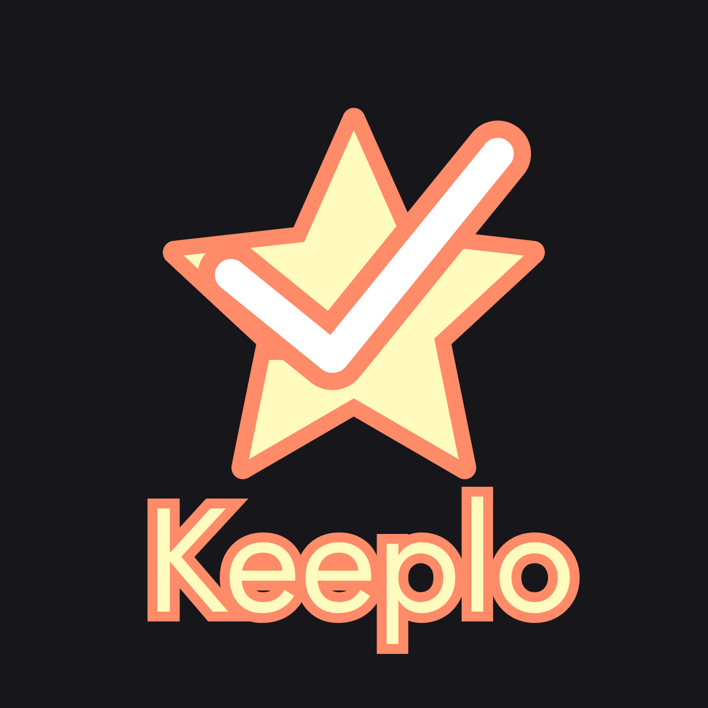
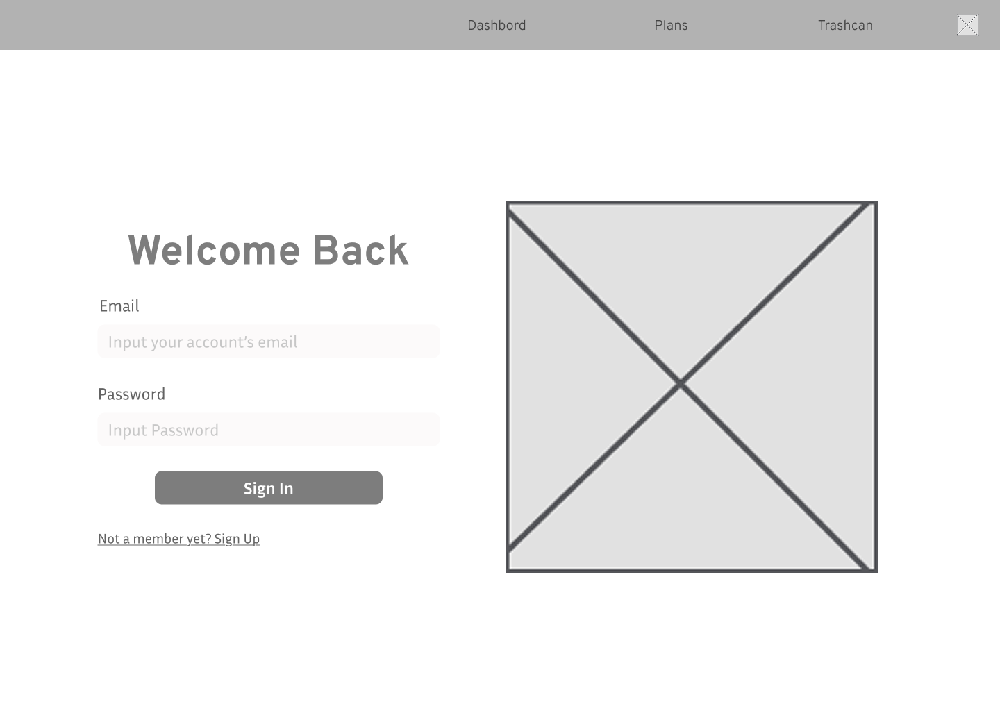
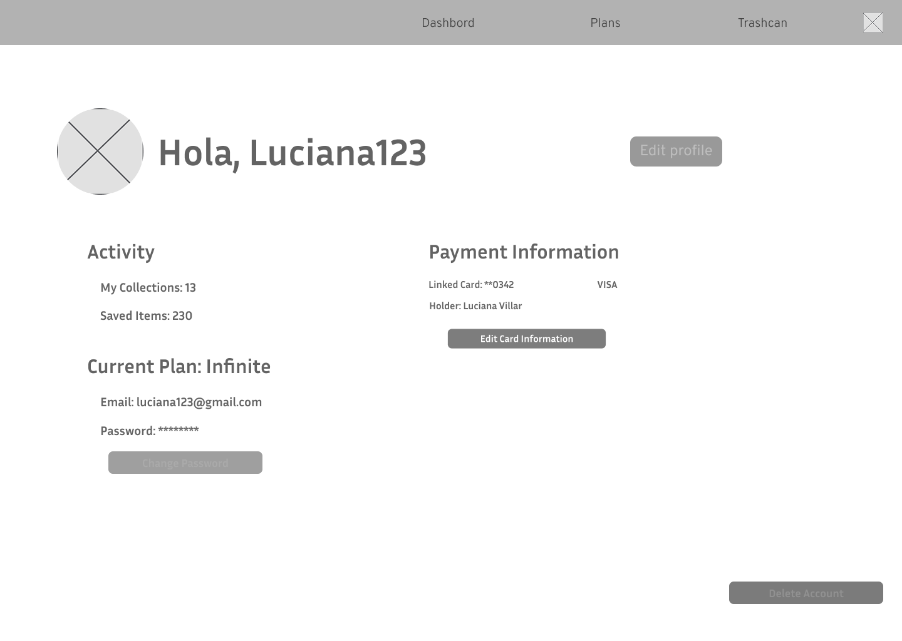
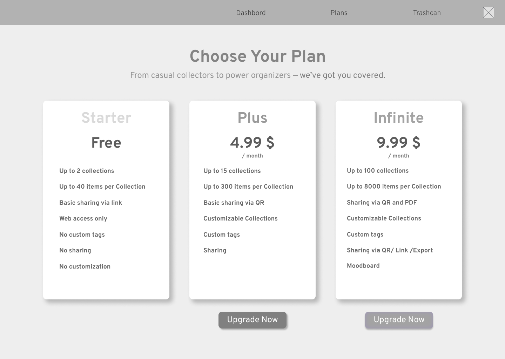
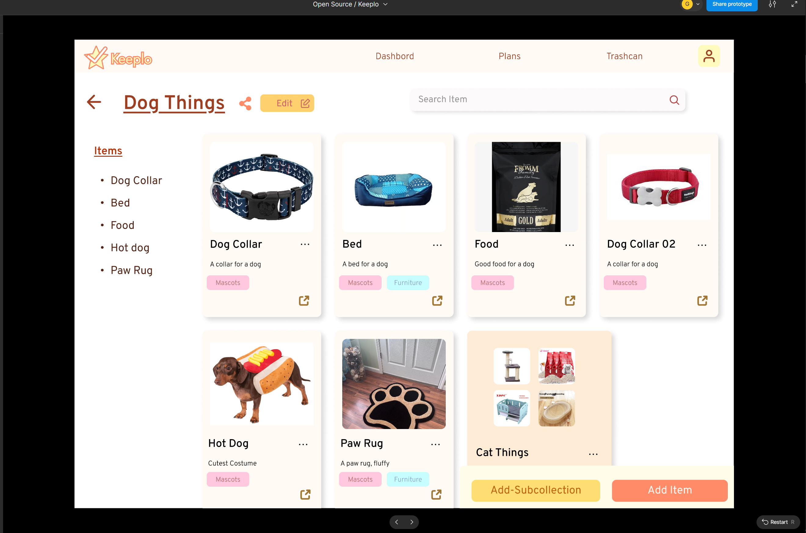
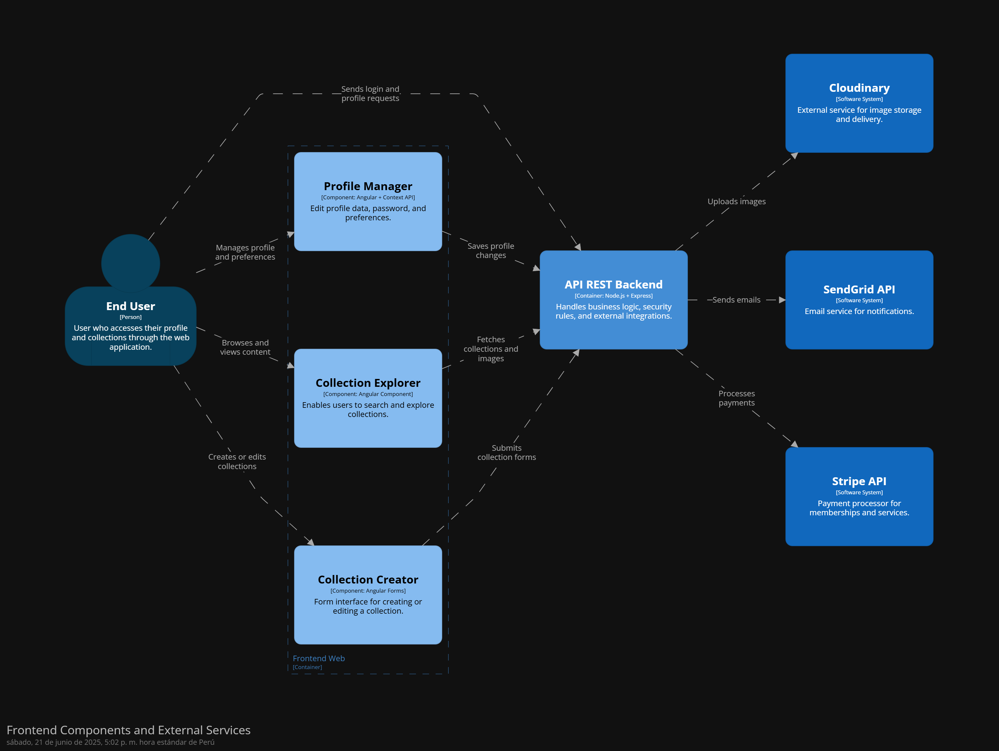
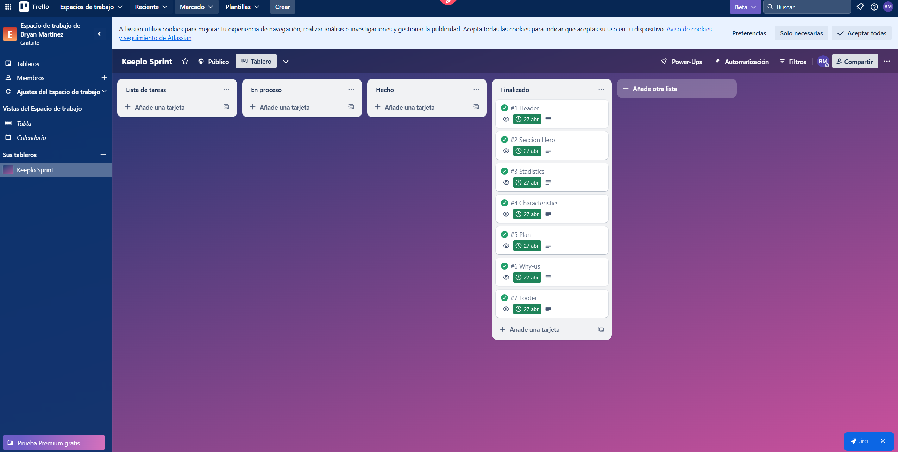
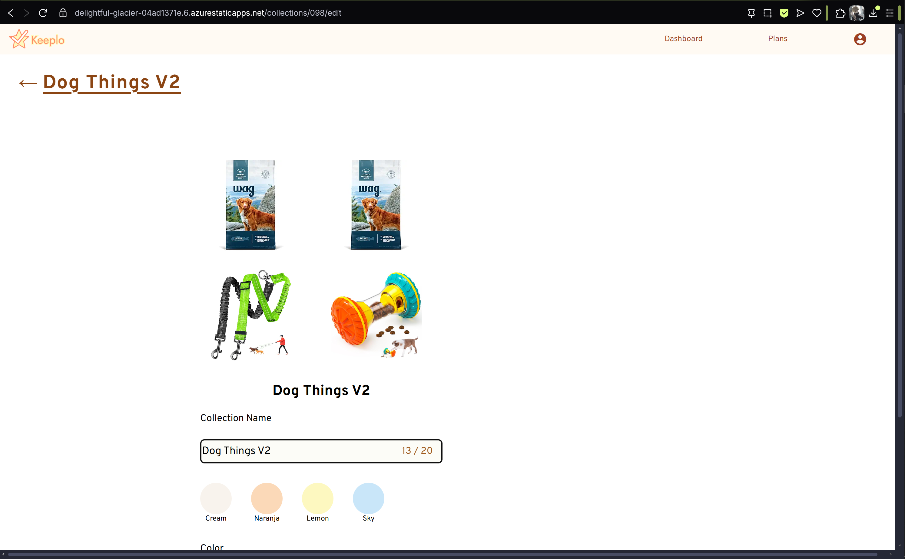
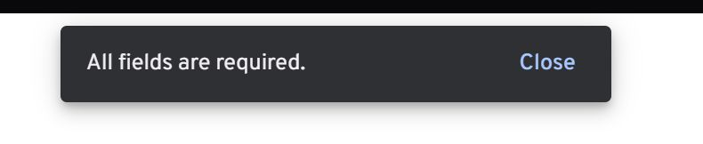
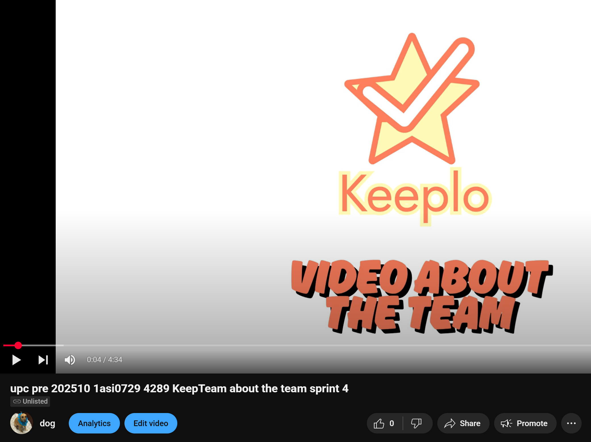

<h1 align="center">
  <strong style="font-size:25px;">Informe de Trabajo Final</strong>
</h1>

---

<p align="center"><strong>Universidad Peruana de Ciencias Aplicadas</strong></p>

<p align="center">
  
</p>

<p align="center">Ingenieria de Software</p>
<p align="center">5to ciclo</p>

---

<p align="center"><strong>Código: </strong>1ASI0729</p>
<p align="center"><strong>Curso:</strong> Desarrollo de Aplicaciones Open Source</p>
<p align="center"><strong>Sección:</strong> 4289</p>

<p align="center"><strong>Docente:</strong> Efraín Ricardo Bautista Ubillús</p>

<p align="center"><strong>StartUp: </strong>KeepTeam</p>
<p align="center"><strong>Proyecto:</strong> Keeplo</p>


## Integrantes:

<table align="center">
  <thead>
    <tr>
      <th>Nombres y Apellidos</th>
      <th>Código</th>
    </tr>
  </thead>
  <tbody>
    <tr><td>George Arturo Aliaga Pimentel</td><td>U20211c273</td></tr>
    <tr><td>Maria Elena Muñoz Machuca</td><td>U202317442</td></tr>
    <tr><td>Sanchez Gonzales</td><td>U202310609</td></tr>
  </tbody>
</table>


<p align="center">Junio 2025-1</p>


# Registro de Versiones del Informe

| Versión  | Fecha  | Autor                                                                             | Descripción de modificación |
| :---- | :---- |:----------------------------------------------------------------------------------| :---- |
| 1.0 | 25/04 | George Aliaga <br>Bryan Martinez <br>Maria Elena Muñoz <br>Luis Miguel Rojas <br>Sanchez Gonzales | Estructura del informe Capítulo I: Introducción <br>Capítulo II: Requirements Elicitation & Analysis <br>Capítulo III: Requirements Specification <br>Capítulo IV: Product Design <br>Capítulo V: Product Implementation & Deployment <br>Conclusiones <br>Recomendaciones <br>Anexos <br>Landing Page |
| 2.0 | 13/05 | George Aliaga <br>Maria Elena Muñoz <br>Sanchez Gonzales                                  | Corrección Diagramas <br>Corrección User Stories <br>Corrección Entrevistas <br>Corrección Sprint Planning <br>Corrección Repositorios <br>Sprint 2 <br>Conclusiones <br> Web Application


# Project Report Collaboration Insights


# Contenido

[Capítulo I: Introducción](#capítulo-i-introducción)
- [1.1. Startup Profile](#11-startup-profile)
  - [1.1.1. Descripción de la Startup](#111-descripción-de-la-startup)
  - [1.1.2. Perfiles de integrantes del equipo](#112-perfiles-de-integrantes-del-equipo)
- [1.2. Solution Profile](#12-solution-profile)
  - [1.2.1. Antecedentes y problemática](#121-antecedentes-y-problemática)
  - [1.2.2. Lean UX Process](#122-lean-ux-process)
    - [1.2.2.1. Lean UX Problem Statements](#1221-lean-ux-problem-statements)
    - [1.2.2.2. Lean UX Assumptions](#1222-lean-ux-assumptions)
    - [1.2.2.3. Lean UX Hypothesis Statements](#1223-lean-ux-hypothesis-statements)
    - [1.2.2.4. Lean UX Canvas](#1224-lean-ux-canvas)
- [1.3. Segmentos objetivo](#13-segmentos-objetivo)

[Capítulo II: Requirements Elicitation & Analysis](#capítulo-ii-requirements-elicitation--analysis)
- [2.1. Competidores](#21-competidores)
  - [2.1.1. Análisis competitivo](#211-análisis-competitivo)
  - [2.1.2. Estrategias y tácticas frente a competidores](#212-estrategias-y-tácticas-frente-a-competidores)
- [2.2. Entrevistas](#22-entrevistas)
  - [2.2.1. Diseño de entrevistas](#221-diseño-de-entrevistas)
  - [2.2.2. Registro de entrevistas](#222-registro-de-entrevistas)
  - [2.2.3. Análisis de entrevistas](#223-análisis-de-entrevistas)
- [2.3. Needfinding](#23-needfinding)
  - [2.3.1. User Personas](#231-user-personas)
  - [2.3.2. User Task Matrix](#232-user-task-matrix)
  - [2.3.3. User Journey Mapping](#233-user-journey-mapping)
  - [2.3.4. Empathy Mapping](#234-empathy-mapping)
  - [2.3.5. As-is Scenario Mapping](#235-as-is-scenario-mapping)
- [2.4. Ubiquitous Language](#24-ubiquitous-language)

[Capítulo III: Requirements Specification](#capítulo-iii-requirements-specification)
- [3.1. To-Be Scenario Mapping](#31-to-be-scenario-mapping)
- [3.2. User Stories](#32-user-stories)
- [3.3. Impact Mapping](#33-impact-mapping)
- [3.4. Product Backlog](#34-product-backlog)

[Capítulo IV: Product Design](#capítulo-iv-product-design)
- [4.1. Style Guidelines](#41-style-guidelines)
  - [4.1.1. General Style Guidelines](#411-general-style-guidelines)
  - [4.1.2. Web Style Guidelines](#412-web-style-guidelines)
- [4.2. Information Architecture](#42-information-architecture)
  - [4.2.1. Organization Systems](#421-organization-systems)
  - [4.2.2. Labeling Systems](#422-labeling-systems)
  - [4.2.3. SEO Tags and Meta Tags](#423-seo-tags-and-meta-tags)
  - [4.2.4. Searching Systems](#424-searching-systems)
  - [4.2.5. Navigation Systems](#425-navigation-systems)
- [4.3. Landing Page UI Design](#43-landing-page-ui-design)
  - [4.3.1. Landing Page Wireframe](#431-landing-page-wireframe)
  - [4.3.2. Landing Page Mock-up](#432-landing-page-mock-up)
- [4.4. Web Applications UX/UI Design](#44-web-applications-uxui-design)
  - [4.4.1. Web Applications Wireframes](#441-web-applications-wireframes)
  - [4.4.2. Web Applications Wireflow Diagrams](#442-web-applications-wireflow-diagrams)
  - [4.4.3. Web Applications Mock-ups](#443-web-applications-mock-ups)
  - [4.4.4. Web Applications User Flow Diagrams](#444-web-applications-user-flow-diagrams)
- [4.5. Web Applications Prototyping](#45-web-applications-prototyping)
- [4.6. Domain-Driven Software Architecture](#46-domain-driven-software-architecture)
  - [4.6.1. Software Architecture Context Diagram](#461-software-architecture-context-diagram)
  - [4.6.2. Software Architecture Container Diagrams](#462-software-architecture-container-diagrams)
  - [4.6.3. Software Architecture Components Diagrams](#463-software-architecture-components-diagrams)
- [4.7. Software Object-Oriented Design](#47-software-object-oriented-design)
  - [4.7.1. Class Diagrams](#471-class-diagrams)
  - [4.7.2. Class Dictionary](#472-class-dictionary)
- [4.8. Database Design](#48-database-design)
  - [4.8.1. Database Diagram](#481-database-diagram)
 
[Capítulo V: Product Implementation, Validation & Deployment](#capítulo-v-product-implementation-validation--deployment)
- [5.1. Software Configuration Management](#51-software-configuration-management)
  - [5.1.1. Software Development Environment Configuration](#511-software-development-environment-configuration)
  - [5.1.2. Source Code Management](#512-source-code-management)
  - [5.1.3. Source Code Style Guide & Conventions](#513-source-code-style-guide--conventions)
  - [5.1.4. Software Deployment Configuration](#514-software-deployment-configuration)
- [5.2. Landing Page, Services & Applications Implementation](#52-landing-page-services--applications-implementation)
  - [5.2.1. Sprint 1](#521-sprint-1)
    - [5.2.1.1. Sprint Planning 1](#5211-sprint-planning-1)
    - [5.2.1.2. Aspect Leaders and Collaborators](#5212-aspect-leaders-and-collaborators)
    - [5.2.1.3. Sprint Backlog 1](#5213-sprint-backlog-1)
    - [5.2.1.4. Development Evidence for Sprint Review](#5214-development-evidence-for-sprint-review)
    - [5.2.1.5. Execution Evidence for Sprint Review](#5215-execution-evidence-for-sprint-review)
    - [5.2.1.6. Services Documentation Evidence for Sprint Review](#5216-services-documentation-evidence-for-sprint-review)
    - [5.2.1.7. Software Deployment Evidence for Sprint Review](#5217-software-deployment-evidence-for-sprint-review)
    - [5.2.1.8. Team Collaboration Insights during Sprint](#5218-team-collaboration-insights-during-sprint)
  - [5.2.2. Sprint 2](#522-sprint-2)
    - [5.2.2.1. Sprint Planning 2](#5221-sprint-planning-2)
    - [5.2.2.2. Aspect Leaders and Collaborators](#5222-aspect-leaders-and-collaborators)
    - [5.2.2.3. Sprint Backlog 2](#5223-sprint-backlog-2)
    - [5.2.2.4. Development Evidence for Sprint Review](#5224-development-evidence-for-sprint-review)
    - [5.2.2.5. Execution Evidence for Sprint Review](#5225-execution-evidence-for-sprint-review)
    - [5.2.2.6. Services Documentation Evidence for Sprint Review](#5226-services-documentation-evidence-for-sprint-review)
    - [5.2.2.7. Software Deployment Evidence for Sprint Review](#5227-software-deployment-evidence-for-sprint-review)
    - [5.2.2.8. Team Collaboration Insights during Sprint](#5228-team-collaboration-insights-during-sprint)
  - [5.2.3 Sprint 3](#523-sprint-3)
    - [5.2.3.1 Sprint Planning 3](#5231-sprint-planning-3)
    - [5.2.3.2 Aspect Leaders and Collaborators](#5232-aspect-leaders-and-collaborators)
    - [5.2.3.3 Sprint Backlog 3](#5233-sprint-backlog-3)
    - [5.2.3.4 Development Evidence for Sprint Review](#5234-development-evidence-for-sprint-review)
    - [5.2.3.5 Execution Evidence for Sprint Review](#5235-execution-evidence-for-sprint-review)
    - [5.2.3.6 Services Documentation Evidence for Sprint Review](#5236-services-documentation-evidence-for-sprint-review)
    - [5.2.3.7 Software Deployment Evidence for Sprint Review](#5237-software-deployment-evidence-for-sprint-review)
    - [5.2.3.8 Team Collaboration Insights during Sprint](#5238-team-collaboration-insights-during-sprint)
- [5.3 Validation Interviews](#53-validation-interviews)
  - [5.3.1 Diseño de Entrevistas](#531-diseño-de-entrevistas)
   - [5.3.2 Registro de Entrevistas](#532-registro-de-entrevistas)
  - [5.3.3 Evaluaciones según heurísticas (2 problemas)](#533-evaluaciones-según-heurísticas-2-problemas)
- [5.4 Video About-the-Product](#54-video-about-the-product)
  
[6. Conclusiones](#6-conclusiones)

[7. Video About the Team](#7-video-about-the-team)

[8. Recomendaciones](#8-recomendaciones)

[9. Bibliografía](#9-bibliografía)

[10. Anexos](#10-anexos)

TB1

| Integrante | Tareas Asignadas |
| :---- | :---- |
| Sanchez Gonzales | 1.2.2 Lean UX Process.  1.2.2.1. Lean UX Problem Statements. 1.2.2.2. Lean UX Assumptions.  1.2.2.3. Lean UX Hypothesis Statements.  1.2.2.4. Lean UX Canvas.  1.3. Segmentos objetivos. 2.2.1. Diseño de entrevistas. 2.3.1. User Personas.  2.3.2. User Task Matrix.  4.1. Style Guidelines.  4.3. Landing Page UI Design. 4.4.1. Web Applications Wireframes.   4.4.2. Web Applications Wireflow Diagrams.   4.4.2. Web Applications Mock-ups.  4.5. Web Applications Prototyping. Recomendaciones |
| George Arturo Aliaga Pimentel | 1.2.1 Antecedentes y problemática 2.3.3. User Journey Mapping.  2.3.4. Empathy Mapping.  2.3.5. As-is Scenario Mapping 3.2. User Stories.  3.3. Impact Mapping 4.7.1. Class Diagrams. 5.1.1. Software Development Environment Configuration.  5.1.2. Source Code Management.  5.1.3. Source Code Style Guide & Conventions  |
| Bryan Felix Martinez Ramos | 1.1.1. Descripción de la Startup 2.1.1. Análisis competitivo.  2.1.2. Estrategias y tácticas frente a competidores. 2.3. Needfinding 2.4. Ubiquitous Language 4.2.3. SEO Tags and Meta Tags  4.2.4. Searching Systems.  4.2.5. Navigation Systems 4.7.2. Class Dictionary 5.2.1.2. Aspect Leaders and Collaborators.  5.2.1.3. Sprint Backlog 1\. Conclusiones |
| Maria Elena Muñoz Machuca | 4.2.1. Organization Systems. 4.2.2. Labeling Systems.  4.8.1. Database Diagram 5.1.4. Software Deployment Configuration 5.2.1. Sprint 1  5.2.1.1. Sprint Planning 1 5.2.1.4. Development Evidence for Sprint Review 5.2.1.8. Team Collaboration Insights during Sprint |
| Luis Miguel Rojas Piñero | 2.2.2. Registro de entrevistas. 2.2.3. Análisis de entrevistas. 3.1. To-Be Scenario Mapping.  3.2. User Stories. 3.4. Product Backlog 4.4.3. Web Applications User Flow Diagrams 4.6.1. Software Architecture Context Diagram.  4.6.2. Software Architecture Container Diagrams.  4.6.3. Software Architecture Components Diagrams.  5.2.1.5. Execution Evidence for Sprint Review.  5.2.1.6. Services Documentation Evidence for Sprint Review.  5.2.1.7. Software Deployment Evidence for Sprint Review.  |

TP1

| Integrante       | Tareas Asignadas                                                                                               |
|:-----------------|:---------------------------------------------------------------------------------------------------------------|
| Sanchez Gonzales | Sprint Backlog 2 <br> Correcciones de TB1 <br>Desarrollo de Web Application                                    |
| Maria Muñoz      | Execution Evidence <br>Services Documentation <br>Conclusiones<br>Desarrollo de Web Application                |
| George Aliaga    | Sprint Planning 2<br>Aspect Leaders and Collaborators<br>Development Evidence<br>Desarrollo de Web Application |

# Student Outcome

| Criterio específico | Acciones realizadas  | Conclusiones  |
| :---- |:---|:------|
| Comunica oralmente con efectividad a diferentes rangos de audiencia. | **Sanchez Gonzales** <br>TB1<br> Durante el desarrollo del TB1 realicé las siguientes actividades: Lean UX Process, Lean UX Problem Statements, Lean UX Assumptions, Lean UX Hypothesis Statements, Lean UX Canvas, Segmentos objetivos, Diseño de entrevistas, User Personas, User Task Matrix, Style Guidelines, Landing Page UI Design, Web Applications Wireframes, Web Applications Wireflow Diagrams, Web Applications Mock-ups, Web Applications Prototyping, Recomendaciones Programación de landing page.<br>**Sanchez Gonzales** <br>TP1<br>Durante el TP1 realice el Sprint Backlog 2 en conjunto con elDesarrollo de la Web Application <br><br>**Rojas Piñero** <br>TB1<br> Durante el desarrollo del TB1 realicé las siguientes actividades: Registro de entrevistas, Análisis de entrevistas, To-Be Scenario Mapping, User Stories, Product Backlog, Web Applications User Flow Diagrams, Software Architecture Context Diagram, Software Architecture Container Diagrams, Software Architecture Components Diagrams, Execution Evidence for Sprint Review, Services Documentation Evidence for Sprint Review, Software Deployment Evidence for Sprint Review, header para la landing page. <br><br>**George Aliaga** <br>TB1<br> Durante el desarrollo del TB1 realicé las siguientes actividades: Antecedentes y problemática, User Journey Mapping, Empathy Mapping, As-is Scenario Mapping, User Stories, Impact Mapping, Class Diagrams, Software Development Environment Configuration, Source Code Management, Source Code Style Guide & Conventions. <br>George Aliaga<br>TP1<br>Durante el desarrollo de la TP1 realicé mis partes correspondientes del front-web como tambien el Execution Evidence for Sprint Review y los Services Documentation Evidence for Sprint Revie<br><br> <br><br>**Bryan Martinez** <br>TB1<br> Durante el desarrollo de la TB1 realicé las siguientes actividades: Descripción de la Startup, Análisis de competidores,Estrategias y tácticas frente a competidores,Needfinding,Ubiquitous Language,SEO tags and Meta Tags, Searching Systems,Navigation system,Class Dictionary,Aspect Leaders and Collaborators, Sprint Backblog 1, Avance de conclusiones. <br><br>**Maria Elena Muñoz Machuca** <br>TB1<br> A lo largo del desarrollo de la TB1 he desarrollado: organization systems, el labelling systems, database diagram, software deployment configuration, sprint 1, sprint planning, development evidence for sprint review y team collaboration insights during sprint y sección characteristics y why us del landing page.<br>TP1<br>A lo largo del TP desarrollé Sprint planning 2, Aspect leaders collaboration, Development evidence for sprint review, Feature user-authentication del frontweb y corrección del diagrama de base de datos.                                                   | **Sanchez Gonzales** <br>TB1<br> Al realizar estas actividades, en especial Segmentos objetivos, Landing Page UI Design y Web Applications demostré mi capacidad para comunicar ideas de diseño y desarrollo de forma clara y estructurada, adaptando mi lenguaje según el perfil del usuario dependiendo de sus necesidades y problemas. Esto me permitió transmitir con efectividad conceptos técnicos y de experiencia de usuario a diferentes audiencias puesto que tenía que usar un lenguaje que se pueda entender para todos al exponer estas secciones dentro del video de este TB. <br>**Sanchez Gonzales** <br>TP1<br>Durante el TP1, lideré la organización del Sprint Backlog 2, asignando tareas según las habilidades del equipo. Me comuniqué oralmente de forma efectiva con mis compañeros y colaboré activamente para lograr los objetivos del equipo. <br><br>**Rojas Piñero** <br>TB1<br> En el desarrollo de actividades como Registro de entrevistas siento que mostré mi habilidad comunicativa al contarle a nuevas personas sobre nuestro proyecto. En actividades como User Flow Diagrams o To-Be Scenario Mapping, utilice mi capacidad de imaginar escenarios relacionados con el proyecto. Y en actividades como las User Stories y el Product Backlog pude poner en práctica mi análisis de requerimientos. <br><br>**George Aliaga** <br>TB1<br> En el desarrollo de actividades como Antecedentes y problemática sentí que demostré mi capacidad de comprensión y síntesis al analizar el contexto del proyecto. En actividades como Empathy Mapping, User Journey Mapping y As-is Scenario Mapping, pude aplicar mi empatía e imaginación para representar las experiencias reales de los usuarios. Y en actividades como User Stories, Impact Mapping y los Class Diagrams, logré poner en práctica mis habilidades de análisis y estructuración de requerimientos. Además, al trabajar en la configuración del entorno de desarrollo, la gestión del código fuente y la guía de estilos, reforcé mi atención al detalle y buenas prácticas de desarrollo.  <br>TP1<br>Durante el desarrollo de la TP1, mi enfoque principal en el front-web de Keeplo me permitió contribuir directamente a la experiencia del usuario a través de la implementación de funcionalidades clave como la visualización de colecciones y las opciones de compartir (enlace y QR). Mi trabajo en conjunto con el equipo para asegurar la correcta ejecución de estas características y la documentación del sprint demuestran mi capacidad para colaborar eficazmente y comunicar el progreso del desarrollo de manera clara.<br> <br><br>**Bryan Martinez** <br>TB1<br> En el desarrollo de actividades como las entrevistas para Needfinding, demostré mi habilidad comunicativa al explicar de forma clara y atractiva nuestro proyecto a distintas personas. Durante la presentación de la sección de competidores y estrategias, utilicé un lenguaje adaptado al público para asegurar que se comprendiera tanto el análisis como nuestras acciones futuras. Además, al exponer temas técnicos como el Ubiquitous Language, el Class Dictionary y el Navigation System, empleé una comunicación precisa y estructurada para facilitar la comprensión entre diferentes perfiles del equipo. Finalmente, en la exposición del Sprint Backlog 1 y el avance de conclusiones, combiné un lenguaje técnico y accesible para transmitir de manera efectiva los avances a todos los involucrados en el proyecto. <br><br>**Maria Elena Muñoz Machuca** <br>TB1<br> Al realizar las actividades de organization system, labelling system y la implementación de las secciones why us y characteristics de la landing page demostré mi lenguaje y forma de comunicar los avances del proyecto, asegurándome de que todos los participantes, independientemente de su rol, comprendieran los logros y decisiones tomadas. Estas experiencias evidencian mi capacidad para comunicarme con claridad y eficacia en diversos contextos y niveles de audiencia.<br>TP1 <br> Durante el TP fui encargada de desarrollar el feature de user authentication que se encarga de el ingreso a la pagina, su registro y editar su perfil. Me comuniqué oralmente con mis compañeros para resolver algunas dudas y poder colaborar y mejorar en mi feature correspondiente. |
| Comunica por escrito con efectividad a diferentes rangos de audiencia | **Sanchez Gonzales** <br>TB1<br> Durante el desarrollo del TB1 realicé las siguientes actividades: Lean UX Process, Lean UX Problem Statements, Lean UX Assumptions, Lean UX Hypothesis Statements, Lean UX Canvas, Segmentos objetivos, Diseño de entrevistas, User Personas, User Task Matrix, Style Guidelines, Landing Page UI Design, Web Applications Wireframes, Web Applications Wireflow Diagrams, Web Applications Mock-ups, Web Applications Prototyping, Recomendaciones Programación de landing page.<br>**Sanchez Gonzales** <br>TP1<br>Durante el TP1 realice el Sprint Backlog 2 en conjunto con elDesarrollo de la Web Application <br><br>**Rojas Piñero** <br>TB1<br> Durante el desarrollo del TB1 realicé las siguientes actividades: Registro de entrevistas, Análisis de entrevistas, To-Be Scenario Mapping, User Stories, Product Backlog, Web Applications User Flow Diagrams, Software Architecture Context Diagram, Software Architecture Container Diagrams, Software Architecture Components Diagrams, Execution Evidence for Sprint Review, Services Documentation Evidence for Sprint Review, Software Deployment Evidence for Sprint Review, header para la landing page. <br><br>**George Aliaga** <br>TB1<br> Durante el desarrollo del TB1 realicé las siguientes actividades: Antecedentes y problemática, User Journey Mapping, Empathy Mapping, As-is Scenario Mapping, User Stories, Impact Mapping, Class Diagrams, Software Development Environment Configuration, Source Code Management, Source Code Style Guide & Conventions. <br>George Aliaga<br>TP1<br>Durante el desarrollo de la TP1 realicé mis partes correspondientes del front-web como tambien el Execution Evidence for Sprint Review y los Services Documentation Evidence for Sprint Revie<br><br> <br><br>**Bryan Martinez** <br>TB1<br> Durante el desarrollo de la TB1 realicé las siguientes actividades: Descripción de la Startup, Análisis de competidores,Estrategias y tácticas frente a competidores,Needfinding,Ubiquitous Language,SEO tags and Meta Tags, Searching Systems,Navigation system,Class Dictionary,Aspect Leaders and Collaborators, Sprint Backblog 1, Avance de conclusiones. <br><br>**Maria Elena Muñoz Machuca** <br>TB1<br> A lo largo del desarrollo de la TB1 he desarrollado: organization systems, el labelling systems, database diagram, software deployment configuration, sprint 1, sprint planning, development evidence for sprint review y team collaboration insights during sprint y sección characteristics y why us del landing page.<br>TP<br> A lo largo del TP desarrollé Sprint planning 2, Aspect leaders collaboration, Development evidence for sprint review, Feature user-authentication del frontweb y corrección del diagrama de base de datos.                                                   | **Sanchez Gonzales** <br>TB1<br> A través de la documentación detallada que tuve que utilizar para cada actividad, logré comunicar por escrito de manera clara y precisa, adaptando el nivel de complejidad según el público objetivo que iba a leer cada sección. Utilizando términos complejos para describir secciones técnicas y términos fáciles de entender para secciones como UX/UI pensando que estas van a un público que no cuenta con un conocimiento en esos términos.<br>**Sanchez Gonzales** <br>TP1<br>Durante el TP1, me encargué de documentar el Sprint Backlog 2 y los avances del equipo. Me aseguré de redactar con claridad y adecuación para que tanto mis compañeros como los docentes pudieran entender el progreso y las tareas realizadas. <br><br>**Rojas Piñero** <br>TB1<br> En el desarrollo de este proyecto tuve que aplicar mis habilidades de comunicación en el contexto requerido logrando implementar lenguaje más técnico si así era necesario para comunicarme con mis compañeros de grupo. De igual manera identificando un contexto en el cual las secciones de trabajo fueran dirigidas al público/usuarios debía implementar otro tipo de expresiones o lenguaje más claro de entender para ellos. <br><br>**George Aliaga** <br>TB1<br> En el desarrollo de las distintas actividades, me aseguré de adaptar mi forma de comunicar según el propósito y el público de cada documento. Al trabajar en tareas técnicas como los Class Diagrams, la configuración del entorno de desarrollo y la gestión del código fuente, empleé un lenguaje preciso y especializado para mantener la claridad técnica. Por otro lado, en actividades centradas en la experiencia del usuario como el Empathy Mapping, el User Journey Mapping y el As-is Scenario Mapping, utilicé una redacción más sencilla y cercana, con el objetivo de que cualquier persona, sin necesidad de conocimientos técnicos, pudiera comprender fácilmente la información presentada. <br>TP1<br>Al haber implementado la visualización de colecciones y las funcionalidades de compartir (enlace y QR) en el front-web de Keeplo, he demostrado mi capacidad para desarrollar características interactivas y centradas en el usuario. Mi colaboración con el equipo para la correcta ejecución y la documentación del sprint reflejan mi habilidad para contribuir al proyecto de manera efectiva y comunicar los avances de forma clara.<br> <br><br>**Bryan Martinez** <br>TB1<br> En el desarrollo de la TB1 y al realizar esta actividades he demostrado habilidades de redacción de documentación técnica que explica claramente las decisiones tomadas y los procesos utilizados, facilitando la comprensión tanto para miembros técnicos como para aquellos sin experiencia técnica. Por otro lado, en las evidencias presentadas para las revisiones del sprint, redacté informes estructurados y claros que permitieron a todos los integrantes del proyecto entender los avances y resultados obtenidos, independientemente de su rol. Estas experiencias reflejan mi capacidad para comunicar ideas y conceptos de manera precisa y adaptada a diversos contextos y niveles de audiencia. <br><br>**Maria Elena Muñoz Machuca** <br>TB1<br> Al haber redactado el organization systems, labelling system y sprint planning he demostrado habilidades de redacción de documentación técnica que explica claramente las decisiones tomadas y los procesos utilizados. Estas experiencias reflejan mi capacidad para comunicar ideas y conceptos de manera precisa y adaptada a diversos contextos y niveles de audiencia.  <br>TP<br>  Durante el TP, me encargue de documentar el sprint planning  2, esto nos ayudo a mantener los objetivos claros y poder organizarnos de la mejor manera. Asimismo, los aspect leader collaborations que nos permitieron reconocer en que aspectos cada integrante tenia más participación. Y finalmente el development evidence review que nos permitía ver las evidencias de el aporte de cada integrante. Me aseguré de redactar y plasmar estas evidencias para que mis compañeros puedan organizarse mejor y los docentes puedan evidenciar el trabajo colaborativo.                                          |

# Capítulo I: Introducción   
## 1.1. Startup Profile
### 1.1.1. Descripción de la Startup
Somos Keeplo, un equipo de estudiantes de la universidad peruana de ciencias aplicadas, enfocado en desarrollar soluciones digitales que simplifiquen la organización de ideas, referencias y descubrimientos personales. Inspirados por la combinación de “keep” y “portfolio”, buscamos ofrecer a los usuarios una experiencia intuitiva y versátil para gestionar sus intereses cotidianos.
Nuestra misión es brindar una herramienta práctica y visualmente atractiva que permita a cualquier persona guardar, organizar y compartir elementos de interés, como productos, ideas y más, en colecciones personalizadas y fácilmente accesibles.
Nuestra visión es posicionarnos como la aplicación líder en organización personal en Latinoamérica, facilitando a nuestros usuarios la creación de catálogos digitales que se adapten a sus estilos de vida, proyectos creativos o rutinas profesionales.
Nuestro producto principal es Keeplo, una aplicación que permite a los usuarios guardar cualquier elemento que deseen en colecciones personalizadas. Cada ítem puede contener un nombre, una descripción, una imagen, un enlace web y puede ser compartido mediante un código QR y enlace. Esta funcionalidad permite no solo la organización personal, sino también la difusión rápida y efectiva de ideas, listas o recomendaciones entre amigos, colegas o comunidades.
Keeplo no solo ayuda a las personas a tener un espacio centralizado para sus intereses, sino que también promueve la creatividad, la planificación y el intercambio de contenido valioso. Es ideal para estudiantes, profesionales, creadores de contenido o cualquier persona que busque capturar y dar seguimiento a lo que les inspira o necesitan recordar.


### 1.1.2. Perfiles de integrantes del equipo
#### 1.1.2.1 Sanchez Gonzales
Soy estudiante en la Universidad Peruana de Ciencias Aplicadas (UPC) cursando el 5to ciclo de la carrera de Ingeniería de Software. Soy una persona comprometida con mi desarrollo académico y profesional. Con esa responsabilidad, aspiro a proveer soluciones tecnológicas a aquellos que las requieran para facilitar su área de trabajo. Junto con mi equipo de trabajo tendré la oportunidad de poner mis conocimientos y habilidades en uso con el proyecto “Keeplo” con el fin de disminuir la problemática identificada.


#### 1.1.2.2 Aliaga Pimentel George Arturo
Soy estudiante en la Universidad Peruana de Ciencias Aplicadas y soy de la carrera de Ingeniería de Software. Me considero una persona cooperativa y responsable, lo cual es requerido para un proyecto grupal. Junto a mis compañeros de grupo espero desarrollar un buen proyecto con las tecnologías que se aprenderán dentro del curso


#### 1.1.2.3 Martinez Ramos Bryan Felix
Soy estudiante de la Universidad Peruana de Ciencias aplicadas, UPC, de la carrera de ingeniería de Software, actualmente estoy en el quinto ciclo de carrera, soy una persona muy proactiva, además de colaborativa, soy responsable con los trabajos y tiempos de entrega durante los proyectos, me emociona mucho el curso y la realización de manera exitosa del proyecto Keeplo


#### 1.1.2.4 Muñoz Machuca Maria Elena
Soy estudiante de la Universidad Peruana de Ciencias Aplicadas (UPC) y soy de la carrera de Ingeniería de Software cursando el quinto ciclo de la carrera. Me considero una persona responsable, ya que me gusta cumplir con las tareas encargadas. Asimismo, me considero perseverante, lo cual es importante para ir mejorando en cada entrega de nuestro proyecto. Junto a mis compañeros espero poder realizar nuestro proyecto con éxito.


#### 1.1.2.4 Rojas Piñero Luis Miguel
Soy estudiante de la Universidad Peruana de Ciencias Aplicadas de la carrera de Ingeniería de Software, actualmente estoy cursando mi 5to ciclo de la carrera y tengo expectativas de los cursos que llevo y lo que puedo lograr con mi esfuerzo. Me considero una persona que se desenvuelve bien trabajando en grupos ya que soy muy comunicativo con mis compañeros, de igual forma me motivan los proyectos actuales relacionados con el desarrollo de tecnologías útiles para el futuro. Junto a mi equipo estoy seguro de que lograremos realizar un gran proyecto este ciclo.


## 1.2. Solution Profile

### 1.2.1. Antecedentes y problemática

### What (¿Qué?)
La forma en que los usuarios guardan ideas o productos de interés está fragmentada entre notas del celular, capturas de pantalla y apps de tiendas específicas. Esta dispersión complica la organización y el seguimiento de deseos personales o futuros planes de compra. La incorporación de funcionalidades como listas de deseos digitales mejora significativamente la experiencia del usuario al permitirle guardar lo que le interesa para revisarlo más adelante, sin repetir búsquedas ni perder tiempo navegando (Sell Emprendepyme, 2023).

### Who (¿Quién?)
Este problema afecta principalmente a personas jóvenes y adultas que utilizan tecnología de manera cotidiana, en especial usuarios activos en redes sociales y plataformas de comercio electrónico. También impacta a quienes valoran la productividad y desean integrar herramientas como asistentes virtuales (Alexa, Google Assistant) para facilitar la gestión de sus intereses y decisiones de compra.

### Where (¿Dónde?)
La problemática se manifiesta sobre todo en contextos urbanos y digitalizados, donde existe un alto acceso a smartphones e internet. En estas zonas, los usuarios están expuestos a gran cantidad de información y productos, lo que aumenta la necesidad de herramientas eficientes que les permitan organizar y retomar decisiones en cualquier momento.

### When (¿Cuándo?)
Esta necesidad se ha intensificado desde la pandemia de COVID-19, momento en el que muchas personas empezaron a digitalizar sus rutinas y a depender más de herramientas móviles para planificar, comprar y tomar decisiones. La cantidad de estímulos visuales, ofertas y opciones en línea ha hecho más difícil la toma de decisiones rápida y eficaz.

### Why (¿Por qué?)
La falta de plataformas integradas que permitan agregar ítems desde diferentes canales, personalizar colecciones y utilizar herramientas modernas como escaneo QR o comandos de voz, limita la funcionalidad de las apps actuales. Además, tecnologías como el Internet de las Cosas (IoT) ofrecen posibilidades para conectar dispositivos y facilitar tareas cotidianas, pero su integración en este tipo de soluciones aún es limitada. Estas tecnologías, al ser bien implementadas, pueden mejorar significativamente la calidad de vida del usuario al automatizar procesos y facilitar la interacción con su entorno digital (Salinas Anaya et al., 2022).

### How (¿Cómo?)
Actualmente, los usuarios deben utilizar múltiples medios para guardar lo que desean: apps de notas, listas en papel o mensajes a sí mismos. Esta falta de unificación no solo reduce la eficiencia, sino que también impide compartir fácilmente listas con otras personas o retomarlas desde diferentes dispositivos. La ausencia de funcionalidades modernas como el agregado por voz o la organización inteligente limita el potencial de las herramientas existentes.

### How much (¿Cuánto?)
El impacto es funcional, emocional y económico. Los usuarios pierden tiempo y energía reubicando información o tomando decisiones de compra repetidas veces. Desde una perspectiva de negocio, esta brecha representa una oportunidad clara para monetizar a través de modelos freemium, mejorar la fidelización y aumentar el tiempo de navegación en plataformas digitales.


### 1.2.2. Lean UX Process

#### 1.2.2.1. Lean UX Problem Statements
Nuestra solución busca proveer al usuario con una organización de sus “Wishes” o cosas que desea a través de categorías y colecciones personalizables. Buscamos que los usuarios no sufran al tener que buscar entre diferentes plataformas un producto en concreto, facilitando exponencialmente el tiempo de búsqueda al categorizarlas tal y como el usuario prefiera, en especial, cuando este es un contenido que se desea compartir con un público como amigos y familiares, en el cual, al ser compartido a través de un código QR facilita la navegación para los observadores.
Hemos observado que nuestros usuarios al no tener una plataforma en la cual puedan organizar correctamente los links, productos, diseños u otros objetos digitales de interés, tienen un problema al poder estructurar el contenido y guardarlo en un solo lugar, causando que a través de diferentes plataformas guarden sus diferentes recursos, causando además un desorden e incluso pérdida de algunos de estos.
¿Cómo podemos ofrecer un modelo de estructuración para que los usuarios puedan guardar sus ideas de forma organizada?
Hemos notado que los usuarios desean compartir ideas con otros usuarios externos, ya sean amigos, familiares o colegas del trabajo, con el fin de distribuir un conjunto de ideas a la vez. Esta necesidad se presencia normalmente en trabajos o proyectos colaborativos donde el usuario requiere compartir una idea general hecha a partir de pequeños recursos encontrados en el internet.
¿Cómo podemos crear una aplicación que mejore la eficiencia de colaboración entre usuarios?
Hemos notado que las plataformas que usan los usuarios para guardar contenido, no están diseñadas hacia esa función, tienen un diseño poco atractivo y cuentan con interfaces poco intuitivas o limitan las acciones que se pueden realizar dentro de la misma para algunos usuarios.
¿Cómo podemos diseñar una aplicación que sea intuitiva y fácil de usar?

#### 1.2.2.2. Lean UX Assumptions
Los usuarios desean guardar cosas distintas del internet en un solo lugar
Los usuarios valoran un sistema de organización personalizada, donde tengan el control de cómo se ordenan las cosas
Los usuarios estan familiriaziados con el uso de links y QR’s
Los usuarios constantemente están encontrando nuevos items en internet
Los usuarios están dispuestos a pagar por un servicio que les ayude a organizar sus ideas e items
#### 1.2.2.3. Lean UX Hypothesis Statements
##### Hypothesis 1
Creemos que los usuarios necesitan de una plataforma para guardar y organizar diversos ítems de internet que requieran usar en un futuro, puesto que sus actuales métodos de organización están dispersos a través de diferentes aplicaciones. Sabremos que estamos en lo correcto cuando más usuarios usen más la aplicación diariamente en un 30% y tengamos reseñas positivas.
##### Hypothesis 2
Creemos que aumentará la organización de los usuarios sobre sus ítems guardados porque tendrán acceso a una estructura adecuada y fácil de usar, por ende mejorando el orden de sus colecciones. Sabremos que estamos en lo correcto cuando el tiempo de búsqueda de un ítem en específico disminuya en un 40%.
##### Hypothesis 3
Creemos  que los usuarios valorarán la forma rápida y eficiente que ofrece la plataforma al momento de compartir sus colecciones con otros usuarios o personas externas a través de un QR pues es una forma mas rapida y limpia que copiar un enlace. Sabremos que estamos en lo correcto cuando la cantidad de usuarios que comparten sus colecciones aumentarán en un 30%
##### Hypothesis 4
Creemos que al ofrecer un filtro a través de palabras claves o etiquetas mejorará la organización y la búsqueda de los usuarios hacia sus ítems puesto que podrán clasificar colecciones entre sí. Sabremos que estamos en lo correcto cuando alrededor de un 40% de nuestros usuarios usen las etiquetas para clasificar sus colecciones.

#### 1.2.2.4. Lean UX Canvas
| Business Problem | Solution Ideas | Business Outcomes |
| :---- | :---- | :---- |
| Nuestra solución busca proveer al usuario con una organización de sus items que desea a través de categorías y colecciones personalizables. Buscamos que los usuarios no sufran al tener que buscar entre diferentes plataformas un producto en concreto, facilitando exponencialmente el tiempo de búsqueda al categorizarlas tal y como el usuario prefiera, en especial, cuando este es un contenido que se desea compartir con un público como amigos y familiares, en el cual, al ser compartido a través de un código QR facilita la navegación para los observadores. Hemos observado que nuestros usuarios al no tener una plataforma en la cual puedan organizar correctamente los links, productos, diseños u otros objetos digitales de interés, tienen un problema al poder estructurar el contenido y guardarlo en un solo lugar, causando que a través de diferentes plataformas guarden sus diferentes recursos, causando además un desorden e incluso pérdida de algunos de estos. <br>¿Cómo podemos ofrecer un modelo de estructuración para que los usuarios puedan guardar sus ideas de forma organizada? <br><br>Hemos notado que los usuarios desean compartir ideas con otros usuarios externos, ya sean amigos, familiares o colegas del trabajo, con el fin de distribuir un conjunto de ideas a la vez. Esta necesidad se presencia normalmente en trabajos o proyectos colaborativos donde el usuario requiere compartir una idea general hecha a partir de pequeños recursos encontrados en el internet. ¿Cómo podemos crear una aplicación que mejore la eficiencia de colaboración entre usuarios? Hemos notado que las plataformas que usan los usuarios para guardar contenido, no están diseñadas hacia esa función, tienen un diseño poco atractivo y cuentan con interfaces poco intuitivas o limitan las acciones que se pueden realizar dentro de la misma para algunos usuarios. <br>¿Cómo podemos diseñar una aplicación que sea intuitiva y fácil de usar? | • Crear un plataforma donde los usuarios puedan guardar sus ideas de cualquier tipo de ítem. <br><br>• Integrar un sistema de generación y lectura de QR para compartir colecciones con otros usuario. <br><br>• Permitir que los ítems tengan un nombre, imagen, descripción y enlace web para facilitar su referencia. Funciones de búsqueda por nombre o descripción |• Aumento en organización de ítems virtuales de los usuarios <br><br>• Más de 50 colecciones compartidas entre usuarios y externos semanalmente Retención de usuarios en un 50% después del primer mes <br><br>• Aumento de visibilidad de la plataforma en un 40% por los usuarios que la comparten  |
| Hypothesis | Users & Customers | User Benefits |
| • Creemos que los usuarios necesitan de una plataforma para guardar y organizar diversos ítems de internet que requieran usar en un futuro, puesto que sus actuales métodos de organización están dispersos a través de diferentes aplicaciones. Sabremos que estamos en lo correcto cuando más usuarios usen más la aplicación diariamente en un 30% y tengamos reseñas positivas. <br><br>• Creemos que aumentará la organización de los usuarios sobre sus ítems guardados porque tendrán acceso a una estructura adecuada y fácil de usar, por ende mejorando el orden de sus colecciones. Sabremos que estamos en lo correcto cuando el tiempo de búsqueda de un ítem en específico disminuya en un 40%. <br><br>• Creemos  que los usuarios valorarán la forma rápida y eficiente que ofrece la plataforma al momento de compartir sus colecciones con otros usuarios o personas externas a través de un QR pues es una forma mas rapida y limpia que copiar un enlace. Sabremos que estamos en lo correcto cuando la cantidad de usuarios que comparten sus colecciones aumentarán en un 30% <br><br>• Creemos que al ofrecer un filtro a través de palabras claves o etiquetas mejorará la organización y la búsqueda de los usuarios hacia sus ítems puesto que podrán clasificar colecciones entre sí. Sabremos que estamos en lo correcto cuando alrededor de un 40% de nuestros usuarios usen las etiquetas para clasificar sus colecciones. | • Diseñadores que necesiten guardar inspiraciones de diferentes páginas en un solo lugar <br><br>• Compradores de E-commerce  |  • Centralizar en un solo lugar ítems de interés fácilmente <br><br>• Categorizar colecciones de ítems para encontrarlos más rápido <br><br>• Mejorar la eficiencia de busqueda de algun item en específico para un proyecto o trabajo <br><br>• Compartir con usuarios externos como amigos o familiares una colección de interes <br><br>• Mejorar la productividad y bajar las probabilidades de pérdida de información. |
|  | What’s the most important thing we need to learn first?  | What’s the least amount of work we need to learn the next most important thing?    |
|  | • Crear colecciones personalizadas <br><br>• Agregar items a las colecciones <br><br>• Compartir colecciones mediante generación de QR Etiquetas o categorías de colecciones | • Diseñar de entrevista con preguntas concretas a una estadística <br><br>• Formulario de interés de la plataforma a usuarios |
## 1.3. Segmentos objetivo

### 1.3.1 Segmento 1: Diseñadores  
     
Los diseñadores diariamente necesitan recopilar referencias visuales e ideas que los ayude a mejorar sus trabajos, estas ideas se pueden encontrar esparcidas por todo el internet y necesitan poder tener un lugar para guardarlas todas e incluso presentarlas como un moodboard para sus clientes.  
     
   **Caracteristícas:**  
   - **Edad:** Mayor a 18 años  
   - **Ubicación:** Lima, Peru  
   - **Nivel Socioeconomico:** Medio a alto

   

### 1.3.2 Segmento 2: Compradores  
        
Los compradores buscan un lugar en el cual puedan guardar todos los objetos de interés que tienen de distintos marketplace en un solo lugar, ya sea para compararlos o usarlo como una lista de compra entre plataformas marketplace o e-commerce.  
        
  **Características:**  
  - **Edad:** Mayor a 18 años  
  - **Ubicación:** Lima, Peru  
  - **Nivel Socioeconomico:** Medio a alto

# Capítulo II: Requirements Elicitation & Analysis

## 2.1. Competidores

### 2.1.1. Análisis competitivo

| Competitive Analysis Landscape  |  |  |  |  |  |
| ----- | :---- | :---- | :---- | :---- | :---- |
| ¿Por qué llevar a cabo este análisis? |  Este análisis permite construir una visión más informada y competitiva del proyecto, aumentando sus probabilidades de éxito.|  |  |  |  |
|  |  | Keeplo <br>   | Pinterest  <br> | Notion <br>  | Raindrop.io  <br> |
|  Perfil | Overview | Aplicación que permite guardar y organizar cualquier tipo de elemento (productos, ideas, lugares, etc.) en colecciones personalizadas, con posibilidad de compartir mediante código QR. | Plataforma visual para descubrir, guardar y organizar ideas e inspiración en tableros. |  Herramienta todo-en-uno para tomar notas, planificar, colaborar y organizar información.  |  Gestor moderno de marcadores para guardar y organizar enlaces con etiquetas, colecciones visuales e integración con navegadores.  |
|  | Ventaja competitiva ¿Qué valor ofrece a los clientes?  | • Guarda cualquier tipo de contenido, organiza en colecciones personalizadas y comparte con QR fácilmente. <br><br>• Enfoque 100% personal y visual. |  Descubre y guarda ideas de otros usuarios; ideal para inspiración, no tanto para organización propia.  |  • Gestión integral de tareas, notas y bases de datos. Potente, pero compleja para uso casual.  | Organización avanzada de enlaces; ideal para profesionales que manejan muchos recursos web. |
| Perfil de Marketing | Mercado Objetivo | Jóvenes creativos, estudiantes y usuarios digitales que desean guardar, organizar y compartir ideas, productos o lugares de forma visual y personalizada. | Público general (mayoría mujeres 25–45 años), interesados en inspiración visual: moda, decoración, recetas, diseño, etc. | Estudiantes, profesionales y equipos que buscan una herramienta de productividad flexible y personalizable | Profesionales tech, diseñadores, marketers y usuarios intensivos de web que requieren guardar y categorizar muchos enlaces. |
|  | Estrategias de marketing | • Marketing en redes sociales (TikTok, Instagram), microinfluencers, campañas con QR físicos en universidades y eventos creativos. <br><br>• Enfoque en viralidad y comunidad. | • SEO visual, integración en buscadores, colaboración con creadores de contenido e influencers de nicho. <br><br>• Alta presencia en redes. | Marketing de contenido (blogs, YouTube), comunidad activa, embajadores estudiantiles, webinars y uso gratuito para estudiantes. | Presencia en foros y comunidades tech (Reddit, Product Hunt), extensiones de navegador y enfoque en early adopters. |
|  Perfil de productos | Productos & Servicios | • Aplicación que permite guardar productos, lugares, ideas, etc., organizados en colecciones personalizadas. <br><br>• Cada ítem puede tener nombre, descripción, imagen, enlace web y se puede compartir mediante código QR. |  Plataforma para descubrir y guardar imágenes o ideas en tableros temáticos. <br><br>• Recomendaciones visuales según intereses.  | Herramienta de productividad todo-en-uno: notas, bases de datos, tareas, wikis, colaboración en tiempo real. | Gestor de marcadores: guarda, organiza y etiqueta enlaces web; sincronización entre dispositivos y vista previa visual |
|  | Precios & Costos  | Se cuenta con 3 planes, siendo el primer plan Starter (gratis), el plan Plus (4.99$) y el plan infinity (9.99$)  | • Gratuito para usuarios. <br><br>• Genera ingresos mediante publicidad segmentada.  |  Plan gratuito con funciones básicas. Planes pagos desde $8/mes con funciones avanzadas.  | Plan gratuito limitado. Versión Pro a $3/mes con funciones premium (etiquetas, búsqueda avanzada, etc.). |
|  | Canales de distribución (Web y/o Móvil) | Web,aplicacion movil (iOS y Android). | Web, aplicación móvil (iOS y Android), extensión de navegador | Web, app de escritorio, app móvil (iOS y Android). | Web, extensión de navegador, app móvil (iOS y Android), app de escritorio.  |
|  Análisis SWOT | Fortalezas | • Simplicidad y personalización en la organización de contenidos. Fácil de usar, con función única de compartir mediante código QR. <br><br>• Ideal para usuarios que buscan guardar y organizar elementos diversos. | • Enorme base de usuarios y una plataforma establecida para inspiración visual. <br><br>• Contenido curado por la comunidad y fácil descubrimiento de ideas. | • Flexibilidad para crear bases de datos, gestionar proyectos y colaborar en equipo. <br><br>• Muy adaptable para uso personal y profesional. | • Organización avanzada de enlaces web y marcadores, con integración entre dispositivos. <br><br>• Gran personalización en la gestión de contenido digital.  |
|  | Debilidades | Falta de un modelo de monetización claro y la necesidad de diferenciarse de herramientas como Pinterest o Notion, que tienen una mayor base de usuarios. | • Limitación en la organización para usuarios que buscan una estructura más flexible y menos enfocada en la inspiración. <br><br>• <br><br>• Depende de la interacción con contenido de terceros. | • Curva de aprendizaje alta para usuarios nuevos. <br><br>• Puede ser excesivo para quienes buscan algo simple y no una herramienta de productividad integral. | • Limitación en funcionalidades gratuitas. <br><br>• El modelo freemium puede ser restrictivo para usuarios que no estén dispuestos a pagar por características avanzadas. |
|  | Oportunidades | • Expansión en el mercado de estudiantes y jóvenes creativos que buscan una plataforma simple para organizar ideas y recursos. <br><br>•Colaboraciones con universidades y eventos de emprendimiento | • Aprovechar la creciente demanda de contenido visual en redes sociales y expandir su presencia en mercados emergentes. <br><br>• Potenciar el comercio social para facilitar compras dentro de la plataforma. | • Adopción en el ámbito empresarial: crecer en el sector profesional y educativo como herramienta central para gestión de equipos y proyectos. <br><br>• Expansión de plantillas personalizadas y tutoriales. | • Ampliar su alcance en mercados de productividad digital y vincular más herramientas externas para usuarios que necesitan organizar grandes cantidades de contenido web. |
|  | Amenazas | • Alta competencia con plataformas consolidadas, posible baja retención si no se innova o amplía la propuesta de valor. <br><br>• Difícil posicionamiento sin una base de usuarios sólida. | • Riesgo de perder usuarios frente a plataformas más modernas o centradas en contenido en video como TikTok o Instagram. <br><br>• Cambios en algoritmos pueden afectar la visibilidad. | • Competencia con otras herramientas de productividad como Trello, ClickUp o Asana. <br><br>• Saturación de funciones puede alejar a usuarios que buscan soluciones simples. | • Poca visibilidad frente a plataformas más populares. <br><br>• El modelo de pago puede limitar su crecimiento masivo si no se ofrecen funciones diferenciadoras claras. |

### 2.1.2. Estrategias y tácticas frente a competidores

Keeplo aplicará una estrategia de diferenciación centrada en la organización personalizada de contenido digital, permitiendo a los usuarios guardar y clasificar elementos como productos, ideas o lugares en colecciones visuales, intuitivas y fáciles de compartir mediante códigos QR. Frente a plataformas más robustas o generalistas como Notion o Pinterest, Keeplo se posiciona como una alternativa ligera, práctica y enfocada en la simplicidad. Su valor está en ofrecer una experiencia de uso directa, rápida y sin complicaciones, ideal para estudiantes, creativos y usuarios que valoran la agilidad. Aprovechará las debilidades de sus competidores como la 

## 2.2. Entrevistas
### 2.2.1. Diseño de entrevistas
**Preguntas a realizar:**

**Generales:**

  - ¿Cuál es tu nombre y apellidos?

  - ¿Cuántos años tienes?

  - ¿En qué distrito de Lima metropolitana resides actualmente?

**Diseñadores:**

  - ¿Cómo guardas tus inspiraciones de diferentes sitios actualmente?

  - ¿Con qué frecuencia recolectas este tipo de información?

  - ¿Qué tan buena es tu organización actual sobre tus ideas?

  - ¿Cuánto tiempo aproximadamente demoras buscando cierto link que ayudará a tu trabajo?

  - ¿Qué tan seguido estás frustrado/a de no encontrar una idea guardada en específico?

  - Si estas trabajando, como presentas tus moodboards o esquemas de proyecto a clientes?

  - Si estás estudiando, ¿de qué forma compartes una colección de ideas a tus demás compañeros?

  - ¿Crees que una plataforma que reúna todas las ideas de diferentes sitios te ayude a mejorar tu productividad? ¿Cómo?

  - ¿Crees que a través de la funcionalidad de compartir una colección de ideas mediante QR disminuiría el tiempo que un grupo demoraría en entender un concepto o idea de una colección?

**Compradores:**

  - ¿Qué tan seguido sueles realizar compras por internet?

  - ¿Guardas productos antes de decidir si comprarlos o no?

  - ¿Cómo guardas tus intereses de compra de diferentes plataformas actualmente?

  - ¿Qué tan buena es tu organización actual sobre tus ítems de interés?

  - ¿Cuánto tiempo aproximadamente demoras buscando cierto ítem en específico?

  - ¿Qué tan seguido estás frustrado/a de no encontrar un item guardado?

  - ¿Crees que una plataforma que reúna todas los items de diferentes sitios te ayude a mejorar la eficiencia en tus compras? ¿Cómo?

  - ¿Crees que a través de la funcionalidad de compartir una colección de ideas mediante QR disminuiría el tiempo que un grupo demoraría en visualizar todos los ítems de la misma?

  - ¿Te gustaría que se puedan agrupar tus items de interés a través de categorías (Cumpleaños, muebles, necesidades etc.)?
### 2.2.2. Registro de entrevistas
Entrevista 1:

**Segmento 1: Diseñadores**


- Nombre: Maria Angeles
- Apellido: Flores Villavicencio
- Edad: 21
- Distrito: Pueblo Libre
- Tiempo de Inicio: 0:00
- tiempo de Fin: 7:04

Link: https://upcedupe-my.sharepoint.com/:v:/g/personal/u202310609_upc_edu_pe/EXe6OhIXtblKsT2opoqwtusBGOqzPmlaZ2nFy-GUhQLaNg?e=FgYqbN&nav=eyJyZWZlcnJhbEluZm8iOnsicmVmZXJyYWxBcHAiOiJTdHJlYW1XZWJBcHAiLCJyZWZlcnJhbFZpZXciOiJTaGFyZURpYWxvZy1MaW5rIiwicmVmZXJyYWxBcHBQbGF0Zm9ybSI6IldlYiIsInJlZmVycmFsTW9kZSI6InZpZXcifX0%3D


[](https://postimg.cc/4Hc0qXxk)

Resumen de la entrevista: Nuestra primera invitada es María Ángeles, una diseñadora gráfica y estudiante que utiliza principalmente Pinterest y Cosmos para guardar inspiración, pero enfrenta problemas como la pérdida de referencias y la búsqueda tediosa de imágenes específicas debido a las limitaciones de organización en estas plataformas. Destaca su necesidad de organización detallada similar a "playlists de Spotify" podríamos decir, algo que Pinterest no ofrece, como subcarpetas o notas grupales, lo que la obliga a complementar con WhatsApp para discutir ideas. Valora la propuesta de Keeplo como una solución unificada para guardar enlaces, imágenes y videos en un solo lugar, con funciones avanzadas como carpetas anidadas y la opción de compartir mediante QR o links, aunque sugiere mantener ambas alternativas por comodidad (especialmente al trabajar en computadora). Su principal frustración es el tiempo perdido migrando contenido entre apps, por lo que una plataforma integrada y flexible mejoraría significativamente su productividad.


Entrevista 2:


**Segmento 1: Diseñadores**


- Nombre: Eunice
- Apellido: Blas Sánchez
- Edad: 22
- Distrito: Pueblo Libre
- Tiempo de Inicio: 7:04
- tiempo de Fin: 11:41


Link: https://upcedupe-my.sharepoint.com/:v:/g/personal/u202310609_upc_edu_pe/EXe6OhIXtblKsT2opoqwtusBGOqzPmlaZ2nFy-GUhQLaNg?e=FgYqbN&nav=eyJyZWZlcnJhbEluZm8iOnsicmVmZXJyYWxBcHAiOiJTdHJlYW1XZWJBcHAiLCJyZWZlcnJhbFZpZXciOiJTaGFyZURpYWxvZy1MaW5rIiwicmVmZXJyYWxBcHBQbGF0Zm9ybSI6IldlYiIsInJlZmVycmFsTW9kZSI6InZpZXcifX0%3D


Resumen de la entrevista: Eunice, una diseñadora gráfica que utiliza principalmente Pinterest y google drive para guardar contenido que sean de su agrado y luego pueda usar de inspiración, pero enfrenta problemas de organización dispersa al guardar contenido en múltiples plataformas. Destaca la dificultad de gestionar los links, estos los suele enviar por su WhatsApp y luego olvidar que los ha guardado ahí, lo que le genera frustración o pérdida de tiempo al intentar encontrarlo. Para presentar proyectos a clientes, recurre a PDFs con moodboards (Canva o figma), pero señala limitaciones al incluir links en formatos estáticos. Valora la propuesta que ofrece Keeplo como una solución centralizada para guardar imágenes, links y videos en un solo lugar, con funciones como tableros por categorías y compartir mediante QR. En resumen su mayor necesidad es ahorrar tiempo evitando migrar entre apps, por lo que una plataforma colaborativa y multifuncional mejoraría su flujo de trabajo y estudio.


Entrevista 3:


**Segmento 1: Diseñadores**


- Nombre: José Martín
- Apellido: Villegas Guerrero
- Edad: 25
- Distrito: Surco
- Duración: 6:01
- Tiempo de Inicio: 11:41
- tiempo de Fin: 15:23


Link: https://upcedupe-my.sharepoint.com/:v:/g/personal/u202310609_upc_edu_pe/EXe6OhIXtblKsT2opoqwtusBGOqzPmlaZ2nFy-GUhQLaNg?e=FgYqbN&nav=eyJyZWZlcnJhbEluZm8iOnsicmVmZXJyYWxBcHAiOiJTdHJlYW1XZWJBcHAiLCJyZWZlcnJhbFZpZXciOiJTaGFyZURpYWxvZy1MaW5rIiwicmVmZXJyYWxBcHBQbGF0Zm9ybSI6IldlYiIsInJlZmVycmFsTW9kZSI6InZpZXcifX0%3D


Resumen de la entrevista: como tercer invitado en este segmento tenemos a José, él utiliza principalmente Google Drive y Pinterest para guardar inspiración, pero recurre a WhatsApp para enviar links a sí mismo, lo que a veces genera pérdida de información. Organiza sus archivos en carpetas nombradas en su computadora y Drive, pero reconoce que el método actual es frágil, especialmente con el tema de los links. José actualmente desempeña labores en proyectos universitarios y freelance, comparte contenido casi exclusivamente por WhatsApp (para trabajos grupales) o envía carpetas de Drive a clientes, aunque admite que los chats pueden saturarse y perder información. Valora la propuesta de Keeplo como una solución para centralizar imágenes, links y videos, destacando el potencial del QR para compartir colecciones. Destacando un punto que sería incluir un sistema de búsqueda eficiente para proyectos antiguos. Su principal dolor es la pérdida de links y la fragmentación de herramientas, por lo que una plataforma unificada que evite migrar entre apps mejoraría su productividad.


Entrevista 4: https://upcedupe-my.sharepoint.com/:v:/g/personal/u202310609_upc_edu_pe/EXe6OhIXtblKsT2opoqwtusBGOqzPmlaZ2nFy-GUhQLaNg?e=FgYqbN&nav=eyJyZWZlcnJhbEluZm8iOnsicmVmZXJyYWxBcHAiOiJTdHJlYW1XZWJBcHAiLCJyZWZlcnJhbFZpZXciOiJTaGFyZURpYWxvZy1MaW5rIiwicmVmZXJyYWxBcHBQbGF0Zm9ybSI6IldlYiIsInJlZmVycmFsTW9kZSI6InZpZXcifX0%3D


**Segmento 2: Compradores**


- Nombre: Dayana Lourdes
- Apellido: Chavarria Ramirez
- Edad: 20
- Distrito: Barranco
- Tiempo de Inicio: 15:23
- tiempo de Fin: 20:36


Link: https://upcedupe-my.sharepoint.com/:v:/g/personal/u202310609_upc_edu_pe/EXe6OhIXtblKsT2opoqwtusBGOqzPmlaZ2nFy-GUhQLaNg?e=FgYqbN&nav=eyJyZWZlcnJhbEluZm8iOnsicmVmZXJyYWxBcHAiOiJTdHJlYW1XZWJBcHAiLCJyZWZlcnJhbFZpZXciOiJTaGFyZURpYWxvZy1MaW5rIiwicmVmZXJyYWxBcHBQbGF0Zm9ybSI6IldlYiIsInJlZmVycmFsTW9kZSI6InZpZXcifX0%3D


Resumen de la entrevista: la entrevistada para este segmento de compradores en línea es Dayana, estudiante universitaria y compradora frecuente (3-4 veces/mes), enfrenta problemas de organización dispersa al guardar productos de interés: recurre a capturas de pantalla y links pegados en WhatsApp, lo que le genera frustración al perder el contexto de los ítems o incluso generando dudas como : ¿Era este el esmalte o la base?". Valora especialmente la propuesta de Keeplo para centralizar y categorizar sus hallazgos (ej: pestañas como "Maquillaje" o "Regalo Mamá"), destacando la utilidad del QR para compartir listas de forma inmediata. Su principal dolor es el tiempo perdido revisando links sin clasificar, por lo que una plataforma con búsqueda por categorías visuales y previsualización de productos mejoraría significativamente su eficiencia en compras. Como sugerencia, resalta la importancia de que las categorías sean personalizables y simples (no requieren subniveles complejos como los diseñadores), adaptándose a su flujo espontáneo de descubrimiento y compra.


Entrevista 5:


**Segmento 2: Compradores**


- Nombre: Leonardo
- Apellido: Roca
- Edad: 22
- Distrito: Breña
- Tiempo de Inicio: 20:36
- tiempo de Fin: 25:21


Link:  https://upcedupe-my.sharepoint.com/:v:/g/personal/u202310609_upc_edu_pe/EXe6OhIXtblKsT2opoqwtusBGOqzPmlaZ2nFy-GUhQLaNg?e=FgYqbN&nav=eyJyZWZlcnJhbEluZm8iOnsicmVmZXJyYWxBcHAiOiJTdHJlYW1XZWJBcHAiLCJyZWZlcnJhbFZpZXciOiJTaGFyZURpYWxvZy1MaW5rIiwicmVmZXJyYWxBcHBQbGF0Zm9ybSI6IldlYiIsInJlZmVycmFsTW9kZSI6InZpZXcifX0%3D


Resumen de la entrevista: nuestro siguiente invitado es Leonardo el  cual realiza compras online 2 veces/mes (principalmente en ropa y productos tangibles) y actualmente organiza sus intereses de compras usando Notion, donde guarda links y capturas de pantalla en un portapapeles personalizado. Aunque considera su método "regularmente organizado", admite que a veces olvida guardar capturas en Notion o las borra accidentalmente, lo que le genera frustración al perder productos de interés. Valora la propuesta de Keeplo para centralizar ítems, pero se muestra escéptico ante el QR para compartir colecciones, resalta el hecho de "personas mayores podrían no entenderlo, prefiriendo links simples. Su principal necesidad es categorizar productos (ej: "Ropa") y sugiere una función innovadora: comparar precios del mismo ítem en distintas plataformas automáticamente. Destaca que, pese a su organización actual, una app dedicada a la organización le ahorraría tiempo en recuperar productos guardados y evitaría pérdidas.


Entrevista 6:


**Segmento 2: Compradores**


- Nombre: Zayuri
- Apellido: Navarro
- Edad: 19
- Distrito: Jesus Maria
- Tiempo de Inicio: 25:21
- tiempo de Fin: 29:57


Link: https://upcedupe-my.sharepoint.com/:v:/g/personal/u202310609_upc_edu_pe/EXe6OhIXtblKsT2opoqwtusBGOqzPmlaZ2nFy-GUhQLaNg?e=FgYqbN&nav=eyJyZWZlcnJhbEluZm8iOnsicmVmZXJyYWxBcHAiOiJTdHJlYW1XZWJBcHAiLCJyZWZlcnJhbFZpZXciOiJTaGFyZURpYWxvZy1MaW5rIiwicmVmZXJyYWxBcHBQbGF0Zm9ybSI6IldlYiIsInJlZmVycmFsTW9kZSI6InZpZXcifX0%3D


Resumen de entrevistas: en las presentes entrevistas hemos reunido un grupo de personas que cumplen con los segmentos objetivos que definimos anteriormente. En estas entrevistas en primer lugar nos aseguramos de conocer a los entrevistados, sobre quienes son y qué actividades desarrollan. En segundo lugar les dimos conocimiento con respecto a la propuesta de Keeplo y como en sus casos específicos podría ser beneficioso para ellos en sus trabajos o día a día utilizar una herramienta como la nuestra. Por último pedimos recomendaciones y opiniones a cada uno de ellos con respecto a la propuesta que ofrece Keeplo, tomando en cuenta todas sus opiniones y recomendaciones consideramos que fueron exitosas las entrevistas realizadas.


### 2.2.3. Análisis de entrevistas
| Nombre del entrevistado | Análisis de la entrevista |
|--------------------------|---------------------------|
| Maria Angeles | Nuestra invitada María Ángeles revela una problemática recurrente en profesionales creativos la cual es la fragmentación de herramientas digitales y la ausencia de sistemas de organización. Su uso de herramientas como Pinterest para inspiración y WhatsApp para compartir evidencia es una brecha en su sistema Su analogía con "playlists de Spotify" es particularmente reveladora, pues señala la necesidad de estructuras jerárquicas personalizables como subcarpetas y contexto colaborativo como notas grupales, son elementos ausentes en soluciones actuales.|
|Eunice Blas  |El caso de Eunice ejemplifica un desafío crítico en la gestión de inspiración creativa: la desconexión entre herramientas de recopilación y presentación es notoria. Su flujo de trabajo actual que combina Pinterest, Google Drive y WhatsApp genera un costo oculto de productividad al obligarla a recontextualizar contenido que puede considerarse desordenado. La práctica de enviar links por                WhatsApp muestra una solución rápida pero poco efectiva, La frustración de Eunice muestra un punto clave el cual es no solo se busca guardar contenido, sino preservar ese contenido.|
|Jose Villegas |El testimonio de José revela una contradicción fundamental en usuarios técnicos: aunque domina herramientas de organización como Google Drive o Notion,su flujo de trabajo sigue dependiendo mucho de soluciones improvisadas como links por WhatsApp. Este comportamiento refleja una brecha en las plataformas actuales. Su mención al "sistema de búsqueda eficiente para proyectos antiguos" es particularmente valiosa. Este dolor sería un principio destacado en  los usuarios técnicos los cuales buscan compatibilidad con otros sistemas.|
|Dayana Chavarria |El caso de Dayana nos muestra un patrón recurrente en compradores online ocasionales este sería la separación entre la intención de compra y la gestión efectiva de referencias.Su dependencia de capturas de pantalla y links por WhatsApp refleja un intento fallido de replicar el concepto de "wishlist" con herramientas que no están diseñadas para este fin. La valoración positiva del QR sugiere que su utilidad va mucho de la mano del contexto de uso. Como recomendación nos dejó su punto de ofrecer plantillas prediseñadas para compradores.|
|Leonardo Roca  |Leonardo representa un perfil dividido en el aspecto de usuarios que  aunque adoptan herramientas avanzadas como Notion para organizar sus compras, su flujo de trabajo sigue presentando puntos débiles. Su caso revela tres puntos claves para el desarrollo de Keeplo: uno sería la organización digital, explicando un poco más seria tomar capturas automáticas de productos para que el usuario no olvide guardarlo. En otro punto se muestra algo escepticismo con respecto al Qr y se ve favorable al uso del link. Y por último la capacidad de comparar precios entre páginas.|      
|Zayuri Navarro |En esta entrevista nuestra invitada Zayuri una compradora ocasional que evidencia tres problemas clave los cuales son la pérdida de productos al depender de un carrito de compras y capturas sin contexto alguno, como segundo punto la fragmentación entre plataformas sin historial de disponibilidad, y por último herramientas improvisadas como screenshots que no permiten acción posterior. Valora la propuesta de Keeplo como solución centralizada, pero rechaza el QR por poco práctico en entornos digitales, prefiriendo links directos. Su principal aporte es la necesidad de "persistencia de productos": que los ítems guardados mantengan acceso aunque se agoten en una tienda, buscándolos automáticamente en otras plataformas. Refleja que los compradores ocasionales priorizan la recuperabilidad sobre funciones complejas.|
               

## 2.3. Needfinding

En esta sección se presentan los resultados del análisis de las necesidades del público objetivo. Se identificó una demanda por una herramienta sencilla y visual para guardar, organizar y compartir contenidos diversos de forma rápida y personalizada.

### 2.3.1. User Personas
**Diseñadores**

[Link a User Persona Diseñador](https://uxpressia.com/w/2JtXc/p/Qlp9Z)

**Compradores**

[Link a User Persona Comprador](https://uxpressia.com/w/uKRya/p/K2kx6)

### 2.3.2. User Task Matrix
**Diseñadores:**

| Actividades | Frecuencia | Importancia |
| ----- | ----- | ----- |
| Guardar imágenes o enlaces de referencia de diferentes plataformas | Alta | Alta |
| Organizar ideas en diferentes carpetas | Baja | Media |
| Compartir sus ideas a usuarios externos | Alta | Alta |
| Volver a buscar un contenido previamente visto | Media | Media |
| Preparar contenido para presentar a otros | Baja | Baja |

**Compradores:**

| Actividades | Frecuencia | Importancia |
| ----- | ----- | ----- |
| Guardar enlaces de referencia a productos de diferentes plataformas | Alta | Alta |
| Organizar productos en diferentes carpetas | Baja | Media |
| Compartir su lista productos a usuarios externos | Alta | Alta |
| Volver a buscar un contenido previamente visto | Media | Media |
| Comparar productos con otros | Media | Baja |
| Anotar detalles sobre lo guardado | Baja | Baja |

### 2.3.3. User Journey Mapping

Mediante los User Journey Maps, se representa la situación (AS-IS) de la experiencia de los usuarios al interactuar con la plataforma desde el momento de exploración inicial hasta la curación y organización de su wishlist o lista de ideas visuales. Estos mapas permiten visualizar los puntos de contacto, emociones y acciones de los usuarios a lo largo de su recorrido, identificando oportunidades de mejora en la experiencia, usabilidad y valor de la plataforma tanto para compradores como para diseñadores.

**Diseñadores:**


**Compradores**


### 2.3.4. Empathy Mapping

**Diseñadores:**


**Compradores:**


### 2.3.5. As-is Scenario Mapping

**Diseñadores:**


**Compradores:**


link a As-Is: [Link a Miro](https://miro.com/welcomeonboard/aGd3M3ludGRjbTNYOUdmK3FaY2gyV2s0dXVSVGJGejBnVlJXY0NkVHlZcHRvV01vS0VDc2xBTWZydHAzYmQ3L3k0ZGZ5QkZTNHFseGJIWUVXbUY2TTFuaGgvN05id0xzTStqNU9wbzFtTVlzbWFWTTVtaGE1V0IrSmJMa0I1UmphWWluRVAxeXRuUUgwWDl3Mk1qRGVRPT0hdjE=?share_link_id=859302578058)

## 2.4. Ubiquitous Language

* **Usuario**: Persona que utiliza la plataforma para organizar y acceder a contenido digital.  
* **Ítem**: Elemento individual guardado por el usuario (producto, enlace, idea, imagen, etc.).  
* **Colección**: Conjunto personalizado de ítems agrupados según temática o propósito.  
* **Descripción**: Texto opcional que proporciona contexto o información sobre un ítem.  
* **Imagen**: Representación visual asociada a un ítem guardado.  
* **Enlace Web**: Dirección URL vinculada a un ítem.  
* **Código QR**: Medio visual para compartir colecciones o ítems de forma rápida.  
* **Guardar**: Acción de registrar un ítem dentro de una colección.  
* **Compartir**: Función que permite distribuir ítems o colecciones mediante enlaces o códigos.  
* **Organización**: Proceso de clasificar, agrupar o reordenar ítems.  
* **Favoritos**: Ítems destacados por el usuario para un acceso rápido.  
* **Recuperabilidad**: Capacidad del sistema para mantener acceso a ítems sin depender del estado original del contenido.  
* **Historial**: Registro de actividad reciente o ítems agregados por el usuario.  
* **Interfaz**: Espacio visual donde el usuario interactúa con las funciones del sistema.


# Capítulo III: Requirements Specification

## 3.1. To-Be Scenario Mapping
El mapeo del escenario futuro (To-Be Scenario) es una herramienta crucial para visualizar los procesos deseados en Keeplo. Esta práctica nos permite definir cómo los usuarios interactúan con la plataforma para guardar, organizar y compartir contenido digital, identificando oportunidades para optimizar su experiencia. Al tener una visión clara del flujo ideal, podemos priorizar funciones que resuelvan problemas clave como la pérdida de referencias, la desorganización de archivos y la dificultad para colaborar. Este enfoque asegurará que Keeplo ofrezca una solución intuitiva y poderosa, impulsando la productividad de nuestros usuarios y diferenciándose de alternativas fragmentadas como Pinterest o Notion.

[](https://postimg.cc/MfWnnpfq)

[](https://postimg.cc/Why4vn82)

## 3.2. User Stories
### 3.2.1 Epics

| EP01: Gestión de colecciones e items.  |  |
| :---- | :---- |
| User Story ID | Título |
| US01 | Crear colecciones personalizadas. |
| US02 | Añadir ítems a una colección. |
| US03 | Personalización de Ítems |
| US06 | Acceso público a colecciones o ítems compartidos. |
| US07 | Visualización de mis colecciones. |
| US08 | Visualización de mis items. |
| US09 | Subcarpetas en mis colecciones. |
| US15 | Eliminar colecciones e ítems. |
| US16 | Etiquetado manual de ítems. |
| US26 | Cambiar tema de colores del fondo de las colecciones |
| US27 | Restaurar colecciones eliminadas.  |

| EP02: Compartir colecciones.  |  |
| :---- | :---- |
| User Story ID | Título |
| US04 | Compartir colección o ítem mediante código QR. |
| US05 | Compartir colección o ítem mediante link. |
| US11 | Compartir con permisos granulares. |
| US12 | Vista previa de colecciones compartidas. |
| US14 | Exportar Colecciones a PDF. |
| US17 | Compartir ítems individuales. |
| US18 | Límite de acceso temporal	 |
| US33 | Encriptación de colecciones compartidas. |
| US34 | Encriptación de ítems compartidos. |

| EP03: Sistema de búsqueda |  |
| :---- | :---- |
| User Story ID | Título |
| US10 | Búsqueda semántica. |

| EP04: Registro y autenticación |  |
| :---- | :---- |
| User Story ID | Título |
| US25 | Registrar Cuenta |
| US35 | Iniciar sesión en cuenta. |

| EP05: Experiencia e interacción con la landing page. |  |
| :---- | :---- |
| User Story ID | Título |
| US19 | Ver el nombre, logo  y eslogan de la aplicación |
| US20 | Visualizar principales funciones |
| US21 | Visualizar botón destacado “Empieza ahora” en la sección principal del landing |
| US22 | Acceder a la página inicio de sesión desde el botón “Iniciar sesión” |
| US23 | Acceder a la página de registro de diseñador a través de botón “Empezar como diseñador” |
| US24 | Acceder a la página de registro de comprador a través de botón “Empezar como comprador” |
| US36 | Navigation Bar |
| US37 | Seccion Hero |
| US38 | Seccion Estadisticas |
| US39 | Sección Ofrecemos |
| US40 | Sección Planes |
| US41 | Sección Porque Nosotros |
| US42 | Footer |
| US43 | Cambio de lenguaje a ingles y español |
| US44 | Atributos Aria |

| EP06: Actualizaciones del sistema. |  |
| :---- | :---- |
| User Story ID | Título |
| US13 | Modo oscuro/accesibilidad. |
| US28 | Actualizar foto de perfil  |
| US29 | Modificar información personal (nombre, correo, etc.)  |
| US30 | Cambiar contraseña.  |
| US32 | Actualizar tarjeta de crédito asociada.  |
| US45 | Cambio de lenguaje a ingles y español en aplicación |

| EP07: Planes de suscripción |  |
| :---- | :---- |
| User Story ID | Título |
| US31 | Acceder a planes de suscripción premium  |

### 3.2.2 User Stories

| User Story ID | Título | Descripción | Criterio de aceptación. | EPIC |
| :---- | :---- | :---- | :---- | :---- |
|  US01 | Crear colecciones personalizadas. | Como usuario de ambos segmentos objetivos comprador y diseñador, quiero crear colecciones con nombre y descripción, para organizar mis intereses por categorías. | **Escenario 1: Creación de colección exitosa.** Dado que el usuario ha iniciado sesión <br> Cuando accede a la sección de 'Mis Colecciones' y crea una nueva colección con nombre y descripción<br> Entonces el sistema debe guardar y mostrar la colección en su dashboard <br><br>**Escenario 2: Creación de colección fallida.**<br> Dado que el usuario ha iniciado sesión <br> Cuando accede a la sección de 'Mis Colecciones' <br> Y su plan actual ha excedido el límite de colecciones disponibles para la cuenta<br> Cuando el usuario intente crear la colección<br> Entonces el sistema debe mandar un mensaje de error, donde se indique que se excedió con la cantidad de colecciones disponibles en su colección | EP01 |
| US02 | Añadir ítems a una colección. | Como usuario de ambos segmentos objetivos comprador y diseñador,, quiero añadir ítems con nombre, imagen, enlace y descripción dentro de una colección, para organizar elementos de interés. | **Escenario 1: Agregado exitoso de ítem.** <br> Dado que el usuario tiene una colección creada<br> Cuando agrega un ítem con los campos completos<br> Entonces el ítem se visualizará correctamente dentro de la colección seleccionada.<br><br> <br><br>**Escenario 2: Creación de item fallida.** Dado que el usuario tiene una colección creada<br> Y su plan actual ha excedido el límite de ítems disponibles para esa colección<br> Cuando el usuario intente crear el item<br> Entonces el sistema debe mandar un mensaje de error, donde se indique que se excedió con la cantidad de ítems disponibles para su colección | EP01 |
| US03 | Personalización de Ítems | Como  usuario  de ambos segmentos objetivos comprador y diseñador, quiero editar la descripción, tags, imagen, link y título a mis ítems, para tenerlo actualizado. | **Escenario 1:  Editor de descripción.**  <br> Dado que el usuario está en la sección de edición de un ítem <br> Cuando haga algún cambio en el editor de texto de la descripción <br> Y da en el botón de “Guardar Cambios” <br> Entonces la descripción de este ítem cambiará <br> <br> **Escenario 2: Editor de título** <br> Dado que el usuario está en la sección de edición de un ítem <br> Cuando haga algún cambio en el campo del título <br> Y dé clic en el botón de “Guardar Cambios” <br> Entonces el título del ítem será actualizado con el nuevo contenido <br> <br> **Escenario 3: Editor de tags** <br> Dado que el usuario está en la sección de edición de un ítem <br> Cuando agregue, elimine o modifique uno o varios tags <br> Y dé clic en el botón de “Guardar Cambios” <br> Entonces los tags del ítem serán actualizados con los cambios realizados  <br> <br> **Escenario 4: Editor de imagen** <br> Dado que el usuario está en la sección de edición de un ítem <br> Cuando cargue una nueva imagen desde su dispositivo <br> vY dé clic en el botón de “Guardar Cambios” <br> Entonces la imagen actual del ítem será reemplazada por la nueva imagen seleccionada <br> <br> **Escenario 5: Editor de link** <br> Dado que el usuario está en la sección de edición de un ítem <br> Cuando modifique el campo del link o URL asociado al ítem <br> Y dé clic en el botón de “Guardar Cambios” <br> Entonces el link del ítem será actualizado con la nueva URL ingresada <br> | EP01 |
| US04 | Compartir colección  o ítem mediante código QR. | Como usuario de ambos segmentos objetivos comprador y diseñador, quiero compartir una colección o ítem  a través de un código QR, para distribuir rápidamente ideas con otros. | **Escenario 1: Generación y escaneo de QR**. <br>Dado que el usuario visualiza una colección o ítem<br> Cuando selecciona la opción 'Compartir'<br> Entonces el sistema debe generar un código QR que permita a otros visualizar la colección  o ítem. | EP02 |
| US05 | Compartir colección  o ítem mediante link. | Como usuario de ambos segmentos objetivos comprador y diseñador, quiero compartir una colección  o ítem a través de un link, para distribuir rápidamente ideas o recursos con otros. | **Escenario 1: Generación y envío de link**. <br> Dado que el usuario visualiza una colección  o ítem<br> Cuando selecciona la opción 'Compartir' y crear<br> Entonces el sistema debe generar un link que permita a otros visualizar la colección o ítem | EP02 |
| US06 | Acceso público a colecciones o ítems compartidos. | Como usuario de ambos segmentos objetivos comprador y diseñador, quiero ver el contenido de una colección o ítem compartido, para conocer los elementos de interés. | **Escenario 1: Acceso directo mediante QR.** <br> Dado que el usuario puede escanear un QR o ingresar a un enlace compartido  Cuando carga la página<br> Entonces visualizará la colección. | EP01 |
| US07 | Visualización de mis colecciones. | Como usuario de ambos segmentos objetivos comprador y diseñador, quiero que mis colecciones se vean de manera ordenada, para encontrar fácilmente lo que necesito. | **Escenario 1:. Menú lateral** <br> Dado que el usuario está en la sección 'Mis Colecciones'<br> Cuando visualice a la izquierda el menú lateral, donde se listan todas sus colecciones<br> Entonces podrá cambiar de una colección a otra en un solo clic mediante un menú intuitivo.<br><br> **Escenario 2: Vista tipo grid.**  <br> Dado que el usuario accede a una colección<br> Cuando visualiza los ítems<br> Entonces puede ver la vista de cuadrícula y ver claramente los detalles principales (imágenes, título, tags). | EP01 |
| US08 | Visualización de mis items. | Como usuario de ambos segmentos objetivos comprador y diseñador, quiero que los ítems dentro de mis colecciones se vean de manera ordenada y visualmente atractiva, para encontrar fácilmente lo que necesito. | **Escenario 1:. Menú lateral** <br> Dado que el usuario está en una de sus colecciones<br> Cuando visualice a la izquierda el menú lateral, donde se listan todos los items de esa colección<br> Entonces podrá ir a uno de sus ítems en un solo clic mediante un menú intuitivo.<br><br> **Escenario 2: Vista tipo grid.** <br> Dado que el usuario está en un una de sus colecciones<br> Cuando visualiza los ítems<br> Entonces puede ver la vista de cuadrícula y ver claramente los detalles principales (imagen, título, descripción, tags). | EP01 |
| US09 | Subcarpetas en mis colecciones. | Como usuario de ambos segmentos objetivos comprador y diseñador, quiero crear subcarpetas dentro de mis colecciones, para organizar referencias por proyectos o categorías específicas. | **Escenario 1: Creación de subcarpeta.**<br> Dado que el diseñador se encuentra dentro de una colección específica<br> Cuando el diseñador haga clic en el botón "Nueva subcarpeta"<br> Entonces podrá ingresar un nombre para la subcarpeta y crearla dentro de la colección actual.<br><br>  **Escenario 2: Herencia de permisos.**<br>  Dado que una colección tiene configurados permisos específicos<br> Cuando el diseñador cree una nueva subcarpeta dentro de esa colección<br> Entonces la subcarpeta heredará automáticamente los mismos permisos que la colección principal.	 | EP01 |
| US10 | Búsqueda semántica. | Como  usuario de ambos segmentos objetivos comprador y diseñador, quiero buscar ítems por palabras clave, tags o tipo de contenido, para encontrar rápidamente lo que necesito. | **Escenario 1: Búsqueda por tag.**<br> Dado que el usuario está en la barra de busqueda <br> Cuando escribe "\#" y un nombre de un tag en la barra de búsqueda <br> Entonces el sistema muestra todos los ítems etiquetados. <br> **Escenario 2: Búsqueda por keywords.** Dado que el usuario está en la barra de busqueda <br> Cuando escribe el nombre de una colección o ítem a buscar en la barra de búsqueda <br> Entonces el sistema muestra todos los ítems etiquetados. | EP03 |
| US11 | Compartir con permisos granulares. | Como usuario  de ambos segmentos objetivos comprador y diseñador, quiero definir quién puede editar o solo ver mis colecciones compartidas, para controlar el acceso. | **Escenario 1: Permisos de lectura**. <br> Dado que el usuario comparte un link <br> Cuando selecciona "Solo lectura" <br> Entonces los usuarios pueden visualizar los ítems, pero no pueden modificarlos. <br> <br> **Escenario 2: Permisos de edición**.  <br>Dado que el usuario comparte un link <br> Cuando selecciona "Solo lectura" <br> Entonces los usuarios no pueden modificar los ítems.	 | EP02 |
| US12 | Vista previa de colecciones compartidas. | Como usuario  de ambos segmentos objetivos comprador y diseñador, quiero ver una miniatura de la colección antes de acceder, para decidir si me interesa. | **Escenario 1: Preview en QR link** <br> Dado que el usuario recibe un link <br> Cuando presiona este link <br> Entonces ve las primeras 4 imágenes de la colección en un modal, junto con el nombre de la colección y quien se la compartió. | EP02 |
| US13 | Modo oscuro/accesibilidad. | Como  usuario  de ambos segmentos objetivos comprador y diseñador, quiero cambiar el tema de la interfaz a modo oscuro, para mayor comodidad visual. | **Escenario 1: Activación de modo oscuro.**  <br> Dado que el usuario accede a Configuración <br> Cuando selecciona "Modo Oscuro" <br> Entonces la interfaz cambia inmediatamente. | EP06 |
| US14 | Exportar Colecciones a PDF. | Como diseñador, quiero exportar colecciones como PDF, para presentarlas a clientes.  | **Escenario 1: Exportación exitosa.**  <br>Dado que el usuario está en la sección “Compartir” <br> Cuando el usuario selecciona la opción "Exportar Moodboard" <br> Entonces el archivo se descarga con imágenes y metadatos.  | EP02 |
| US15 | Eliminar colecciones e ítems. | Como  usuario  de ambos segmentos objetivos comprador y diseñador, quiero eliminar colecciones e ítems que ya no necesito, para mantener mi espacio organizado. | **Escenario 1\. Eliminación con confirmación.** <br> Dado que el comprador está visualizando una de sus colecciones o ítems dentro de la papelera <br> Cuando presione el botón de "Eliminar" <br> Entonces se mostrará un mensaje de confirmación solicitando que confirme la eliminación **Escenario 2\. Eliminación definitiva** Dado que el comprador está visualizando una de sus colecciones o ítems dentro de la papelera <br> Y presionó el botón de "Eliminar" <br> Cuando presione el botón de "Continuar Eliminación" <br> Entonces se borra el item o colección de la base de datos | EP01 |
| US16 | Etiquetado manual de ítems. | Como  usuario  de ambos segmentos objetivos comprador y diseñador, quiero añadir tags personalizados a mis ítems, para clasificarlos con mis propios criterios. | **Escenario 1: Añadir tags desde el detalle del ítem.**  Dado que el usuario está en la sección de edición de un ítem <br> Cuando escriba o seleccione un tag personalizado <br> Entonces el ítem será categorizado con ese tag <br> <br> **Escenario 2: Búsqueda por tags personalizados.** <br> Dado que el comprador ha etiquetado ítems con tags personalizados <br> Cuando utilice el buscador e ingrese un tag <br> Entonces se mostrarán todos los ítems que contienen ese tag | EP01 |
| US17 | Compartir ítems individuales. | Como usuario  de ambos segmentos objetivos comprador y diseñador, quiero compartir un ítem específico, para enviar contenido relevante. | **Escenario 1: Opción "Compartir" en cada ítem.**  <br> Dado que el usuario está visualizando un ítem en la plataforma <br> Cuando se muestre la tarjeta o detalle del ítem <br> Entonces se mostrará un botón u opción de "Compartir" asociada a ese ítem <br> <br> **Escenario 2: Vista previa del ítem en el link.** <br> Dado que el usuario ha recibido un link de una colección compartida <br> Cuando accede al enlace desde su navegador <br> Entonces se mostrará una vista previa del ítem con con el nombre del usuario, nombre del item, etiquetas asociadas y un botón para acceder al ítem. | EP02 |
| US18 | Límite de acceso temporal	 | Como usuario  de ambos segmentos objetivos comprador y diseñador, quiero compartir colecciones e ítems con fecha de expiración para controlar el acceso. | **Escenario 1: Selector de fecha/hora al compartir.**  <br> Dado que el diseñador desea compartir una colección o ítem de forma temporal <br> Cuando el usuario comparta la colección  o ítem <br> Entonces podrá definir una fecha y hora de expiración para limitar el tiempo de acceso del visitante <br> <br> **Escenario 2: Notificación al expirar.** <br> Dado que la colección  o ítem compartido tiene un tiempo de expiración definido <br> Cuando se cumpla el tiempo establecido por el usuario <br> Entonces el recibidor observará una notificación indicando que el acceso ha expirado <br>  | EP02 |
| US19 | Ver el nombre, logo  y eslogan de la aplicación | Como visitante del segmento objetivo diseñador y comprador, quiero poder visualizar el nombre y eslogan de la aplicación para saber de qué se trata a primera vista | **Escenario 1: Ver logo en header** <br> Dado que el visitante se encuentra en la página del landing page de Keeplo <br> Cuando el visitante mire hacia la parte del header <br> Entonces el visitante podrá visualizar el logo de Keeplo arriba a la izquierda. <br> <br> **Escenario 2: Ver logo y slogan principal** Dado que el visitante se encuentra en la página del landing page de Keeplo <br> Cuando el visitante mire la sección principal <br> Entonces visualizará el logo de Keeplo y su eslogan  | EP05 |
| US20 | Visualizar principales funciones | Como visitante del segmento objetivo de diseñador y comprador, quiero poder ver las funcionalidades que ofrece la aplicación para saber que beneficios puedo tener | **Escenario 1: Ver funcionalidades de Keeplo** <br> Dado que el visitante accede al landing page de Keeplo <br> Cuando el visitante observa la sección "Qué es Keeplo" desplazándose hacia abajo. <br> Entonces podrá visualizar tarjetas con con descripciones acerca de lo que se ofrece dentro de la aplicación. <br> <br> **Escenario 2: Ver beneficios para diseñadores** <br> Dado que el visitante del segmento objetivo de diseñadores se encuentra en la landing page <br> Cuando el visitante del segmento objetivo de diseñadores baje a la sección de planes <br> Entonces verá los beneficios para los diseñadores. <br> <br> **Escenario 3: Ver beneficios para compradores** <br> Dado que el visitante del segmento objetivo de compradores y se encuentra en la landing page <br> Cuando el visitante del segmento objetivo de compradores baje a la sección de planes <br> Entonces verá los beneficios para los compradores. | EP05 |
| US21 | Visualizar botón destacado “Empieza ahora” en la sección principal del landing | Como visitante del segmento objetivo de diseñadores y compradores, quiero ver un botón llamativo de “Empieza ahora” en la sección principal para comenzar el proceso de registro sin perder tiempo. | **Escenario 1: Presionar botón empieza ahora** <br> Dado que el visitante se encuentra en la sección principal del landing page  <br> Y ubica el botón con el texto “Empezar ahora” <br> Cuando hace clic en el botón con el texto “Empezar ahora” <br>Entonces será redirigido a la página de registro de la aplicación. | EP05 |
| US22 | Acceder a la página inicio de sesión desde el botón “Iniciar sesión” | Como visitante del segmento objetivo de diseñadores y compradores, quiero ver un botón llamativo de “Iniciar sesión” en el header para comenzar el proceso de inicio de sesión sin perder tiempo. | **Escenario 1: Presionar botón Iniciar Sesión** <br> Dado que el visitante se encuentra en la sección principal del landing page  <br> Y se dirige al header para clickear el botón con el texto “Iniciar Sesión” <br> Cuando hace clic en el botón con el texto “Iniciar sesión” <br>Entonces será redirigido a la página de inicio de sesión de la aplicación. | EP05 |
| US23 | Acceder a la página de registro de diseñador a través de botón “Empezar como diseñador” | Como visitante del segmento objetivo de diseñadores, quiero poder registrarme rápidamente como un diseñador para comenzar el proceso de registro sin perder tiempo.   | **Escenario 1: Presionar botón “Empezar como diseñador”** <br> Dado que el visitante se encuentra en la sección de planes <br> Y ubica el botón “Empezar como diseñador” <br> Cuando hace clic en el botón “Empezar como diseñador”. <br> Entonces será redirigido a la página de registro como diseñador de la aplicación | EP05 |
| US24 | Acceder a la página de registro de comprador a través de botón “Empezar como comprador” | Como visitante del segmento objetivo de comprador, quiero poder registrarme rápidamente como un comprador para comenzar el proceso de registro sin perder tiempo. | **Escenario 1: Presionar botón “Empezar como comprador”** <br> Dado que el visitante se encuentra en la sección de precios y tarifas Y ubica el botón “Empezar como comprador” <br> Cuando hace clic en el botón “Empezar como comprador”. <br> Entonces será redirigido a la página de registro como comprador de la aplicación | EP05 |
| US25 | Registrar Cuenta | Como visitante del segmento objetivo diseñador y comprador, quiero registrarme usando mi correo para poder acceder a las funcionalidades de la plataforma.  | **Escenario 1: Registro con correo** <br> Dado que el visitante selecciona la opción "Registrarse" <br> Cuando ingresa su correo electrónico y los datos solicitados <br> Entonces el sistema registrará su cuenta y le permitirá iniciar sesión  | EP04: |
| US26 | Cambiar tema de colores del fondo de las colecciones | Como visitante del segmento objetivo diseñador y comprador, quiero personalizar los colores principales de mis colecciones, para que coincida con mi identidad visual.  | **Escenario 1:** **Selección de paleta** <br> Dado que el diseñador está en la pestaña de edición de las colecciones <br> Cuando haga clic en alguna de las opciones de colores de colección <br> Entonces el color del fondo de la colección se cambiará <br> <br> **Escenario 2:** **Guardar selección de paleta** <br> Dado que el diseñador está en la pestaña de edición de las colecciones <br> Y da clic en alguna de las opciones de colores de colección <br> Cuando haga clic al botón de guardar Entonces el color del fondo de la colección se guardará | EP01 |
| US27 | Restaurar colecciones eliminadas.  | Como usuario  de ambos segmentos objetivos comprador y diseñador, quiero recuperar colecciones borradas accidentalmente desde una papelera, para evitar pérdidas accidentales de información.  | **Escenario 1: Recuperar colección** <br> Dado que el usuario accede a la "Papelera" <br> Cuando selecciona una colección y hace clic en "Restaurar" <br> Entonces la colección volverá a su ubicación original. | EP06 |
| US28 | Actualizar foto de perfil  | Como usuario  de ambos segmentos objetivos comprador y diseñador, quiero cambiar mi foto de perfil para personalizar mi cuenta  | **Escenario 1: Subir nueva imagen** <br> Dado que el usuario accede a "Mi Perfil" \> "Editar" <br> Cuando selecciona "Cambiar foto" y sube una imagen desde su dispositivo <br> Entonces la nueva foto se mostrará en su perfil y colecciones compartidas.  | EP06 |
| US29 | Modificar información personal (nombre, correo, etc.)  | Como usuario  de ambos segmentos objetivos comprador y diseñador, quiero editar mis datos personales para mantener mi cuenta actualizada.  | **Escenario 1: Actualizar correo electrónico** Dado que el usuario está en "Configuración" \> "Datos personales" <br> Cuando edita su correo electrónico y hace clic en "Guardar" <br> Entonces el sistema enviará un email de confirmación y actualizará la información. | EP06 |
| US30 | Cambiar contraseña.  | Como usuario  de ambos segmentos objetivos comprador y diseñador, quiero actualizar mi contraseña para proteger mi cuenta.  | **Escenario 1: Contraseña actualizada** <br> Dado que el usuario ingresa las opciones de su perfil y clickea el botón de “Cambiar Contraseña” <br> Cuando introduce su contraseña actual y la nueva contraseña (dos veces) <br> Entonces el sistema validará que coincidan y aplicará el cambio al confirmar. | EP06 |
| US31 | Acceder a planes de suscripción premium  | Como usuario  de ambos segmentos objetivos comprador y diseñador, quiero explorar los beneficios y precios del plan premium para decidir si actualizo mi cuenta.  | **Escenario 1: Ver planes disponibles** Dado que el usuario ha iniciado sesión <br> Cuando navega a "Planes"  <br> Entonces verá una comparativa de planes (Free / Plus / Infinito) con precios y beneficios destacados.  <br> <br> **Escenario 2: Seleccionar Plan Plus** <br> Dado que el usuario está en la página de suscripción <br> Cuando hace clic en el botón "Mejorar ahora" en uno de los planes <br> Y da en el botón pagar <br> Entonces se redirigirá a un formulario seguro para ingresar sus datos de pago.  <br> <br> **Escenario 2: Seleccionar Plan Infinito** <br> Dado que ha rellenado el formulario seguro para ingresar sus datos de pago <br> Y da en el botón pagar <br> Cuando la aplicación confirma el pago <br> Entonces la cuenta del usuario cambiará y se le brindaran los beneficios del plan  | EP07 |
| US32 | Actualizar tarjeta de crédito asociada.  | Como usuario  de ambos segmentos objetivos comprador y diseñador, quiero modificar los datos de mi tarjeta de crédito para asegurar que los pagos mensuales no fallen.  | **Escenario 1: Cambiar tarjeta activa**<br> Dado que el usuario accede a su perfil<br> Cuando selecciona "Editar información de  tarjeta" e ingresa los nuevos datos<br> Entonces el sistema validará la tarjeta y mostrará un mensaje de confirmación: "¡Tarjeta actualizada correctamente\!". <br><br> **Escenario 2: Error en datos de tarjeta**<br> Dado que el usuario ingresa un número de tarjeta inválido<br> Cuando intenta guardar los cambios<br> Entonces el sistema mostrará: "Verifica los datos de tu tarjeta e inténtalo nuevamente". | EP06 |
| US33 | Encriptación de colecciones compartidas. | Como usuario  de ambos segmentos objetivo comprador y diseñador, quiero encriptar los datos de mis colecciones compartidas para asegurar que la información se comparta de manera segura y sin riesgos de acceso no autorizado. | **Escenario 1: El usuario desea compartir una colección mediante un enlace.**<br> Dado que el usuario desea compartir una colección<br> Cuando selecciona la opción para generar un enlace  <br> Entonces el sistema encriptará la colección y proporcionará el enlace para compartir de forma segura <br><br> **Escenario 2: El usuario desea compartir una colección mediante un codigo QR.**<br> Dado que el usuario desea compartir una colección <br> Cuando selecciona la opción para generar un código QR <br> Entonces el sistema encriptará la colección y proporcionará el QR para compartir de forma segura  | EP02 |
| US34 | Encriptación de ítems compartidos. | Como usuario  de ambos segmentos objetivo diseñador y comprador, quiero encriptar los datos de mis items compartidos para asegurar que la información se comparta de manera segura y sin riegos de acceso no autorizado. | **Escenario 1: El usuario desea compartir un ítem mediante un enlace.**<br> Dado que el usuario desea compartir un ítem <br> Cuando selecciona la opción para generar un enlace  <br> Entonces el sistema encriptará el ítem y proporcionará el enlace para compartir de forma segura <br><br> **Escenario 2: El usuario desea compartir un ítem mediante un código QR.**<br> Dado que el usuario desea compartir un ítem <br> Cuando selecciona la opción para generar  un código QR <br> Entonces el sistema encriptará el ítem y proporcionará el QR para compartir de forma segura  | EP02 |
| US35 | Iniciar sesión en cuenta. | Como usuario  de ambos segmentos objetivos comprador y diseñador quiero iniciar sesión con mi usuario y contraseña para acceder a mi cuenta. | **Escenario 1: El usuario desea iniciar sesión.**<br> Dado que el usuario se encuentra en la pantalla de inicio de sesión <br> Cuando introduce su nombre de usuario o correo y su contraseña <br> Entonces el sistema valida las credenciales y, si son correctas, inicia sesión automáticamente en la cuenta del usuario | EP04 |
| US36 | Navigation Bar | Como visitante del segmento objetivo diseñador y comprador quiero acceder a la barra de navegación para moverse rápidamente a cualquier sección de la página. | **Escenario 1: Ver la barra de navegación en la parte superior** <br> Dado que el visitante está en la landing page <br> Cuando hace clic en el enlace de navegación <br> Entonces el visitante será redirigido a la sección correspondiente de la misma página. | EP05 |
| US37 | Seccion Hero | Como visitante del segmento objetivo diseñador y comprador quiero ver un mensaje llamativo y claro al entrar, para entender de inmediato el propósito de Keeplo. | **Escenario 1: Visualizar la sección hero al ingresar al sitio** <br> Dado que el visitante entra por primera vez a la landing page <br> Cuando la página carga completamente <br> Entonces el visitante verá un mensaje principal con título, descripción y botón de acción. | EP05 |
| US38 | Seccion Estadisticas | Como visitante del segmento objetivo diseñador y comprador quiero ver estadísticas clave del uso de Keeplo para confiar más en el producto. | **Escenario 1: Consultar estadísticas del uso del servicio** <br> Dado que el visitante está navegando en la landing page <br> Cuando se desplaza hasta la sección de estadísticas <br> Entonces verá contadores con datos estadisticos del uso de Keeplo. | EP05 |
| US39 | Sección Ofrecemos | Como visitante del segmento objetivo diseñador y comprador quiero conocer qué funcionalidades ofrece Keeplo para evaluar si cubre mis necesidades. | **Escenario 1: Ver los beneficios de Keeplo** <br> Dado que el visitante está en la landing page <br> Cuando llega a la sección de Que Ofrecemos <br> Entonces visualizará los principales beneficios y herramientas que ofrece la aplicación. | EP05 |
| US40 | Sección Planes | Como visitante del segmento objetivo diseñador y comprador quiero comparar los planes disponibles para decidir si debo suscribirme | **Escenario 1: Comparar planes y precios** <br> Dado que el visitante navega hasta la sección de planes <br> Cuando visualiza las opciones disponibles <br> Entonces verá los precios, características y botones de suscripción de cada plan. | EP05 |
| US41 | Sección Porque Nosotros | Como visitante del segmento objetivo diseñador y comprador quiero saber por qué debería elegir Keeplo sobre otras opciones para tomar una decisión informada. | **Escenario 1: Conocer los diferenciales de Keeplo** <br> Dado que el visitante está en la landing page <br> Y llega a la sección “Por qué nosotros” <br> Cuando lee el contenido de esa sección <br> Entonces comprenderá las ventajas y razones por las que Keeplo es una buena elección. | EP05 |
| US42 | Footer | Como visitante del segmento objetivo diseñador y comprador quiero ver información útil en el footer de la página para acceder rápidamente a redes sociales. | **Escenario 1: Consultar información desde el footer** <br> Dado que el visitante está en la parte inferior de la página <br> Cuando visualiza el footer <br> Entonces encontrará enlaces a redes sociales <br> | EP05 |
| US43 | Cambio de lenguaje a ingles y español | Como visitante del segmento objetivo diseñador y comprador quiero cambiar el idioma del sitio entre inglés y español para entender mejor el contenido. | **Escenario 1: Visualizar en idioma de navegador de inglés o español** <br> Dado que el visitante tiene el idioma de su navegador configurado a ingles o espanol <br> Cuando entra a la landing page <br> Entonces todo el contenido del sitio se mostrará en el idioma del navegador. <br> <br> **Escenario 2: Visualizar en idioma de navegador de otro idioma** <br> Dado que el visitante tiene el idioma de su navegador configurado a uno que no es ingles o espanol <br> Cuando entra a la landing page <br> Entonces todo el contenido del sitio se mostrará en el idioma inglés por defecto. <br> <br> **Escenario 3: Cambiar el idioma del sitio** <br> Dado que el visitante se encuentra en la landing page <br> Cuando selecciona el botón “EN” o “ES” de la parte inferior derecha <br> Entonces todo el contenido del sitio se mostrará en el idioma elegido. | EP05 |
| US44 | Atributos Aria | Como visitante del segmento objetivo diseñador y comprador con discapacidad quiero que el sitio sea accesible para navegarlo con lectores de pantalla. | **Escenario 1: Usar atributos ARIA para accesibilidad** <br> Dado que el visitante navega con un lector de pantalla <br> Cuando interactúa con los elementos de la interfaz <br> Entonces el lector de pantalla describirá correctamente los elementos gracias a los atributos ARIA. <br> | EP05 |
| US45 | Cambio de lenguaje a ingles y español en aplicación | Como usuario de ambos segmentos objetivos comprador y diseñador quiero poder cambiar el idioma del sitio entre inglés y español para comprender mejor el contenido según mi preferencia. | **Escenario 1: Cambio de idioma desde el menú** <br> Dado que el visitante accede al sitio web <br> Cuando selecciona la opción de idioma en el menú superior <br> Entonces todo el contenido del sitio se actualizará al idioma seleccionado, manteniendo la estructura visual. | EP05 |
| US46 | Añadir video about the team | Como visitante de ambos segmentos objetivos quiero ver un video donde se muestre quiénes están detrás del proyecto para generar cercanía y credibilidad. | **Escenario 1:** **Reproducir video del equipo** <br> Dado que el visitante se desplaza a la sección del video about the team en la landing page <br> Cuando da clic en el botón de reproducir el video del equipo <br> Entonces se mostrará el video presentando a los miembros del equipo y su propósito. <br> | EP05 |
| US47 | Añadir video about the product | Como visitante de ambos segmentos objetivos quiero ver un video que muestre sus características principales para entender su funcionalidad de forma rápida. | **Escenario 1: Reproducir video del producto** <br> Dado que el visitante se desplaza a la sección del video about the product en la landing page <br> Cuando da clic en el botón de reproducir el video del producto <br> Entonces el video se mostrará en una ventana emergente o sección integrada, permitiendo conocer visualmente cómo funciona el producto. | EP05 |

### 3.2.3 Technical Stories:

Technical:

| Technical ID | Título | Descripción | Criterio de aceptación. | EPIC |
| :---- | :---- | :---- | :---- | :---- |
| TS01 | Diseñar una API de gestión de perfiles. | Como desarrollador, quiero crear endpoints para manejar perfiles de usuarios (compradores/diseñadores). | **Escenario 1: Diferenciación de roles en BD.** <br> Dado que existen distintos tipos de usuarios (compradores y diseñadores) <br> Cuando se registre un nuevo usuario a través del endpoint correspondiente <br> Entonces el sistema deberá almacenar el rol asociado en la base de datos para permitir comportamientos diferenciados <br> <br> **Escenario 2: Validación de campos obligatorios** <br> Dado que un usuario está creando o actualizando su perfil mediante la API <br> Cuando no complete todos los campos obligatorios (como nombre, correo electrónico, rol, etc.) <br> Entonces el sistema deberá rechazar la solicitud y devolver un mensaje de error indicando los campos faltantes | **No Aplica** |
| TS02 | Desarrollar una API de cruds de colecciones | Como desarrollador quiero diseñar una API que se enfoque en la gestión de las colecciones para obtener información sobre estas. | **Escenario 1: Crear una colección** <br> Dado que el usuario cuenta con un perfil activo en la plataforma <br> Cuando envíe una solicitud a la API para crear una nueva colección con nombre y descripción <br> Entonces la API registrará la colección y devolverá una respuesta con los datos creados <br> <br> **Escenario 2: Editar una colección.** <br> Dado que el usuario desea modificar una colección existente  <br> Cuando envíe una solicitud a la API con los nuevos datos de la colección <br> Entonces la API actualizará la colección correspondiente y devolverá la información actualizada <br> <br> **Escenario 3: Eliminar una colección.** <br> Dado que el usuario ya no necesita una colección <br> Cuando envíe una solicitud a la API para eliminarla <br> Entonces la API marcará la colección como eliminada y dejará de estar disponible para el usuario | **No Aplica** |
| TS03 | Desarrollar una API cruds de ítems. | Como desarrollador quiero diseñar una API que se enfoque en la gestión de ítems  para obtener información sobre estas rápidamente. | **Escenario 1: Guardar un ítem.** <br> Dado que el usuario tiene un ítem que desea almacenar en la plataforma <br> Cuando envíe una solicitud a la API con los datos del ítem <br> Entonces la API registrará el ítem y devolverá una respuesta con los datos guardados <br> <br> **Escenario 2: Eliminar un ítem.** <br> Dado que el usuario ya no desea conservar un ítem en su cuenta <br> Cuando envíe una solicitud a la API para eliminar dicho ítem <br> Entonces la API lo marcará como eliminado y lo retirará de las vistas activas del usuario | **No Aplica** |
| TS4 | Desarrollar una API que devuelva colecciones o items en base a una query. | Como desarrollador quiero realizar una API que al hacer una query en el buscador devuelve una colección o item relacionada  para obtener información sobre colecciones o ítems específicos. | **Escenario 1: El usuario usa palabras clave.** <br> Dado que el usuario quiere encontrar una colección mediante el buscador <br> Cuando ingrese una palabra clave relacionada con la colección <br> Entonces la API devolverá una lista de colecciones que coincidan con la palabra clave <br> <br> **Escenario 2: El usuario coloca una fecha específica.** <br> Dado que el usuario quiere encontrar colecciones creadas en una fecha determinada <br> Cuando realice una búsqueda utilizando una fecha como filtro <br> Entonces la API devolverá las colecciones creadas en esa fecha | **No Aplica** |

## **3.3. Impact Mapping**

**Diseñadores:**


- [Link del Impact Mapping de Diseñadores](https://uxpressia.com/w/XLwXE/i/hFhVH?tagId=noTag) 

**Compradores:** 


- [Link del Impact Mapping de Compradores](https://uxpressia.com/w/XLwXE/i/Do298?tagId=noTag)


## 3.4. Product Backlog

| \# Orden | User Story Id | Título | Descripción | Story Points (1 / 2 / 3 / 5 / 8\) |
| ----: | :---- | :---- | :---- | :---: |
| 1 | US01 | Crear colecciones personalizadas. | Permitir crear colecciones con nombre/descripción. | 3 |
| 2 | US02 | Añadir ítems a una colección. | Agregar ítems a colecciones. | 3 |
| 3 | US03 | Personalización de Ítems | Modificar detalles de ítems guardados. | 2 |
| 4 | US06 | Acceso público a colecciones o ítems compartidos. | Acceso a items o colecciones compartidas por un usuario | 3 |
| 5 | US07 | Visualización de mis colecciones. | Cambiar entre colecciones fácilmente desde el dashboard. | 3 |
| 6 | US08 | Visualización de mis items. | Ver ítems. | 2 |
| 7 | US09 | Subcarpetas en mis colecciones. | Crear subniveles dentro de una colección. | 5 |
| 8 | US15 | Eliminar colecciones e ítems. | Eliminar colecciones con opción de recuperación. | 3 |
| 9 | US16 | Etiquetado manual de ítems. | Añadir tags personalizados a ítems. | 2 |
| 10 | US26 | Cambiar tema de colores del fondo de las colecciones | Personalizar fondo de colecciones. | 3 |
| 11 | US27 | Restaurar colecciones eliminadas. | Recuperar colecciones desde la papelera. | 3 |
| 12 | US04 | Compartir colección o ítem mediante código QR. | Generar un QR para compartir colecciones. | 3 |
| 13 | US05 | Compartir colección o ítem mediante link. | Generar un link para compartir colecciones. | 2 |
| 14 | US11 | Compartir con permisos granulares. | Controlar quién puede ver o editar las colecciones. | 5 |
| 15 | US12 | Vista previa de colecciones compartidas. | Ver miniatura antes de acceder a una colección compartida. | 3 |
| 16 | US14 | Exportar Colecciones a PDF. | Descargar colecciones como documento PDF. | 5 |
| 17 | US17 | Compartir ítems individuales. | Compartir ítems específicos, no toda la colección. | 3 |
| 18 | US18 | Límite de acceso temporal. | Compartir colecciones que expiren en cierto tiempo. | 5 |
| 19 | US33 | Encriptación de colecciones compartidas. | Asegurar datos compartidos. | 5 |
| 20 | US34 | Encriptación de ítems compartidos. | Proteger ítems compartidos con QR o link. | 5 |
| 21 | US10 | Búsqueda semántica. | Buscar ítems por palabra clave, tag o tipo de contenido. | 5 |
| 22 | US25 | Registrar cuenta. | Registro con correo. | 3 |
| 23 | US35 | Iniciar sesión en cuenta. | Login con usuario y contraseña. | 2 |
| 24 | US19 | Ver el nombre, logo y eslogan de la aplicación. | Mostrar identidad de la app. | 1 |
| 25 | US20 | Visualizar principales funciones. | Mostrar lo que hace la app desde el landing page. | 2 |
| 26 | US21 | Visualizar botón destacado “Empieza ahora” en la sección principal del landing. | Llamada a acción en la landing. | 1 |
| 27 | US22 | Acceder a la página inicio de sesión desde el botón “Iniciar sesión”. | Acceder a login desde el header de landing page. | 1 |
| 28 | US23 | Acceder a la página de registro de diseñador a través de botón “Empezar como diseñador”. | Registro directo como diseñador. | 2 |
| 29 | US24 | Acceder a la página de registro de comprador a través de botón “Empezar como comprador”. | Registro rápido como comprador. | 2 |
| 30 | US36 | Navigation Bar. | Barra de navegación para moverse por el sitio. | 3 |
| 31 | US37 | Sección Hero. | Mensaje principal llamativo al entrar al sitio. | 2 |
| 32 | US38 | Sección Estadísticas. | Mostrar datos clave de uso de la plataforma. | 5 |
| 33 | US39 | Sección Ofrecemos. | Beneficios clave de la app en la landing. | 2 |
| 34 | US40 | Sección Planes. | Comparar precios y beneficios. | 3 |
| 35 | US41 | Sección Porque Nosotros. | Mostrar ventajas de Keeplo sobre otras opciones. | 2 |
| 36 | US42 | Footer. | Pie de página con info y enlaces útiles. | 2 |
| 37 | US43 | Cambio de lenguaje a inglés/español. | Alternar entre idiomas desde el sitio de landing. | 5 |
| 38 | US44 | Atributos Aria. | Accesibilidad para usuarios con lectores de pantalla. | 5 |
| 39 | US13 | Modo oscuro/accesibilidad. | Cambiar tema y ajustar texto para mejor lectura. | 3 |
| 40 | US28 | Actualizar foto de perfil. | Cambiar la imagen del perfil del usuario. | 2 |
| 41 | US29 | Modificar información personal. | Editar nombre, correo, teléfono, etc. | 3 |
| 42 | US30 | Cambiar contraseña. | Actualizar contraseña desde la configuración. | 2 |
| 43 | US32 | Actualizar tarjeta de crédito asociada. | Cambiar datos de pago para suscripción. | 3 |
| 44 | US45 | Cambio de lenguaje a inglés y español en aplicación. | Alternar idioma desde la app. | 5 |
| 45 | US31 | Acceder a planes de suscripción premium. | Ver precios y beneficios, y suscribirse. | 5 |
| 46 | US46 | Anadir video de about the team | Ver video de about the team | 3 |
| 47 | US47 | Anadir video de about the product | Ver video de about the product  | 3 |

# Capítulo IV: Product Design

## 4.1. Style Guidelines
### 4.1.1. General Style Guidelines
Los “Style Guidelines” se refieren al conjunto de reglas y parámetros que se debe seguir al desarrollar una plataforma a través de todas sus pantallas
#### 4.1.1.1  Colores


Para el desarrollo de “Keeplo” elegimos cuidadosamente los colores que nos representarían puesto que éstos crearían la paleta principal de colores que nuestro usuario visualizará al ingresar a la plataforma. Tomando esto en cuenta optamos por una paleta conformada por colores amarillos y naranjas. La eleccion de los colores fue importante puesto que cada color transmitia un sentimiento hacia el usuario, por ejemplo, decidimos elegir el amarillo pues este transmite una serenidad y alegria a nuestra solucion, logrando que sea mas amigable a la vista. Por otro lado, otro color que se presenta bastante dentro de nuestra solución es el naranja puesto que este refleja el entusiasmo, confianza y creatividad.


#### 4.1.1.2 Tipografía

La fuente que estamos empleando para el texto es Overpass. Esta cuenta con un aspecto limpio y medianamente curvo, logrando una interfaz estética al usuario mientras mantiene la profesionalidad del sitio. Asimismo, consideramos que su diseño amigable hace que los usuarios estén más dispuestos a leer lo que se encuentra dentro de la página. Para lograr un diseño organizado y fácil de distinguir, haremos ajustes al tamaño y grosor del texto.

##### 4.1.1.2.1 Escala  


##### 4.1.1.2.2 Weights  


##### 4.1.1.2.3 Nomenclatura  


##### 4.1.1.2.4 Ejemplos  


#### 4.1.1.3 Branding
    

Para el logo que representará a la plataforma optamos por utilizar sus característicos colores para formarlo, y por otro lado vectores para formar una imagen amigable para el usuario y fácil de recordar.

Para asegurar que nuestro logo sea visible desde cualquier situación con su nombre incluimos una versión con fondo claro y oscuro. De forma que podamos asegurar que el logotipo iba a generar un buen contraste y visibilidad independientemente de la base.

##### 4.1.1.3.1 Claro


##### 4.1.1.3.2 Oscuro:



### 4.1.2 Web Style Guidelines

Para el desarrollo del diseño web hemos optado por usar la misma paleta de colores puesto que una buena consistencia dentro de los colores es algo que nos representa y logra que el usuario pueda ver una continuidad entre las pantallas. Por otro lado, y siguiendo el concepto de consistencia visual, usaremos bordes redondeados, todos con 10px, para poder lograr un estilo más amigable a la vista. En cuanto al texto, estaremos usando diferentes tamaños de letra y restricciones de entrada de caracteres, variaciones de colores con el fin de evitar cualquier sobrecarga de pantalla por texto y por último aseguraremos que nuestras pantallas cuenten con un descanso visual adecuado, logrando que los diferentes elementos que se encuentren sean fáciles de entender.

#### 4.1.2.1 Paleta de colores


#### 4.1.2.1 Estilos de letra

##### 4.1.2.1.1 Headings


##### 4.1.2.1.2 Body Text


##### 4.1.2.1.3 Captions


##### 4.1.2.1.4 Forms


##### 4.1.2.1.5 Buttons


#### 4.1.2.2 Botones


#### 4.1.2.3 Caja de texto


#### 4.1.2.4  Ventanas desplegables: 


#### 4.1.2.5  Ventanas Emergentes


## 4.2. Information Architecture
### 4.2.1. Organization Systems

En nuestra plataforma Keeplo, organizamos la información para que los usuarios puedan explorar, comparar y añadir productos a su respectiva wishlist. A continuación, explicamos los sistemas de organización que utilizamos en distintas secciones de la aplicación:
Utilizamos la **organización jerárquica** principalmente en la pantalla de inicio, donde destacamos secciones como colecciones principales, productos recomendados y botones de acción como “Ver más” o “Suscribirse”. Asimismo, también está presente en las fichas de producto, donde el título y la imagen tienen mayor relevancia visual que las descripciones secundarias.
Por otro lado, aplicamos la **organización secuencial** en pantallas como la de suscripciones, en el flujo de pago y en el cambio de contraseña, donde el usuario debe seguir pasos consecutivos: seleccionar una opción, ingresar sus datos y finalmente confirmar.
Además, para la presentación de productos se utiliza una **organización matricial**, que permite a los usuarios visualizar y comparar varios elementos simultáneamente en una cuadrícula.
En cuanto a la categorización, aplicamos la **organización por tópicos** para agrupar los productos según características o temáticas, mejorando así la navegación y el aspecto visual. También implementamos la **organización alfabética** para facilitar la búsqueda de wishlists guardadas o elementos dentro de cada lista. Asmismo, usamos la **organización cronológica** para permitir a los usuarios ordenar sus listas según la fecha de creación, desde las más recientes hasta las más antiguas. Finalmente, algunas secciones como la gestión de cuenta, suscripción o historial están enfocadas al usuario registrado siguiendo una **categorización por audiencia**, mientras que la navegación general de productos está disponible para todos los visitantes.


### 4.2.2. Labeling Systems
En esta sección, buscamos representar la información de manera clara, utilizando etiquetas concisas que guíen al usuario sin generar ambigüedades. Estas etiquetas mantienen un estilo consistente y, cuando es necesario, se acompañan de íconos para reforzar su significado. Para el sistema de etiquetado se hace uso de un lenguaje claro y directo, manteniendo entre una y tres palabras por etiqueta y cuidando las asociaciones visuales, como el uso de colores específicos para diferenciar planes o destacar botones de acción. Algunos ejemplos de las etiquetas utilizadas en la interfaz son: Home, New, Trending, Plans para la navegación principal; Dog Things y Accessories como nombres de categorías o colecciones de listas; Add to cart, Buy Now y See More como botones de acción; Starter Free, Plus e Infinite para los planes de suscripción; y finalmente, etiquetas como Change Password, Payment Information e History, dentro del perfil del usuario. Estas etiquetas permiten una experiencia más simple y fluida, evitando la sobrecarga y facilitando la navegación dentro de la aplicación web.

### 4.2.3. SEO Tags and Meta Tags

* `<meta charset="UTF-8">`
* `<meta name="viewport" content="width=device-width, initial-scale=1.0">`
* `<title>Keeplo</title>`

Meta tags que pueden ser implementados:

* `<meta name="descripcion" content="descripcion del proyecto.">`, para una descripción del proyecto  
* `<meta property="og:imagen" content="URL_imagen_destacada.jpg">`, para agregar las redes sociales de Keeplo


### 4.2.4. Searching Systems

El sistema de búsqueda presente en el diseño se basa en una única barra de búsqueda visible en la interfaz principal, bajo el título “Search Collection”. Esta funcionalidad permite al usuario encontrar rápidamente una colección específica escribiendo un término clave y presionando “Enter”.

\<\!-- Barra de búsqueda simple para colecciones →  
\<form action="/search" method="GET"\>  
 			 \<input  
    			type="text"  
    			name="query"  
    			placeholder="Search collection"  
    			aria-label="Search collection"  
    			style="width: 100%; padding: 10px; font-size: 16px;"/\>  
\</form\>

### 4.2.5. Navigation Systems

**Navegación superior (Tabs principales):**  
 El prototipo incluye una barra de navegación ubicada en la parte superior con pestañas para acceder a las secciones clave: **Dashboard**, **Discover** y **Plans**. Esta estructura permite cambiar fácilmente entre funcionalidades centrales de la aplicación, manteniendo el contexto del usuario.

**Sección de navegación interna (My Collections):**  
 Dentro del dashboard, la sección **My Collection** organiza el contenido en listas como **`Dog` Things, Cat Things, References**, entre otros. Cada ítem funciona como entrada navegable a una colección específica, facilitando el acceso rápido a contenidos previamente guardados.

**Navegación por etiquetas (Tags):**  
 Adicionalmente, se incluyen etiquetas temáticas como **Mascot, Inspo y Furniture**, que actúan como filtros o categorías para refinar la visualización del contenido según el interés del usuario.

**Flujo de navegación esperado:**  
 El flujo previsto parte del login o acceso, seguido por la llegada al **`Dashboard`** principal. Desde allí, el usuario puede explorar nuevas ideas (**`Discover`**), gestionar colecciones (**`My Collection`**) o revisar los planes de pago (`Plans`), generando una experiencia lógica e intuitiva.

## 4.3. Landing Page UI Design
### 4.3.1. Landing Page Wireframe
**Mobile:**


**Desktop:**


### 4.3.2. Landing Page Mock-up
**Mobile:**


Link a landing page: [Figma Landing Page](https://www.figma.com/design/QmmzmtCb8pCD996oJcV43F/Open-Source---Keeplo?node-id=662-263&t=pMqV3oN4AieCUZ1h-1)

**Desktop:**


## 4.4. Web Applications UX/UI Design


### 4.4.1. Web Applications Wireframes








### 4.4.2. Web Applications Wireflow Diagrams


### 4.4.3. Web Applications Mock-ups


Link a Web Application: [Figma Web Application](https://www.figma.com/design/QmmzmtCb8pCD996oJcV43F/Open-Source---Keeplo?node-id=82-1755&t=pMqV3oN4AieCUZ1h-1)

### 4.4.4. Web Applications User Flow Diagrams
[](https://postimg.cc/QHcKymCw)
[](https://postimg.cc/WdjqLZJ3)
[](https://postimg.cc/0MLrtKs9)
[](https://postimg.cc/tnWJ8RqW)
[](https://postimg.cc/xqzXX5v8)
[](https://postimg.cc/D838LG6g)
[](https://postimg.cc/BL1n1Z1k)

Link Miro: https://miro.com/welcomeonboard/aXRqaHNteXl2dlUrQTVWQ2VYSnZYc0FjblY1MTc1bEd3bklqcjdobEh4TWxCa1NFbEpBRkZkalF3WkppTjIwNXVXSElLY215aEl6c216VUN2VjU5dXVhV1hKTE84SUppTWM2SDhmaHNUVnJ0MXJZNnorMnVIUk9YV2RaRmVpYTJyVmtkMG5hNDA3dVlncnBvRVB2ZXBnPT0hdjE=?share_link_id=117657769779


## 4.5. Web Applications Prototyping


[Link a prototipo de Figma](https://www.figma.com/proto/QmmzmtCb8pCD996oJcV43F/Open-Source---Keeplo?node-id=135-228&t=4qndhMek0CzRLY0i-1&scaling=min-zoom&content-scaling=fixed&page-id=13%3A501&starting-point-node-id=58%3A23&show-proto-sidebar=1)
## 4.6. Domain-Driven Software Architecture
### 4.6.1. Software Architecture Context Diagram


### 4.6.2. Software Architecture Container Diagrams


### 4.6.3. Software Architecture Components Diagrams
Frontend

Backend


Link a C4: [Link a Structurizer](https://structurizr.com/share/87207/5b87183f-b13d-403d-a0bd-be6b565d1c8f )

## 4.7. Software Object-Oriented Design
### 4.7.1. Class Diagrams


### 4.7.2. Class Dictionary

**Users**

| Attribute           | Type   | Description         | Constraints |
|:--------------------|:-------|:--------------------| :---- |
| id                  | int    | Unique identifier   | PRIMARY KEY |
| name                | String | Username            | NOT NULL |
| email               | String | Email address       | UNIQUE, NOT NULL |
| password            | String | Encrypted password  | NOT NULL |
| profile\_image\_url | String | Profile picture URL |  |
| settings | int    | User settings       | |

**UserSettings**

| Attribute            | Type    | Description                       | Constraints |
| -------------------- | ------- | --------------------------------- |-----------|
| notificationsEnabled | Boolean | Whether notifications are enabled |           |
| language             | String  | Preferred language                |           |
| themePreference      | String  | UI theme preference               |           |

**Collections**

| Attribute   | Type           | Description                       | Constraints |
| ----------- |----------------| --------------------------------- | ----------- |
| id          | int            | Unique collection identifier      | PRIMARY KEY |
| name        | String         | Collection name                   | NOT NULL    |
| description | String         | Description of the collection     |             |
| visibility  | VisibilityType | Visibility (e.g., public/private) | NOT NULL    |

**Wishes**

| Attribute   | Type      | Description                   | Constraints  |
| ----------- |-----------| ----------------------------- | ------------ |
| id          | int       | Unique wish identifier        | PRIMARY KEY  |
| title       | String    | Title of the wish             | NOT NULL     |
| description | String    | Description of the wish       |              |
| url         | URL       | URL for the wish item         |              |
| tags        | Set\<Tag> | Tags associated with the wish | Can be empty |


**QR code**

| Attribute | Type   | Description                             | Constraints |
| --------- | ------ | --------------------------------------- | ----------- |
| hash      | String | Encoded string representing the QR code | NOT NULL    |

**Wish Id**

| Attribute | Type | Description    | Constraints |
| --------- |------| -------------- | ----------- |
| value     | int  | Unique wish ID | PRIMARY KEY |


**Collection Id**

| Attribute | Type | Description          | Constraints |
| --------- |------|----------------------| ----------- |
| value     | int  | Unique collection ID | PRIMARY KEY |


**Trash**

| Attribute       | Type                | Description                     | Constraints |
| --------------- |---------------------| ------------------------------- | ----------- |
| id              | int                 | Unique trash ID                 | PRIMARY KEY |
| userId          | int                 | ID of the user owning the trash | FOREIGN KEY |
| deletedEntities | List<DeletedEntity> | List of deleted entities        |             |
| lastEmptied     | DateTime            | Last time the trash was emptied |             |

**Deleted Entities**

| Attribute    | Type     | Description                            | Constraints |
| ------------ |----------| -------------------------------------- | ----------- |
| entityId     | int      | ID of the deleted entity               |             |
| entityType   | String   | Type of the deleted entity (e.g. Wish) |             |
| deletedAt    | DateTime | When the entity was deleted            |             |
| originalData | JSON     | Serialized original entity data        |             |

**TrashId**

| Attribute | Type | Description     | Constraints |
| --------- | ---- | --------------- | ----------- |
| value     | UUID | Unique trash ID | PRIMARY KEY |

**Subscription**

| Attribute      | Type               | Description                         | Constraints |
| -------------- |--------------------| ----------------------------------- | ----------- |
| id             | int                | Unique subscription ID              | PRIMARY KEY |
| planType       | PlanType           | Type of subscription plan           | NOT NULL    |
| paymentInfo    | PaymentInformation | Payment details                     | NOT NULL    |
| expirationDate | Date               | Expiration date of the subscription |             |

**Plan Types**

| Attribute      | Type    | Description                       | Constraints |
| -------------- | ------- | --------------------------------- | ----------- |
| name           | String  | Name of the plan (e.g. Basic)     |             |
| maxCollections | Integer | Max number of collections allowed |             |
| maxItems       | Integer | Max number of items allowed       |             |

**Payment Information**

| Attribute      | Type   | Description          | Constraints |
| -------------- | ------ | -------------------- | ----------- |
| cardNumber     | String | Credit card number   | NOT NULL    |
| holderName     | String | Name on the card     | NOT NULL    |
| expirationDate | Date   | Card expiration date | NOT NULL    |
| cvv            | String | Card CVV             | NOT NULL    |

**SubscriptionId**

| Attribute | Type | Description            | Constraints |
| --------- |------| ---------------------- | ----------- |
| value     | int  | Unique subscription ID | PRIMARY KEY |

**Subscription**

| Attribute | Type | Description            | Constraints |
|-----------|------|------------------------|-------------|
| id        | int  | Unique subscription ID | PRIMARY KEY |
| planType  | int  | Plan Type              | NOT NULL    |
| planType  | Date  | Expiration Date        | NOT NULL    |


## 4.8. Database Design
### 4.8.1. Database Diagram


[Enlace del diagrama de base de datos ]([https://my.vertabelo.com/doc/lah8xd68anzS3iGZAssm1kXuLByWPuqi ](https://my.vertabelo.com/doc/pzHl6Xqb8nAH1OTw92cOjw17LIyV8NTN))

# Capítulo V: Product Implementation, Validation & Deployment

## 5.1. Software Configuration Management

### 5.1.1. Software Development Environment Configuration

Esta sección aborda la configuración de las herramientas necesarias para el desarrollo del software, organizadas de acuerdo con las distintas fases y actividades del proyecto.

| Actividad | Producto | Proposito | Ruta de referencia |
| :---- | :---- | :---- | :---- |
| Project Management | Trello | Planificación, seguimiento y gestión de tareas ágiles. (Sprints, Product Backlog, etc.) | [https://trello.com](https://trello.com/) |
| Product UX/UI Design | Figma | Diseño de interfaces de usuario, landing page y prototipado | [https://figma.com](https://figma.com) |
| Software Development (Frontend) | Visual Studio Code | Edición y desarrollo de código para interfaces web y móvil | [https://code.visualstudio.com/](https://code.visualstudio.com/) |
| Software Development (Backend) | IntelliJ Idea | Edición y desarrollo de código | [https://www.jetbrains.com/idea/](https://www.jetbrains.com/idea/) |
| Software Deployment | Github Pages | Despliegue de la landing Page | [https://pages.github.com/](https://pages.github.com/) |
| Software Documentation | Markdown \+ StackEdit.io | Redacción y despliegue de documentación técnica. | [https://stackedit.io](https://stackedit.io) |
| Version Control | Git (Github) | Control de versiones y revisiones de código | [https://github.com](https://github.com) |


### 5.1.2. Source Code Management

En los próximos sprints, aplicaremos **Git Flow** para manejar el desarrollo, correcciones y lanzamientos. Esta metodología brinda un flujo de trabajo claro y ordenado, lo que mejora la colaboración del equipo y asegura una integración eficiente de los cambios, contribuyendo a la calidad del producto final.

---

### Repositorios GitHub

- **Landing Page:** [https://github.com/1ASI0729-2510-4289-G3-KeepTeam/landing-page](https://github.com/1ASI0729-2510-4289-G3-KeepTeam/landing-page)  
- **Documentación:** [https://github.com/1ASI0729-2510-4289-G3-KeepTeam/report](https://github.com/1ASI0729-2510-4289-G3-KeepTeam/report)
- **FrontEnd:** [https://github.com/1ASI0729-2510-4289-G3-KeepTeam/front-web](https://github.com/1ASI0729-2510-4289-G3-KeepTeam/front-web)
- **BackEnd:** [https://github.com/1ASI0729-2510-4289-G3-KeepTeam/back-end](https://github.com/1ASI0729-2510-4289-G3-KeepTeam/back-end)
- **DB-JSON:** [https://github.com/1ASI0729-2510-4289-G3-KeepTeam/db-json-server-keeplo](https://github.com/1ASI0729-2510-4289-G3-KeepTeam/db-json-server-keeplo)
---

### Implementación de Git Flow

**Git Flow** se implementará como el workflow principal de control de versiones para gestionar eficientemente el desarrollo del software.

#### Estructura de ramas:

##### Ramas Principales:
- `main`: Contiene el código estable y listo para producción.
- `develop`: Rama de integración donde se consolidan nuevas funcionalidades.

##### Ramas de Soporte:

- **Feature branches**: Para nuevas funcionalidades.  
  - Convención: `feature/[nombre-de-la-característica]`
  - Ejemplo:
    ```bash
    git checkout -b feature/autenticacion-usuario
    git add .
    git commit -m "feat: Implementa autenticación de usuario"
    git push -u origin feature/autenticacion-usuario
    ```

- **Release branches**: Para preparar una nueva versión antes del lanzamiento.  
  - Convención: `release/[version]`
  - Ejemplo:
    ```bash
    git checkout -b release/1.0.0
    ```

- **Hotfix branches**: Para corregir errores críticos directamente en `main`.  
  - Convención: `hotfix/[version-fix]`
  - Ejemplo:
    ```bash
    git checkout -b hotfix/1.0.1
    git add .
    git commit -m "fix: Corrige error crítico en autenticación"
    git push -u origin hotfix/1.0.1
    ```

---

### Flujo de Trabajo en Git Flow

**Desarrollo de Características (Feature):**
   - Se crean ramas desde `develop`.
   - Al finalizar, se fusionan de nuevo en `develop`.

   Ejemplo:
   ```bash
   git checkout -b feature/[nombre-de-la-caracteristica]
   git add .
   git commit -m "feat: [descripcion-de-la-caracteristica]"
   git push -u origin feature/[nombre-de-la-característica]
   ```

---

**Convenciones de Commits**

Para los nombres de los commits, usamos el estándar Conventional Commits, que proporciona una estructura clara para los mensajes en los commits, facilitando la colaboración y el seguimiento de cambios:

- feat: Nueva característica

```
git commit -m "feat: [descripcion de la caracteristica]"
```

- fix: Corrección de errores

```
git commit -m "fix: [descripcion del error]"
```

- docs: Cambios en la documentación

```
git commit -m "docs: [descripcion de los cambios en la documentacion]"
```

- style: Cambios en el estilo

```
git commit -m "style: [descripcion de los cambios en el estilo que no afectan a la logica del codigo]"
```

- refactor: Refactorización del código

```
git commit -m "refactor: [descripcion de la refactorizacion]"
```

- test: Cambios en las pruebas

```
git commit -m "test: [descripcion de los cambios en las pruebas]"
```

- chore: Cambios en la configuración

```
git commit -m "chore: [descripcion de los cambios en la configuracion]"
```

Este modelo proporciona una estructura organizada que ayuda a los desarrolladores a entender el flujo de trabajo y colaborar de manera efectiva.


### 5.1.3. Source Code Style Guide & Conventions

En el desarrollo del proyecto utilizaremos los siguientes lenguajes y tecnologías: **HTML**, **CSS**, **JavaScript** y **Angular**. A continuación se detallan las convenciones y guías de estilo:

---

## HTML

Utilizado para diseñar páginas web mediante etiquetas que definen el contenido de la página, como texto, imágenes, vídeos, etc.

---

## CSS

### Variables de Colores  
Los colores globales se definen en el archivo de estilos principal usando variables en el selector `:root`, facilitando la reutilización y mantenimiento de los estilos en toda la página.

### Convenciones

- **Nombres de Clases Compuestas**: Usar guiones (`-`) para unir las palabras.  
  ```css
  .box-container {}
  ```

- **Unidad de Medida `rem`**: Usar `rem` para mantener un diseño responsivo y consistente.  
  ```css
  font-size: 1rem;
  ```

---

## Angular

Framework para construir aplicaciones web modernas.

### Convenciones

- **Uso de Componentes**: Importar y utilizar componentes siguiendo la documentación oficial.  
  ```typescript
  import { Component } from '@angular/core';

  @Component({
    selector: 'app-root',
    template: `<button (click)="handleClick()">Click Me</button>`,
  })
  export class AppComponent {
    handleClick() {
      console.log('Button clicked');
    }
  }
  ```

- **Estructura del Proyecto**: Mantener una estructura clara y consistente para los módulos, componentes y servicios.

- **Nombres de Archivos**: Utilizar el formato `kebab-case` para nombres de archivos y carpetas.

- **Servicios**: Seguir el patrón de inyección de dependencias para gestionar servicios y mantener una alta cohesión y bajo acoplamiento.


### 5.1.4. Software Deployment Configuration
El equipo realizó el despliegue de la Landing Page del proyecto utilizando la herramienta GitHub Pages, que permite publicar sitios web directamente desde un repositorio. A continuación, se describen los pasos llevados a cabo:

**1. Acceso al repositorio en GitHub**
Se ingresó al repositorio correspondiente al proyecto en la plataforma GitHub.

**2. Ingreso a la configuración de GitHub Pages**
Dentro del repositorio, se hizo clic en la pestaña Settings, y luego se seleccionó la opción Pages desde el menú lateral izquierdo.

**3. Selección de la fuente de despliegue**
En la sección “Source”, se eligió la rama main como origen del contenido para el despliegue. Asimismo, se seleccionó la carpeta raíz (/root) como ubicación de los archivos a publicar.

**4. Guardado de la configuración**
Se hizo clic en Save para confirmar y aplicar los cambios de configuración.

**5. Publicación automática del sitio**
GitHub procedió a generar y publicar automáticamente el sitio web estático.

**6. Obtención del enlace público**
Tras unos segundos, GitHub proporcionó la URL pública del sitio:
https://1asi0729-2510-4289-g3-keepteam.github.io/landing-page/

**7. Verificación del despliegue**
Se accedió al enlace generado para confirmar que la Landing Page se visualizaba correctamente y sin errores.


## 5.2. Landing Page, Services & Applications Implementation

### 5.2.1. Sprint 1

#### 5.2.1.1. Sprint Planning 1

| Sprint #                         | 1                                                                                                                                                       |
|:---------------------------------|:--------------------------------------------------------------------------------------------------------------------------------------------------------|
| **Sprint Planning Background**   |                                                                                                                                                         |
| Date                             | 20/04/2025                                                                                                                                              |
| Time                             | 8:00 PM                                                                                                                                                 |
| Location                         | Llamada mediante Discord                                                                                                                                |
| Prepared by                      | George Aliaga                                                                                                                                           |
| Attendees(to planning meeting)   | George Aliaga, Gabriel Sanchez, Bryan Martinez, Luis Rojas, Maria Muñoz                                                                                 |
| Sprint 1-1 Review Summary        | Se completó el diseño y desarrollo inicial de la landing page de Keeplo                                                                                 |
| Sprint 1-1 Retrospective Summary | - Buena coordinación del equipo a través de Discord <br>- Mejor organización en la creación de carpetas para evitar conflictos al clonar el repositorio |
| **Sprint Goal & User Stories**   |                                                                                                                                                         |
| Sprint 1 Goal                    | Transmitir de forma clara y atractiva el propósito de Keeplo a potenciales usuarios mediante una landing page informativa que fortalezca la imagen de la marca y estimule el interés por la plataforma.                                                                         |
| Sprint 1 Velocity                | 39                                                                                                                                                      |
| Sum of Story Points              | 39                                                                                                                                                      |


#### 5.2.1.2. Aspect Leaders and Collaborators

| Team Member (Last Name, First Name) | GitHub Username | Visualización e iconos  Leader(L)/Colaborador(C) | Funcionalidades principales de la landing | Registro e inicio de sesión de usuarios | Navegación y estructura web | Accesibilidad y multi-idioma |
| :---- | ----- | :---- | :---- | :---- | :---- | :---- |
| Sanchez Gonzales | [yigabriel](https://github.com/yigabriel) |           L |       |       |             L |              L                |
| Martinez Ramos, Bryan Felix | [BryanMartinez123](https://github.com/BryanMartinez123) |  |  |  |             C  |              C                |
| Aliaga Pimentel, George Arturo  | [GeorAliaga](https://github.com/GeorAliaga) |  |          C |          C |  |                              |
| Muñoz Machuca, Maria Elena | [maria-mm0907](https://github.com/maria-mm0907) |  |          L |          L |  |            C                  |
| Rojas Piñero, Luis Miguel  | [Lucho0725](https://github.com/Lucho0725) |          C |          C |          C |  |                        |


#### 5.2.1.3. Sprint Backlog 1

El sprint Backlog 1 se enfocará en el desarrollo de las funcionalidades de Keeplo, la corrección de error y mejoras para la Landing Page, es fundamental que el equipo tome en cuenta la prioridad de la tarea para asegurar el éxito de nuestro proyecto



Link:  
[https://trello.com/invite/b/680c1b3707a0b63a2ed43576/ATTIc7a9db55a40cdcfa9c61daa30643a42e6F50E0CE/keeplo-sprint](https://trello.com/invite/b/680c1b3707a0b63a2ed43576/ATTIc7a9db55a40cdcfa9c61daa30643a42e6F50E0CE/keeplo-sprint)


| Sprint \# | Sprint 1 |  |  |  |  |  |  |
| :---: | :---: | :---: | :---: | :---: | :---: | ----- | :---: |
| User Story |  | Work-Item / Task |  |  |  |  |  |
| ID | Title | ID | Title | Description | Estimation (Hours) | Assigned To | Status |
| US41 | Header | US36-1 | Implementación de Barra de Navegación | Como visitante quiero acceder a la barra de navegación para moverse rápidamente a cualquier sección de la página. | 4 | Luis | Done |
| US42 | Section Hero | US37-1 | Implementación de Sección Hero | Como visitante quiero ver un mensaje llamativo y claro al entrar, para entender de inmediato el propósito de Keeplo. | 4 | George | Done |
| US43 | Stadistics | US38-1 | Implementación de Sección Estadísticas | Como visitante quiero ver estadísticas clave del uso de Keeplo para confiar más en el producto. | 6 | Bryan | Done |
| US25 | characteristics | US39-1 | Implementación Sección Ofrecemos | Como visitante quiero conocer qué funcionalidades ofrece Keeplo para evaluar si cubre mis necesidades. | 4 | Maria | Done |
| US45 | Plan | US40-1 | Implementación de planes | Como visitante quiero comparar los planes disponibles para decidir si debo suscribirme | 6 | George | Done |
| US46 | Why-us | US41-1 | Implementación del porqué nosotros | Como visitante quiero saber por qué debería elegir Keeplo sobre otras opciones para tomar una decisión informada. | 4 | Maria | Done |
| US47 | Footer | US42-1 | Implementación de Footer Keeplo | Como visitante quiero ver información útil en el footer de la página para acceder rápidamente a redes sociales. | 4 | Sanchez Gonzales | Done |


#### 5.2.1.4. Development Evidence for Sprint Review
| **Repository** | **Branch**              | **Commit Id**   | **Commit Message** | **Commit Message Body**        | **Commited on(Date)** |
|----------------|-------------------------|-----------------|--------------------|--------------------------------|-----------------------|
|  https://github.com/1ASI0729-2510-4289-G3-KeepTeam/landing-page              | feature/characteristics | 5d42e8d…0386864 |  feat: add why us styles css.css| feat: add why us styles css.css | 25/04/2025            |
|    https://github.com/1ASI0729-2510-4289-G3-KeepTeam/landing-page             | feature/characteristics | 2e82bbb…9becc29 | feat: add characteristics index html.html| feat: add characteristics index html.html| 25/04/2025            |
|     https://github.com/1ASI0729-2510-4289-G3-KeepTeam/landing-page            | feature/footer          | 99a47c0  | feat: add footer section in HTML and CSS |  feat: add footer section in HTML and CSS  | 21/04/2025            |
|      https://github.com/1ASI0729-2510-4289-G3-KeepTeam/landing-page           | feature/header          | 4714e01 |  feat: add header in HTML and CSS|  feat: add header in HTML and CSS| 24/04/2025            |
|       https://github.com/1ASI0729-2510-4289-G3-KeepTeam/landing-page          | feature/keeploUsers     |    030a423       |  feat: add users section to HTML and CSS                | feat: add users section to HTML and CSS | 20/04/2025            |
|        https://github.com/1ASI0729-2510-4289-G3-KeepTeam/landing-page         | feature/plans           |    e617f31       |  feat: add plans                  | feat: add plans                               | 24/04/2025            |
|      https://github.com/1ASI0729-2510-4289-G3-KeepTeam/landing-page           | feature/why-us          |    153d1a9       |  feat: add why us styles.css                  | feat: add why us styles.css                               | 25/04/2025            |
|       https://github.com/1ASI0729-2510-4289-G3-KeepTeam/landing-page          | feature/why-us          |    2e82bbb       |  feat: why us index html.html   | feat: why us index html.html | 25/04/2025            |
|       https://github.com/1ASI0729-2510-4289-G3-KeepTeam/landing-page          | landin-page/develop     |    e2d927a       |  feat: add favicon icon to website in HTML   | feat: add favicon icon to website in HTML | 20/04/2025            |
|        https://github.com/1ASI0729-2510-4289-G3-KeepTeam/landing-page         | landing-page/develop    |    e2d927a       |  feat: add script to connect translations JSON files to HTML   | feat: add script to connect translations JSON files to HTML | 20/04/2025            |


#### 5.2.1.5. Execution Evidence for Sprint Review

Para esta primera entrega el equipo de Keepteam llegó a la meta de implementar la landing page con ayudas visuales estratégicas que ayudan a la plataforma a interactuar mejor con nuestros usuarios. El objetivo principal de nuestra landing era lograr que el usuario entendiera quienes somos y qué ofrecemos, yendo de la mano el mostrar como somos diferentes a la competencia y mostrando como nos preocupamos por ellos y su organización. Ofreciendo nuestros planes disponibles. De esta manera buscamos que el usuario se sienta cómodo y atraído hacia nuestro proyecto.

[](https://postimg.cc/tYxsw5SW)

[](https://postimg.cc/Zvyqkbc4)

[](https://postimg.cc/nMsr92tg)

[](https://postimg.cc/dDz12Cs1)

[](https://postimg.cc/SJCKDKRG)

[Link a landing page desplegado](https://1asi0729-2510-4289-g3-keepteam.github.io/landing-page/)

#### 5.2.1.6. Services Documentation Evidence for Sprint Review

Para este primer sprint nos enfocamos en el desarrollo de la landing page, esta fue nuestra tarea principal desde las decisiones de diseño hasta la elaboración de la misma. No utilizamos servicios web para elaborarla en este punto, ya que la implementación de estos servicios será evaluada en futuros sprints cuando nuestra landing page se encuentre óptima al 100%.


#### 5.2.1.7. Software Deployment Evidence for Sprint Review


- Git: Ha sido utilizado como sistema de control de versiones, nos ayudó en la colaboración entre los miembros del equipo durante el desarrollo.
- GitFlow: metodología implementada de trabajo, nos ayudó a gestionar de modo más eficiente los aportes de cada participante, así nos aseguramos un flujo de trabajo apto para el proyecto.
- GitHub: Plataforma esencial para organizar el trabajo de grupo, donde gestionamos y almacenamos todas las versiones que se fueron presentando en el proyecto, así aseguramos un control correcto de los cambios.
- GitHub Pages: lo utilizamos para el despliegue de la landing page de forma rápida y sencilla, permitiendo que la aplicación esté disponible públicamente desde un repositorio de GitHub.

[link a landing page desplegada:](https://1asi0729-2510-4289-g3-keepteam.github.io/landing-page/) https://1asi0729-2510-4289-g3-keepteam.github.io/landing-page/

#### 5.2.1.8. Team Collaboration Insights during Sprint

| Alumno                        | Actividad                                                               | 
|-------------------------------|-------------------------------------------------------------------------|
| George Arturo Aliaga Pimentel | Implementación de la sección hero y plans                               | 
| Bryan Felix Martinez Ramos    | Implementación de la sección statistics                                 | 
| Maria Elena Muñoz Machuca     | Implementación de la sección characteristics y why us de la landing page | 
| Luis Miguel Rojas Piñero      | Implementación de la sección header de la landing page                  |
| Gabriel Sanchez Gonzales      | Implementación de la sección Who Should Use This? y footer                       |


### 5.2.2. Sprint 2

#### 5.2.2.1. Sprint Planning 2

| Sprint #                         | 2 |
|:---------------------------------| :---- |
| **Sprint Planning Background**   |  |
| Date                             | 9/05/2025 |
| Time                             | 8:00 PM |
| Location                         | Llamada mediante Discord |
| Prepared by                      | Gabriel Sanchez |
| Attendees(to planning meeting)   | George Aliaga, Gabriel Sanchez y Maria Muñoz |
| Sprint 2-1 Review Summary        |  Buena organización y coordinación del equipo mediante Discord y WhatsApp  Buena organización de carpetas en el repositorio para evitar conflictos al hacer merge  |
| Sprint 2-1 Retrospective Summary |  Se completó el diseño y desarrollo del frontend de Keeplo  |
| **Sprint Goal & User Stories**   |  |
| Sprint 2 Goal                    | Mejorar la experiencia de los usuarios al interactuar con la plataforma de Keeplo, asegurando  un impresión profesional y ofreciendo una interfaz que permita a nuestros usuarios guardar y visualizar contenido |
| Sprint 2 Velocity                |  40 |
| Sum of Story Points              |  40 |

#### 5.2.2.2. Aspect Leaders and Collaborators
| Team Member (Last Name, First Name) | GitHub Username | Visualización de colecciones  Leader(L)/Colaborador(C) | Editar colecciones | Compartir items de colecciones | Autenticacion y registro de usuarios | Editar los perfiles de usuarios |
| :---- | ----- |:-------------------------------------------------------|:-------------------|:-------------------------------|:-------------------------------------|:--------------------------------|
| Sanchez Gonzales | [yigabriel](https://github.com/yigabriel) | L                                                      | C                  |                                | C                                    |                                 |
| Aliaga Pimentel, George Arturo  | [GeorAliaga](https://github.com/GeorAliaga) | C                                                      | C                  | L                              |                                      |                                 |
| Muñoz Machuca, Maria Elena | [maria-mm0907](https://github.com/maria-mm0907) |                                                        | L                  | L                              | L                                    | L                               |


#### 5.2.2.3. Sprint Backlog 2

##### El sprint Backlog 2 se enfocará en el desarrollo de las funcionalidades de Keeplo a través de las vistas clave para las funcionalidades de la Web Application, y mejoras para la Landing Page.


 
Link a Sprint Backlog 2: https://trello.com/invite/b/6816bf1524e8bf4e292c6d52/ATTIa28ec7b2c9cc95da1e4c84ad135ee6ebCF4B9B6B/sprint-2

| Sprint \# | Sprint 2 |  |  |  |  |  |  |
| ----- | ----- | ----- | ----- | ----- | :---: | ----- | :---: |
| User Story |  | Work-Item / Task |  |  |  |  |  |
| ID | Title | ID | Title | Description | Estimation (Hours) | Assigned To | Status |
| US07 | Visualización de mis colecciones. | US07-1 | Implementación de la funcionalidad de visualización de colecciones | Como usuario de ambos segmentos objetivos comprador y diseñador, quiero que mis colecciones se vean de manera ordenada, para encontrar fácilmente lo que necesito. | 8 | Sanchez, Aliaga | Done |
| US08 | Visualización de mis items. | US08-1 | Implementación de la funcionalidad de visualización de ítems | Como usuario de ambos segmentos objetivos comprador y diseñador, quiero que los ítems dentro de mis colecciones se vean de manera ordenada y visualmente atractiva, para encontrar fácilmente lo que necesito. | 8 | Sanchez, Aliaga | Done |
| US16 | Eliminar colecciones e items. | US16-1 | Implementación de la funcionalidad para eliminar items | Como  usuario  de ambos segmentos objetivos comprador y diseñador, quiero eliminar colecciones e ítems que ya no necesito, para mantener mi espacio organizado. | 6 | Sanchez | Done |
| US17 | Etiquetado manual de ítems. | US16-1 | Implementación de la funcionalidad de etiquetado manual de ítems | Como  usuario  de ambos segmentos objetivos comprador y diseñador, quiero añadir tags personalizados a mis ítems, para clasificarlos con mis propios criterios. | 6 | Sanchez | Done |
| US18 | Desarrollar una API de cruds de colecciones | US18-1 |  Desarrollo de la API para CRUD de colecciones  | Como desarrollador quiero diseñar una API que se enfoque en la gestión de las colecciones para obtener información sobre estas rápidamente. | 4 | Sanchez | Done |
| US19 | Desarrollar una API cruds de ítems. | TS03\-1 | Desarrollo de la API para CRUD de ítems | Como desarrollador quiero diseñar una API que se enfoque en la gestión de ítems  para obtener información sobre estas rápidamente. | 4 | Sanchez | Done |
| US19 | Desarrollar una API cruds de colecciones. | TS03\-1 | Desarrollo de la API para CRUD de colecciones | Como desarrollador quiero diseñar una API que se enfoque en la gestión de las colecciones para obtener información sobre estas. | 4 | Sanchez, Aliaga | Done |
| US20 | Personalización de Ítems | US03-1 | Implementación de la funcionalidad de personalización de ítems | Como  usuario  de ambos segmentos objetivos comprador y diseñador, quiero editar la descripción, tags, imagen, link y título a mis ítems, para tenerlo actualizado. | 6 | Sanchez | Done |
| US31 | Cambiar tema de colores del fondo de las colecciones | US26-1 |  Implementación de cambio de tema de fondo en colecciones  | Como visitante del segmento objetivo diseñador y comprador, quiero personalizar los colores principales de mis colecciones, para que coincida con mi identidad visual. | 4 | Rojas | Done |
| US30 | Registrar Cuenta | US25-1 | Implementación de la funcionalidad de registro de cuenta | Como visitante, quiero registrarme usando mi correo para poder acceder a las funcionalidades de la plataforma.  | 4 | Muñoz | Done |
| US40 | Iniciar sesión en cuenta. | US35-1 |  Implementación de la funcionalidad de inicio de sesión  | Como usuario  de ambos segmentos objetivos comprador y diseñador quiero iniciar sesión con mi usuario y contraseña para acceder a mi cuenta.  | 4 | Muñoz | Done |
| US34 | Modificar información personal (nombre, correo, etc.)  | US29-1 | Implementación de la funcionalidad para modificar datos personales | Como usuario  de ambos segmentos objetivos comprador y diseñador, quiero editar mis datos personales para mantener mi cuenta actualizada. | 4 | Muñoz | Done |
| US35 | Cambiar contraseña.  | US35-1 | Implementación de la funcionalidad para cambiar contraseña | Como usuario  de ambos segmentos objetivos comprador y diseñador, quiero actualizar mi contraseña para proteger mi cuenta. | 4 | Muñoz | Done |
| US37 | Acceder a planes de suscripción premium  | US37-1 | Implementación de acceso al plan de suscripción premium | Como usuario  de ambos segmentos objetivos comprador y diseñador, quiero explorar los beneficios y precios del plan premium para decidir si actualizo mi cuenta.  | 4 | Muñoz | Done |
| US22 | Compartir ítems individuales. | US17-1  | Desarrollo de funcionalidad para compartir ítems | Como usuario  de ambos segmentos objetivos comprador y diseñador, quiero compartir un ítem específico, para enviar contenido relevante. | 4 | Aliaga | Done |
| US04 | Compartir colección o ítem mediante código QR. | US04-1  | Generación y escaneo de código QR para compartir items de forma individual | Como usuario de ambos segmentos objetivos comprador y diseñador, quiero compartir una colección o ítem  a través de un código QR, para distribuir rápidamente ideas con otros. | 4 | Aliaga | Done |
| US05 | Compartir colección o ítem mediante link. | US05-1  | Crear enlace único para compartir ítems o colecciones | Como usuario de ambos segmentos objetivos comprador y diseñador, quiero compartir una colección  o ítem a través de un link, para distribuir rápidamente ideas o recursos con otros. | 4 | Aliaga | Done |
| US23 | Límite de acceso temporal	 | US18-1  | Configuración de tiempos límite para acceso compartido | Como usuario  de ambos segmentos objetivos comprador y diseñador, quiero compartir colecciones e ítems con fecha de expiración para controlar el acceso. | 4 | Aliaga | Done |
| US12 | Compartir con permisos granulares. | US11-1  | Definir niveles de permisos al compartir ítems o colecciones | Como usuario  de ambos segmentos objetivos comprador y diseñador, quiero definir quién puede editar o solo ver mis colecciones compartidas, para controlar el acceso. | 4 | Aliaga | Done |

#### 5.2.2.4. Development Evidence for Sprint Review
| **Repository** | **Branch**              | **Commit Id**   | **Commit Message** | **Commit Message Body**        | **Commited on(Date)** |
|----------------|-------------------------|-----------------|--------------------|--------------------------------|-----------------------|
|  https://github.com/1ASI0729-2510-4289-G3-KeepTeam/landing-page              | feature/collection-list | 64ca4fe |  feat: implement routes and json changes for collections lists| feat: implement routes and json changes for collections lists | 08/05/2025            |
|    https://github.com/1ASI0729-2510-4289-G3-KeepTeam/landing-page             | feature/collection-list | 2e82bbb…9becc29 | feat: items actions and soft-delete dor wish items| feat: items actions and soft-delete dor wish items| 07/05/2025            |
|     https://github.com/1ASI0729-2510-4289-G3-KeepTeam/landing-page            | feature/collection-list          | 88f45a6  | feat: added collection card component |  feat: added collection card component  | 08/05/2025            |
|      https://github.com/1ASI0729-2510-4289-G3-KeepTeam/landing-page           | feature/collection-list-aux          | 99a47c0 |  feat: add collection edit page|  feat: add collection edit page| 08/05/2025            |
|       https://github.com/1ASI0729-2510-4289-G3-KeepTeam/landing-page          | feature/edit-collection     |    c86d4cf      |  feat: add edit color-collection page                | feat: add edit color-collection page | 07/05/2025            |
|        https://github.com/1ASI0729-2510-4289-G3-KeepTeam/landing-page         | feature/edit-collection           |    507b78      |  feat: add redirect link for each card in collection products page                  | feat: add redirect link for each card in collection products page                               | 09/05/2025            |
|      https://github.com/1ASI0729-2510-4289-G3-KeepTeam/landing-page           | /feature/item-wish          |    e30da2       |  feat: add wish share page into routes                  | feat: add wish share page into routes                               | 10/05/2025            |
|       https://github.com/1ASI0729-2510-4289-G3-KeepTeam/landing-page          | /feature/item-wish         |   7839ee       |  feat: add wish edit page   | feat: add wish edit page | 06/05/2025            |
|       https://github.com/1ASI0729-2510-4289-G3-KeepTeam/landing-page          | feature/share-wish    |    ecfcecb       |  feat: add wish page   | feat: add wish page | 06/05/2025            |
|        https://github.com/1ASI0729-2510-4289-G3-KeepTeam/landing-page         | feature/user-authentication    |    b20ea8      |  feat: add user edit password page   | feat: add user edit password page | 15/05/2025            |


#### 5.2.2.5. Execution Evidence for Sprint Review
Durante el Sprint Actual, el equipo de Keeplo logró implementar y desarrollar varias funcionalidades clave para nuestra aplicación web de gestión de listas de deseos y colecciones. Las características principales implementadas incluyen en unas pantallas de registro e inicio de sesión, lla visualización en cuadrícula de las colecciones, la funcionalidad de compartir enlaces de items y colecciones, la opción de compartir mediante códigos QR, la navegación consistente al volver desde las pantallas de compartir, pantallas de edición de perfil, de colecciones y de objetos. Estas funcionalidades mejoran significativamente la usabilidad y la capacidad de compartir contenido dentro de Keeplo, permitiendo una experiencia más completa y conectada para nuestros usuarios. A continuación, presentamos capturas de pantalla de las principales vistas y funcionalidades implementadas en este Sprint:

**Sign Up**  


**Sign In**  


**Dashboard**  


**Plans**  


**Profile**  


**Edit Password**  


**Edit Profile**  


**Items from a Collection Page**  


**Single Item Page**  


**Edit Item**  


**Edit Collection**  


**Share Settings (Share by Link)**  


**Share Link**  


**Share as QR**  


#### 5.2.2.6. Services Documentation Evidence for Sprint Review

Para esta segunda entrega, se ha desplegado lo que es el Frontend utilizando el servicio gratuito de Microsoft Azure. El FrontEnd es visible en el siguiente link: https://delightful-glacier-04ad1371e.6.azurestaticapps.net/collections


Asimismo, para el despliegue de la API, se utilizó la plataforma Render. Dicho servicio nos permitió desplegar una API RESTful utilizando los datos proporcionados en formato JSON. Para visualizar la API, ingrese al siguiente enlace:
https://db-json-server-keeplo.onrender.com/api/v1/users


#### 5.2.2.7. Software Deployment Evidence for Sprint Review

Para el despliegue de nuestra aplicación web decidimos utilizar los servicios de Azure, más específicamente Azure Static Web Apps, un servicio que nos permite interactuar con la aplicación a través de un enlace público.


  
  
  
  
  
  
  
  
  


[Link a Aplicación desplegada:](https://delightful-glacier-04ad1371e.6.azurestaticapps.net) https://delightful-glacier-04ad1371e.6.azurestaticapps.net

#### 5.2.2.8. Team Collaboration Insights during Sprint
| Alumno                        | Actividad                                         | 
|-------------------------------|---------------------------------------------------|
| George Arturo Aliaga Pimentel | Implementación de colecciones y links compartidos |
| Maria Elena Muñoz Machuca     | Implementación de perfil y planes                 |
| Gabriel Sanchez Gonzales      | Implementación de colecciones e ítems             |


#### 5.2.2.2. Aspect Leaders and Collaborators
| Team Member (Last Name, First Name)     | GitHub Username                                              | Visualización de colecciones (L/C) | Editar colecciones | Compartir ítems de colecciones | Autenticación y registro de usuarios | Editar los perfiles de usuarios |
|----------------------------------------|--------------------------------------------------------------|------------------------------------|--------------------|-------------------------------|-------------------------------------|---------------------------------|
| Sanchez Gonzales                       | [yigabriel](https://github.com/yigabriel)                   | L                                  | C                  |                                | C                                   |                                 |
| Aliaga Pimentel, George Arturo         | [GeorAliaga](https://github.com/GeorAliaga)                 | C                                  | C                  | L                              |                                     |                                 |
| Muñoz Machuca, Maria Elena             | [maria-mm0907](https://github.com/maria-mm0907)             |                                    | L                  | L                              | L                                   | L                               |


### 5.2.3 Sprint 3
#### 5.2.3.1 Sprint Planning 3
| Sprint #                         | 3                                                                                                                                                       |
|:---------------------------------|:--------------------------------------------------------------------------------------------------------------------------------------------------------|
| **Sprint Planning Background**   |                                                                                                                                                         |
| Date                             | 7/06/2025                                                                                                                                              |
| Time                             | 8:00 PM                                                                                                                                                 |
| Location                         | Llamada mediante Discord                                                                                                                                |
| Prepared by                      | Gabriel Sanchez                                                                                                                                           |
| Attendees(to planning meeting)   | George Aliaga, Gabriel Sanchez y Maria Muñoz                                                                                 |
| Sprint 3-1 Review Summary        | Se completó la implementacion del frontend y parcialmente del backend. En este caso el feedback realizado por los usuarios cumplio con sus expectativas.                                                                                |
| Sprint 3-1 Retrospective Summary | - Buena coordinación del equipo a través de Discord y Whatsapp<br>- Mejor organización en la creación de carpetas para evitar conflictos al clonar el repositorio<br> -|
| **Sprint Goal & User Stories**   |                                                                                                                                                         |
| Sprint 3 Goal                    | Establecer y desarrollar la designacion de responsabilidades entre usuarios y gestion de colecciones, para  permitir que Keeplo escale de manera apropiada y mejore la experiencia de usuario.                                                                         |
| Sprint 3 Velocity                | 39                                                                                                                                                      |
| Sum of Story Points              | 39                                                                                                                                                      |

#### 5.2.3.2 Aspect Leaders and Collaborators

| Team Member (Last Name, First Name)     | GitHub Username                                              | Administración de perfiles (L/C) | Administración de suscripciones | Gestión de colecciones | Gestión de ítems |
|----------------------------------------|--------------------------------------------------------------|----------------------------------|-------------------------------|------------------------|------------------|
| Sanchez Gonzales                       | [yigabriel](https://github.com/yigabriel)                   | L                                | C                             | C                      | C                |
| Aliaga Pimentel, George Arturo         | [GeorAliaga](https://github.com/GeorAliaga)                 | C                                | L                             | L                      | C                |
| Muñoz Machuca, Maria Elena             | [maria-mm0907](https://github.com/maria-mm0907)             | C                                | C                             | C                      | L                |


#### 5.2.3.3 Sprint Backlog 3
#### 5.2.3.4 Development Evidence for Sprint Review

| **Repository**                                                                 | **Branch**     | **Commit Id** | **Commit Message**                              | **Commit Message Body**                                | **Committed on (Date)** |
|--------------------------------------------------------------------------------|----------------|----------------|--------------------------------------------------|----------------------------------------------------------|--------------------------|
| https://github.com/1ASI0729-2510-4289-G3-KeepTeam/back-end                     | wish-core      | d7f5a3b        | feat: add shared bounded context                 | feat: add shared bounded context                        | 16/06/2025               |
| https://github.com/1ASI0729-2510-4289-G3-KeepTeam/back-end                     | wish-core      | a3b9e9c        | feat: add wishlist bounded context and collections domain | feat: add wishlist bounded context and collections domain | 18/06/2025               |
| https://github.com/1ASI0729-2510-4289-G3-KeepTeam/back-end                     | wish-core      | 4c6fd82        | feat: add wishlist controller and resources      | feat: add wishlist controller and resources             | 18/06/2025               |
| https://github.com/1ASI0729-2510-4289-G3-KeepTeam/back-end                     | wish-core      | 9fcba0e        | feat: add wishlist queries                       | feat: add wishlist queries                              | 18/06/2025               |
| https://github.com/1ASI0729-2510-4289-G3-KeepTeam/back-end                     | wish-core      | ad8cbe3        | feat: update collections queries                 | feat: update collections queries                        | 18/06/2025               |
| https://github.com/1ASI0729-2510-4289-G3-KeepTeam/back-end                     | wish-core      | e7bcf4a        | feat: add wish controller and resources          | feat: add wish controller and resources                 | 18/06/2025               |
| https://github.com/1ASI0729-2510-4289-G3-KeepTeam/back-end                     | wish-core      | 03f6be4        | feat: add tags in collections                    | feat: add tags in collections                           | 18/06/2025               |
| https://github.com/1ASI0729-2510-4289-G3-KeepTeam/back-end                     | wish-core      | 617fa25        | feat: add wish services of command and query     | feat: add wish services of command and query            | 21/06/2025               |
| https://github.com/1ASI0729-2510-4289-G3-KeepTeam/back-end                     | wish-core      | 7bca48c        | feat: add delete wish and wishlist               | feat: add delete wish and wishlist                      | 21/06/2025               |
| https://github.com/1ASI0729-2510-4289-G3-KeepTeam/back-end                     | wish-core      | c28be91        | feat: add tag into wishlist                      | feat: add tag into wishlist                             | 21/06/2025               |
| https://github.com/1ASI0729-2510-4289-G3-KeepTeam/back-end                     | wish-core      | bd5c1f2        | fix: add tag into collection                     | fix: add tag into collection                            | 21/06/2025               |
| https://github.com/1ASI0729-2510-4289-G3-KeepTeam/back-end                     | subscription   | 64ca4fe        | chore: initial commit                            | chore: initial commit                                   | 02/06/2025               |
| https://github.com/1ASI0729-2510-4289-G3-KeepTeam/back-end                     | subscription   | 3b4e1d2        | feat: add domain user management service contracts | feat: add domain user management service contracts     | 03/06/2025               |
| https://github.com/1ASI0729-2510-4289-G3-KeepTeam/back-end                     | subscription   | 9a2c8e7        | feat: add users repository                        | feat: add users repository                              | 03/06/2025               |
| https://github.com/1ASI0729-2510-4289-G3-KeepTeam/back-end                     | subscription   | 1f76cd9        | feat: add command and query service implementations | feat: add command and query service implementations     | 03/06/2025               |
| https://github.com/1ASI0729-2510-4289-G3-KeepTeam/back-end                     | subscription   | 5cf9e8d        | feat: add resource and assemblers for rest interface layer | feat: add resource and assemblers for rest interface layer | 03/06/2025           |
| https://github.com/1ASI0729-2510-4289-G3-KeepTeam/back-end                     | subscription   | b61f8ad        | feat: userId value object implementation         | feat: userId value object implementation                | 04/06/2025               |
| https://github.com/1ASI0729-2510-4289-G3-KeepTeam/back-end                     | subscription   | 45c3f0e        | fix: userManagement changed to users bounded context | fix: userManagement changed to users bounded context    | 07/06/2025               |
| https://github.com/1ASI0729-2510-4289-G3-KeepTeam/back-end                     | subscription   | 2a6e4cf        | fix: userId Value Object not referenced          | fix: userId Value Object not referenced                 | 07/06/2025               |
| https://github.com/1ASI0729-2510-4289-G3-KeepTeam/back-end                     | subscription   | f7d2c8b        | feat: add membership support                     | feat: add membership support                            | 09/06/2025               |
| https://github.com/1ASI0729-2510-4289-G3-KeepTeam/back-end                     | subscription   | 03c5eb6        | feat: add card number value object               | feat: add card number value object                      | 09/06/2025               |
| https://github.com/1ASI0729-2510-4289-G3-KeepTeam/back-end                     | subscription   | 16bdb62        | feat: add paymentcard entity and relations       | feat: add paymentcard entity and relations              | 09/06/2025               |
| https://github.com/1ASI0729-2510-4289-G3-KeepTeam/back-end                     | subscription   | 90c2c3a        | feat: add subscription aggregate (memory) and relations | feat: add subscription aggregate (memory) and relations | 09/06/2025          |
| https://github.com/1ASI0729-2510-4289-G3-KeepTeam/back-end                     | subscription   | 6ac6fe0        | fix: users join column                           | fix: users join column                                 | 09/06/2025               |
| https://github.com/1ASI0729-2510-4289-G3-KeepTeam/back-end                     | subscription   | 389eb43        | feat: add subscription table                     | feat: add subscription table                            | 17/06/2025               |
| https://github.com/1ASI0729-2510-4289-G3-KeepTeam/back-end                     | subscription   | 9842cf1        | fix: clear unused lines                          | fix: clear unused lines                                 | 17/06/2025               |
| https://github.com/1ASI0729-2510-4289-G3-KeepTeam/back-end                     | subscription   | d4e2f88        | feat: integrate subscription module with IAM user | feat: integrate subscription module with IAM user       | 19/06/2025               |
| https://github.com/1ASI0729-2510-4289-G3-KeepTeam/back-end                     | subscription   | 2f8e597        | feat: add payment card endpoint                  | feat: add payment card endpoint                         | 20/06/2025               |
| https://github.com/1ASI0729-2510-4289-G3-KeepTeam/back-end                     | subscription   | f7ae4d1        | feat: add UpdateSubscriptionCommandFromResourceAssembler implementation | feat: add UpdateSubscriptionCommandFromResourceAssembler implementation | 20/06/2025  |
| https://github.com/1ASI0729-2510-4289-G3-KeepTeam/back-end                     | subscription   | c3bd671        | chore: add JavaDoc documentation on files        | chore: add JavaDoc documentation on files               | 20/06/2025               |


#### 5.2.3.5 Execution Evidence for Sprint Review
#### 5.2.3.6 Services Documentation Evidence for Sprint Review
#### 5.2.3.7 Software Deployment Evidence for Sprint Review
#### 5.2.3.8 Team Collaboration Insights during Sprint

## 5.3 Validation Interviews

### 5.3.1 Diseño de Entrevistas

**General**

Preguntas Generales:

Nombres, apellidos, edad, distrito

Landing Page:

1. ¿Entiendes que hace esta aplicación con solo ver la página principal?  
2. ¿Sientes que puedes navegar fácilmente por las secciones de la landing page?  
3. ¿Hay algo que te confunde o no queda claro?¿Qué mejorarías del mensaje o diseño para hacerlo más claro?

Application:

4. ¿Cómo te resulta el proceso de guardar una nueva colección?  
5. ¿Cómo te resulta el proceso de guardar un nuevo ítem?  
6. ¿Compartes links o ideas con otros? ¿Cómo te parece la función de compartir en esta app?  
7. ¿Cómo sientes la estética y fluidez del proceso de eliminar?  
8. ¿Piensas que las opciones de edición son claras?  
9. ¿Qué tan útil te resulta poder organizar tus productos en colecciones y subcolecciones?

**Segmento 1: Diseñadores**

Landing Page:

1. Entiendes claramente los beneficios de inscribirte a Keeplo como diseñador?  
2. ¿Sientes que la app está pensada para profesionales creativos como tú?

Application:

1. ¿En qué momento del proceso creativo crees que usarías Keeplo?  
2. ¿Crees que tus inspiraciones puedan ser fácilmente guardadas?

**Segmento 2: Compradores en línea**

Landing Page:

1. Entiendes claramente los beneficios de inscribirte a Keeplo como Comprador?  
2. ¿La información te da confianza para guardar tus links de compras?

Application:

1. ¿Cómo te resultó guardar un producto desde una tienda en línea?  
2. ¿Sueles eliminar productos que ya no vas a comprar? ¿Cómo te pareció la función de papelera?
   
### 5.3.2 Registro de Entrevistas

En el **Registro de Entrevistas**, se documenta todo lo que dijeron los entrevistados y se organiza para poder analizar sus respuestas. Aquí se incluye información básica de cada participante, un resumen de sus respuestas y enlaces a los videos de las entrevistas. Este registro es muy útil para entender mejor lo que opinan los usuarios y, además, sirve de base para hacer mejoras en Keeplo, adaptando la plataforma a lo que realmente necesitan y valoran.

### Segmento 1: Diseñadores

#### Entrevista 1

- **Nombre**: Adrian Paoli
- **Apellidos**: Zapata Mongrut
- **Edad**: 22
- **Lugar de residencia**: Carabayllo
- **Entrevistador**: George Aliaga

**Evidencia de entrevista**


**Enlace de entrevista:** https://upcedupe-my.sharepoint.com/:v:/g/personal/u202310609_upc_edu_pe/EannRcC4-ulNnEy2UziYkVUB8Cw4SpOz1v_43UtEKK5I1A?e=PaoU9z&nav=eyJyZWZlcnJhbEluZm8iOnsicmVmZXJyYWxBcHAiOiJTdHJlYW1XZWJBcHAiLCJyZWZlcnJhbFZpZXciOiJTaGFyZURpYWxvZy1MaW5rIiwicmVmZXJyYWxBcHBQbGF0Zm9ybSI6IldlYiIsInJlZmVycmFsTW9kZSI6InZpZXcifX0%3D

**Inicio:** 4:35

**Fin:** 9:50

**Resumen de entrevista**

Se entrevistó a Adrian Zapata, un diseñador, quien participó en una sesión para evaluar la landing page y la aplicación web de Keeplo, con un enfoque particular en cómo la plataforma podría servir a profesionales creativos.
En cuanto a la Landing Page, Adrian comprendió claramente la función de la aplicación con solo ver la página principal, destacando la presencia de accesos directos y descripciones claras. Afirmó que la navegación por las secciones es fácil y no saturada, conteniendo "lo poco y suficiente". No identificó confusiones o puntos de mejora significativos en el mensaje o diseño, más allá de "detalles mínimos de decoración", bajo la premisa de que "si algo funciona, ¿para qué cambiarlo?". Como diseñador, sintió que la aplicación está pensada para profesionales creativos como él, entendiendo los beneficios de inscribirse en Keeplo. La única posible limitación mencionada fue la necesidad de conexión a internet para tener las colecciones "a la mano".
Respecto a la aplicación Keeplo, Adrian encontró que el proceso de guardar una nueva colección era rápido, especialmente al poder añadir tags para una búsqueda más ágil. Para las colecciones, sugirió la posibilidad de moverlas o agregar una categoría de "prioridades" (como un botón de favorito), lo que sería muy útil si se crean muchas, para acceder rápidamente a las más importantes. La función de compartir links o ideas le pareció muy útil para diseñadores, ya que permite compartir dibujos, diseños e inspiraciones, facilitando el intercambio de ideas y la inspiración mutua entre colegas.
La estética y fluidez del proceso de eliminar fueron bien recibidas, especialmente la opción de recuperar elementos, lo cual consideró muy valioso para evitar pérdidas accidentales. Las opciones de edición las encontró claras, aunque sugirió que podrían mejorar en fluidez y ser "más rapiditas", pero sí son comprensibles para usuarios que no están "acostumbrados a pocos botones". La utilidad de organizar productos en colecciones y subcolecciones le pareció "muy útil", ya que permite tener todo organizado y etiquetado sin necesidad de navegar por múltiples carpetas. Finalmente, Adrian indicó que usaría Keeplo para sus proyectos personales y creativos, como historietas o cómics, separando y organizando diseños para ilustración, 3D o guion, lo que le permitiría tener sus inspiraciones y el resultado final "fácilmente guardados" y "a la mano" gracias a la organización y los tags.


#### Entrevista 2

- **Nombre**: Luz 
- **Apellidos**: Rupay Hung
- **Edad**: 22
- **Lugar de residencia**: Cercado de Lima
- **Entrevistador**: Maria Elena Muñoz  

**Evidencia de entrevista**


- **Enlace de entrevista**: https://upcedupe-my.sharepoint.com/:v:/g/personal/u202310609_upc_edu_pe/EannRcC4-ulNnEy2UziYkVUB8Cw4SpOz1v_43UtEKK5I1A?e=PaoU9z&nav=eyJyZWZlcnJhbEluZm8iOnsicmVmZXJyYWxBcHAiOiJTdHJlYW1XZWJBcHAiLCJyZWZlcnJhbFZpZXciOiJTaGFyZURpYWxvZy1MaW5rIiwicmVmZXJyYWxBcHBQbGF0Zm9ybSI6IldlYiIsInJlZmVycmFsTW9kZSI6InZpZXcifX0%3D
- **Inicio**: 0:01
- **Fin**: 4:35

  
**Resumen de entrevista**:
  
Se entrevistó a Luz Rupay, diseñadora, quien participó en una sesión de evaluación de la plataforma Keeplo. La conversación se centró en cómo la experiencia estaba pensada tanto para diseñadores como para compradores, y en qué medida sus funciones aportaban valor al proceso creativo y organizativo. En cuanto a la navegación general de la plataforma, Luz destacó que el flujo era claro y nada confuso, gracias a una barra de navegación que consideró útil para orientarse fácilmente. Según comentó, esto le permitió explorar Keeplo sin perderse y encontrar lo que necesitaba sin dificultad. Uno de los puntos donde propuso una mejora fue en la comparación entre los planes de comprador y diseñador, sugiriendo que esta diferencia podría destacarse mejor visualmente para que el usuario entienda rápidamente cuál opción es la ideal según su perfil. Desde su rol como diseñadora, valoró especialmente la función de guardar ideas y mantenerlas en orden, comentando que Keeplo le ofrecía una estructura ideal para tener sus proyectos organizados por tema o etapa. Propuso añadir un botón para que las colecciones pudieran hacerse públicas sin necesidad de compartir un link específico, lo cual facilitaría la difusión de su trabajo o inspiración de manera abierta. También resaltó como eficaz el proceso para eliminar colecciones o ítems, ya que la plataforma le pedía una confirmación antes de completar la acción, lo que evitaba errores. En línea con esto, celebró la funcionalidad de la papelera, que le permitía recuperar ítems eliminados por accidente, dándole seguridad y control sobre su contenido.Finalmente, Luz indicó que Keeplo le servía como un espacio confiable y práctico para tener sus ideas ordenadas y disponibles en cualquier momento que necesitara retomarlas, favoreciendo su flujo creativo y la gestión visual de sus proyectos.

#### Entrevista 3

- **Nombre**: Chloe 
- **Apellidos**: Holguin Marzo
- **Edad**: 25
- **Lugar de residencia**: San Isidro
- **Entrevistador**: Gabriel Sanchez Gonzales

**Evidencia de entrevista**


- **Enlace de entrevista**: https://upcedupe-my.sharepoint.com/:v:/g/personal/u202310609_upc_edu_pe/EannRcC4-ulNnEy2UziYkVUB8Cw4SpOz1v_43UtEKK5I1A?e=PaoU9z&nav=eyJyZWZlcnJhbEluZm8iOnsicmVmZXJyYWxBcHAiOiJTdHJlYW1XZWJBcHAiLCJyZWZlcnJhbFZpZXciOiJTaGFyZURpYWxvZy1MaW5rIiwicmVmZXJyYWxBcHBQbGF0Zm9ybSI6IldlYiIsInJlZmVycmFsTW9kZSI6InZpZXcifX0%3D
  
- **Inicio**: 0:01
- **Fin**: 4:35

  
**Resumen de entrevista**:

Se entrevistó a Chloe Holguin Marzo, diseñadora gráfica de 25 años que evaluó la landing page y la aplicación web de Keeplo desde la perspectiva su perspectiva. Durante esta entrevista, Chloe compartió sus impresiones generales sobre la interfaz, usabilidad y funciones principales de la plataforma.
En relación con la landing page, Chloe comentó que comprendió rápidamente la finalidad de la herramienta, comparándola con Pinterest, ya que le transmitió la idea de una plataforma para guardar y organizar referencias visuales o productos. Destacó el diseño visual, afirmando que los colores del logo combinaban bien con la estética general del sitio. También valoró la navegación sencilla, y consideró positivo que la página estuviera disponible tanto en inglés como en español, ya que amplía su accesibilidad. En términos generales, consideró que el mensaje visual y funcional era claro y no encontró elementos confusos o que requirieran mejoras.
Al probar la aplicación, Chloe encontró que el proceso para guardar nuevos ítems le pareció útil y funcional, especialmente pensando en guardar enlaces de interés como conciertos o productos, aunque mencionó una falla puntual al intentar guardar un producto a nivel del guardado del item. A nivel de interacción, resaltó que la función de compartir, especialmente a través de códigos QR, le pareció muy práctica para enviarlo fácilmente a grupos o amigos. También destacó lo intuitivo del diseño, mencionando que la elección de íconos facilitaba esta tarea. Las opciones de edición le parecieron claras, incluso como alguien sin conocimientos técnicos avanzados. En cuanto a la organización de contenido, mencionó que crear y manejar colecciones y subcolecciones fue sencillo y ordenado. Finalmente, afirmó que como diseñadora veía valor en la plataforma, ya que le permitiría trabajar en equipo, compartir inspiración visual y mantenerse organizada en sus proyectos creativos.


### Segmento 2: Compradores en línea

#### Entrevista 1

- **Nombre**: Kenny Alexander
- **Apellidos**: Ayme Cuba
- **Edad**: 23
- **Lugar de residencia**: San Miguel
- **Entrevistador**: George Aliaga

**Evidencia de entrevista**


* **Enlace de entrevista**: https://upcedupe-my.sharepoint.com/:v:/g/personal/u202310609_upc_edu_pe/Ec9mnTJR_pRIs1CZJQljK90BxlcxElkN5_toYE07AD7q4A?e=BSGYm8&nav=eyJyZWZlcnJhbEluZm8iOnsicmVmZXJyYWxBcHAiOiJTdHJlYW1XZWJBcHAiLCJyZWZlcnJhbFZpZXciOiJTaGFyZURpYWxvZy1MaW5rIiwicmVmZXJyYWxBcHBQbGF0Zm9ybSI6IldlYiIsInJlZmVycmFsTW9kZSI6InZpZXcifX0%3D  
  
* **Inicio**: 0:00  
* **Fin**: 03:42
  
**Resumen de entrevista**:

Se entrevistó a Kenny Alexander Ayme Cuba, quien evaluó la funcionalidad de la landing page y la aplicación web de Keeplo. Durante la sesión, Kenny compartió sus impresiones y sugerencias basadas en su experiencia interactuando con la plataforma.
Respecto a la Landing Page, Kenny encontró que era bastante intuitiva y de fácil uso, tanto para personas familiarizadas con la tecnología como para quienes no lo están. Destacó la fluidez de navegación, los colores, el contraste del menú y los botones, que consideró bien logrados. Mencionó la posibilidad de mejorar el diseño con la adición de botones para agregar ítems y colecciones directamente desde la landing page, lo cual le pareció una mejora recomendable. Como comprador en línea, Kenny afirmó que entendió claramente los beneficios de inscribirse, pero le gustaría ver el resultado final de la aplicación antes de decidir si pagaría por el servicio. Confirmó que la información ofrecía confianza para guardar sus links de compra.
En cuanto a la aplicación Keeplo, Kenny resaltó que el proceso para guardar nuevas colecciones e ítems dentro de una colección le resultó bastante fácil y muy intuitivo. Describió la función de compartir como "genial", especialmente siendo una persona que disfruta de las compras en línea, ya que le permite compartir sus ideas y gustos. La estética y fluidez al eliminar elementos también le parecieron muy buenas, valorando el mensaje de confirmación que funciona como una "doble eliminación" (papelera), lo cual consideró muy útil para restaurar elementos si fuera necesario. Las opciones de edición las encontró claras y le gustó mucho la utilidad de organizar productos en colecciones y subcolecciones por ser "bastante ordenado", algo que valora mucho como comprador frecuente. Finalmente, el proceso de guardar un producto desde una tienda en línea (copiar y pegar un enlace) le pareció sumamente sencillo y accesible, incluso para usuarios con poca experiencia tecnológica.

#### Entrevista 2

- **Nombre**: Sergio
- **Apellidos**: Aguirre
- **Edad**: 20
- **Lugar de residencia**: San Isidro
- **Entrevistador**: Maria Elena Muñoz  

**Evidencia de entrevista**


- **Enlace de entrevista**: https://upcedupe-my.sharepoint.com/:v:/g/personal/u202310609_upc_edu_pe/Ec9mnTJR_pRIs1CZJQljK90BxlcxElkN5_toYE07AD7q4A?e=BSGYm8&nav=eyJyZWZlcnJhbEluZm8iOnsicmVmZXJyYWxBcHAiOiJTdHJlYW1XZWJBcHAiLCJyZWZlcnJhbFZpZXciOiJTaGFyZURpYWxvZy1MaW5rIiwicmVmZXJyYWxBcHBQbGF0Zm9ybSI6IldlYiIsInJlZmVycmFsTW9kZSI6InZpZXcifX0%3D  
- **Inicio**: 11:04
- **Fin**: 14:41
  
**Resumen de entrevista**:

Se entrevistó a Sergio Aguirre, quien participó en una sesión de evaluación de la aplicación Keeplo. Su perspectiva aportó ideas valiosas desde el punto de vista de un comprador que busca mantener un orden eficiente en sus listas y decisiones de compra. Sergio comentó que el diseño de la plataforma le pareció preciso, ya que se centraba en resaltar los aspectos más importantes de la aplicación sin abrumar al usuario. Destacó que la navegación era clara y ordenada, permitiéndole moverse por las secciones sin dificultad. Aun así, señaló como punto de mejora que la experiencia visual podría optimizarse en dispositivos móviles, para ofrecer una presentación más fluida y adaptable. Desde su rol como comprador, valoró especialmente cómo Keeplo le permitía mantener organizadas sus listas de compras, facilitando el acceso a productos que deseaba adquirir más adelante. Sugerió añadir una opción de búsqueda alfabética, que le permitiría identificar sus colecciones con mayor rapidez, especialmente cuando se acumulan muchas. La funcionalidad para compartir colecciones le pareció muy útil, sobre todo porque le permitía colaborar con amigos o familiares al agregar ítems en conjunto y luego comparar opciones. Este aspecto colaborativo fue algo que destacó como esencial para quienes compran en grupo o planifican adquisiciones compartidas. En cuanto a la eliminación de elementos, mencionó que el sistema actual, con confirmación previa, era eficiente y seguro, minimizando errores. Además, celebró la utilidad de la papelera, que le permitía recuperar productos eliminados por accidente. Como sugerencia, propuso incluir un botón para restaurar todas las colecciones eliminadas, lo cual mejoraría la eficiencia cuando se necesita recuperar múltiples elementos. Finalmente, Sergio señaló que Keeplo lo ayudaba a gestionar sus compras futuras de manera más ordenada, evitando olvidos y manteniendo visible aquello que necesita adquirir. La plataforma, según dijo, cumple con su promesa de simplificar y organizar el proceso de compra personal.


#### Entrevista 3

- **Nombre**: Marcelo Fabián
- **Apellidos**: Garro Vega
- **Edad**: 22
- **Lugar de residencia**: 
- **Entrevistador**: George Aliaga 

**Evidencia de entrevista**


- **Enlace de entrevista**: https://upcedupe-my.sharepoint.com/:v:/g/personal/u202310609_upc_edu_pe/Ec9mnTJR_pRIs1CZJQljK90BxlcxElkN5_toYE07AD7q4A?e=BSGYm8&nav=eyJyZWZlcnJhbEluZm8iOnsicmVmZXJyYWxBcHAiOiJTdHJlYW1XZWJBcHAiLCJyZWZlcnJhbFZpZXciOiJTaGFyZURpYWxvZy1MaW5rIiwicmVmZXJyYWxBcHBQbGF0Zm9ybSI6IldlYiIsInJlZmVycmFsTW9kZSI6InZpZXcifX0%3D  
- **Inicio**: 3:50
- **Fin**: 11:02
  
**Resumen de entrevista**:

Se entrevistó a Marcelo Fabián Garro Vega, estudiante y trabajador en el servicio de Retail de Ecommerce, para evaluar la landing page y la aplicación web de Keeplo desde la perspectiva de un comprador en línea.
En relación con la Landing Page, Marcelo consideró que la aplicación se entiende bastante bien desde la página principal, destacando el logo, el eslogan y las secciones que brindan una descripción clara de las funcionalidades y beneficios de Keeplo, especialmente para "compartir wishlists". Afirmó que la navegación es fluida y fácil de entender, resaltando la presencia de enlaces en el encabezado y la excelente accesibilidad mediante teclado (uso de Tab), lo que le permitió navegar sin el mouse. Como mejora, sugirió optimizar el eslogan de la portada para que la idea principal se capte más rápidamente. También notó que algunas secciones eran "demasiado grandes", ocupando toda la pantalla con poco contenido, lo que genera "mucho vacío" y podría ser mejorado visualmente. En general, como comprador en línea, Marcelo entendió claramente los beneficios de inscribirse en Keeplo.
Respecto a la aplicación Keeplo, Marcelo encontró que el proceso para guardar una nueva colección era fácil y práctico, destacando la sencillez del formulario con pocos campos. De manera similar, el proceso para guardar un nuevo ítem fue percibido como muy fácil y práctico, implicando la URL y la imagen del producto. La función de compartir le pareció "muy útil", especialmente para organizar y compartir listas de compras para eventos (ej. una boda), permitiéndole compartir enlaces o QR con familiares. Sobre la estética y fluidez del proceso de eliminar, lo describió como "muy sencillo" y un "estándar" en otras aplicaciones, lo que facilita su uso. Las opciones de edición las consideró claras y prácticas, contribuyendo a una pantalla ordenada y sin información innecesaria. En cuanto a la utilidad de organizar productos en colecciones o subcolecciones, la consideró "muy útil" para cualquier tipo de organización, especialmente para eventos o compras masivas, ayudando a saber el propósito de cada colección. Finalmente, sobre la experiencia de guardar un producto desde una tienda en línea, Marcelo señaló que el flujo actual es "un poco extenso" (3 o 4 pasos), requiriendo copiar manualmente la URL, imagen y texto. Su principal sugerencia fue automatizar el llenado de campos (imagen, nombre, descripción) con solo pegar la URL, lo que reduciría significativamente los pasos y haría el proceso más eficiente. La función de la papelera le pareció "muy útil", especialmente para recuperar elementos eliminados por error, ya que su actividad de eliminación de productos es "bastante elevada" al desactualizarse colecciones.

  
### 5.3.3 Evaluaciones según heurísticas 

<h4 align="center"><strong>Usability – Inclusive Design – Information Architecture</strong></h4>

**CARRERA : Ingeniería de Software**

**CURSO : Desarrollo de Aplicaciones Open Source**

**SECCIÓN : 4289**

**PROFESORES : Todos**

**AUDITOR : KeepTeam**

**CLIENTE(S) :** Luz Rupay Hung 

***SITE o APP A EVALUAR:***

Keeplo

***TAREAS A EVALUAR:***

*El alcance de esta evaluación incluye la revisión de la usabilidad de las siguientes tareas:*

1. Log In
2. Sign Up
3. Perfiles

No están incluidas en esta versión de la evaluación las siguientes tareas:

1. Validación y Compra con Método de Pago

   
***ESCALA DE SEVERIDAD:***

*Los errores serán puntuados tomando en cuenta la siguiente escala de severidad*


| Nivel | Descripción |
| :---- | :---- |
| 1 | Problema superficial: puede ser fácilmente superado por el usuario o ocurre con muy poco frecuencia. No necesita ser arreglado a no ser que exista disponibilidad de tiempo. |
| 2 | Problema menor: puede ocurrir un poco más frecuentemente o es un poco más difícil de superar para el usuario. Se le debería asignar una prioridad baja resolverlo de cara al siguiente reléase |
| 3 | Problema mayor: ocurre frecuentemente o los usuarios no son capaces de resolverlos. Es importante que sean corregidos y se les debe asignar una prioridad alta. |
| 4 | Problema muy grave: un error de gran impacto que impide al usuario continuar con el uso de la herramienta. Es imperativo que sea corregido antes del lanzamiento. |

***TABLA RESUMEN:***

| \# | Problema | Escala de severidad | Heurística/Principio violada(o) |
| :---: | ----- | ----- | :---- |
| 1 | No hay un mensaje de error al equivocarse en un formulario | 1 | Usability: Prevención de errores |
| 2 | Evitar mostrar opciones a las que el usuario no puede acceder | 2 | Usability: Prevención de errores |
|  |  |  |  |
|  |  |  |  |
|  |  |  |  |
|  |  |  |   |

***DESCRIPCIÓN DE PROBLEMAS:***

#### *PROBLEMA \#1:* No hay un mensaje de error al equivocarse en un formulario

Severidad: 1

Heurística violada: Prevención de errores

**Problema:**

Cuando el usuario rellena un formulario en la aplicación y comete un error como dejar un campo requerido vacío o ingresar un valor invalido, el sistema no muestra ningún mensaje de error de retroalimentación. Esto termina generando confusión al usuario porque no entiende qué está mal ni como corregirlo para continuar.


**Recomendación:**

*Incluir mensajes de errores de los campo de formularios, estos mensajes aparecen cuando el usuario intenta realizar una acción o inmediatamente cuando el error es cometido. Este mensaje indica que se debe corregir junto con el tipo de campo que acepta.* 




#### *PROBLEMA \#2:* Evitar mostrar opciones a las que el usuario no puede acceder

Severidad: 3

Heurística violada: Prevención de errores

**Problema:**

Cuando el usuario se encuentra en la sección de inicio de sesión o registro de usuario, en la parte superior se muestra un header con las opciones de Dashboard, Plans, Trashcan, a pesar de no haber iniciado sesión. Esto puede llevar a una confusión por parte del usuario puesto que no se tiene un evento que se cumpla al momento de hacer clic en estas opciones produciendo un error.


**Recomendación:**

Ocultar las opciones que requieren que el usuario esté con una sesión iniciada. Estas opciones sólo se mostrarán en pantallas donde el usuario debe estar con la sesión iniciada.


## 5.4 Video About-the-Product



Link a Video About the Product en Microsoft Stream: https://upcedupe-my.sharepoint.com/:v:/g/personal/u202310609_upc_edu_pe/EdEQsr7nuthMsiu8_jE9OOcBr3ptOgBNGKL5Lg1OxTwGEA?nav=eyJyZWZlcnJhbEluZm8iOnsicmVmZXJyYWxBcHAiOiJTdHJlYW1XZWJBcHAiLCJyZWZlcnJhbFZpZXciOiJTaGFyZURpYWxvZy1MaW5rIiwicmVmZXJyYWxBcHBQbGF0Zm9ybSI6IldlYiIsInJlZmVycmFsTW9kZSI6InZpZXcifX0%3D&e=H2TqoD

Link a Video About the Product en Youtube: https://youtu.be/1k5EaMVat8A?si=UwYtcRMYDvNhMQGY 

# 6. Conclusiones


- Conclusión 1

El desarrollo de Keeplo responde eficazmente a una necesidad real y no resuelta en el mercado digital actual: la organización centralizada y personalizada de ideas, productos e intereses. A través de entrevistas y análisis UX, se evidenció que tanto diseñadores como compradores experimentan frustraciones con métodos dispersos e ineficientes. Keeplo ofrece una solución integral y accesible que mejora la experiencia del usuario al permitir guardar, clasificar y compartir contenido de manera intuitiva.

- Conclusión 2

Keeplo se posiciona como una herramienta innovadora al ofrecer funciones que otras plataformas no integran de forma conjunta, como el uso de códigos QR, etiquetas personalizadas, y colecciones compatibles. Frente a competidores como Pinterest o Notion, Keeplo destaca por su simplicidad y enfoque visual, lo cual lo hace ideal para usuarios que buscan rapidez, orden y colaboración. Esta diferenciación representa un valor agregado clave para su adopción.

- Conclusión 3

Durante este desarrollo parcial, Keeplo nos ha demostrado un alto potencial para impactar positivamente la productividad y organización digital de los usuarios. Su enfoque centrado en el usuario, combinado con una estructura de diseño ágil y adaptable, le otorga la capacidad de escalar y evolucionar según nuevas necesidades del mercado. Esto convierte a Keeplo no solo en un producto funcional, sino en una plataforma con proyección hacia la innovación continua en el ámbito de la gestión personal de información.

- Conclusión 4

El desarrollo del frontend de Keeplo respondió a la necesidad de ofrecer una experiencia visual clara, rápida y centrada en el usuario. Durante el proceso de construcción, se priorizaron aspectos como la accesibilidad, el diseño responsivo y la organización eficiente del contenido. Gracias a una estructura modular y una arquitectura coherente, se logró una interfaz intuitiva que facilita la interacción con las funcionalidades clave de la plataforma.

- Conclusión 5

La elección de Render como plataforma de despliegue facilitó considerablemente la publicación del frontend de Keeplo. Al permitir la conexión directa con repositorios y automatizar los procesos de integración, Render se posicionó como una solución eficaz para mantener el proyecto actualizado, accesible y estable. Esta elección tecnológica contribuyó a acortar los tiempos de despliegue y a garantizar una experiencia fluida en distintos entornos de uso.

# 7. Video About The Team


- [Link a Video About the Team en Microsoft Stream: https://upcedupe-my.sharepoint.com/:v:/g/personal/u202310609_upc_edu_pe/Ebz8rpkJ3TdPtQfA58uYwB0BAuJhDYSCi3dEnFduGSLSdA?nav=eyJyZWZlcnJhbEluZm8iOnsicmVmZXJyYWxBcHAiOiJTdHJlYW1XZWJBcHAiLCJyZWZlcnJhbFZpZXciOiJTaGFyZURpYWxvZy1MaW5rIiwicmVmZXJyYWxBcHBQbGF0Zm9ybSI6IldlYiIsInJlZmVycmFsTW9kZSI6InZpZXcifX0%3D&e=6tPW54](https://upcedupe-my.sharepoint.com/:v:/g/personal/u202310609_upc_edu_pe/Ebz8rpkJ3TdPtQfA58uYwB0BAuJhDYSCi3dEnFduGSLSdA?nav=eyJyZWZlcnJhbEluZm8iOnsicmVmZXJyYWxBcHAiOiJTdHJlYW1XZWJBcHAiLCJyZWZlcnJhbFZpZXciOiJTaGFyZURpYWxvZy1MaW5rIiwicmVmZXJyYWxBcHBQbGF0Zm9ybSI6IldlYiIsInJlZmVycmFsTW9kZSI6InZpZXcifX0%3D&e=6tPW54)

- [Link a Video About the Team en Youtube: https://youtu.be/a7vinekxhnw](https://youtu.be/a7vinekxhnw)


# 8. Recomendaciones

Posterior a la entrega de este trabajo, para el funcionamiento y mejora de la plataforma, recomendamos realizar las siguientes acciones:

- Incluir una funcionalidad donde los usuarios puedan guardar sus “Wish” a través de extensiones de navegador, permitiéndoles guardar ítems de manera inmediata mientras navegan, logrando evitar una desconexión de concentración, mejorando la eficacia y la rapidez con la que crean nuevos wishes
- Desarrollar un algoritmo de auto-etiquetado, donde los “Wishes” puedan ser asignados automáticamente una etiqueta en el caso de no tener una etiqueta añadida manualmente, estas auto-etiquetas serían creadas a partir del nombre y descripción del “Wish”, facilitando la organización rápida de contenido y reduciendo el esfuerzo de acciones manuales por parte del usuario
- Incorporar una funcionalidad de extra valor para los compradores, en la cual se les permite asignar un campo de valor, como lo es el precio, el cual funcionaria como un tag adicional y aparte, permitiendo ordenar y filtrar a partir del precio de un ítem, optimizando la comparación de precios entre productos similares.

# 9. Bibliografía  
     
   *¿Cuál es la función de la lista de deseo de una tienda online?* (2023, 1 junio). Sell Emprendepyme. [https://sell.emprendepyme.net/cual-es-la-funcion-de-la-lista-de-deseo-de-una-tienda-online.html](https://sell.emprendepyme.net/cual-es-la-funcion-de-la-lista-de-deseo-de-una-tienda-online.html)  
     
   Salinas Anaya, Y. D., Galván Rodríguez, D. G., Guzmán Prince, I., & Orrante Sakanassi, J. A. (2022). *El impacto del internet de todas las cosas (IoT) en la vida cotidiana.* Ciencia Latina Revista Científica Multidisciplinar, 6(2), 1369–1378. https://doi.org/10.37811/cl\_rcm.v6i2.1959  
     
# 10. Anexos

## Anexo A: Links importantes

### Entrevistas

#### Entrevistas a segmentos objetivos

- [Entrevistas a Compradores: https://upcedupe-my.sharepoint.com/:v:/g/personal/u202310609_upc_edu_pe/EXe6OhIXtblKsT2opoqwtusBGOqzPmlaZ2nFy-GUhQLaNg?e=9p8CVR](https://upcedupe-my.sharepoint.com/:v:/g/personal/u202310609_upc_edu_pe/EXe6OhIXtblKsT2opoqwtusBGOqzPmlaZ2nFy-GUhQLaNg?e=9p8CVR)

- [Entrevista a Diseñadores: https://upcedupe-my.sharepoint.com/:v:/g/personal/u202310609_upc_edu_pe/ETT-Y4hwZ3dOhbTL41ZnM_QBVFXD3A8NBi1W71INKC09GQ?e=eLUK08](https://upcedupe-my.sharepoint.com/:v:/g/personal/u202310609_upc_edu_pe/ETT-Y4hwZ3dOhbTL41ZnM_QBVFXD3A8NBi1W71INKC09GQ?e=eLUK08)

#### Entrevistas de validación

- [Entrevistas a Compradores: https://upcedupe-my.sharepoint.com/:v:/g/personal/u202310609_upc_edu_pe/Ec9mnTJR_pRIs1CZJQljK90BxlcxElkN5_toYE07AD7q4A?e=BSGYm8&nav=eyJyZWZlcnJhbEluZm8iOnsicmVmZXJyYWxBcHAiOiJTdHJlYW1XZWJBcHAiLCJyZWZlcnJhbFZpZXciOiJTaGFyZURpYWxvZy1MaW5rIiwicmVmZXJyYWxBcHBQbGF0Zm9ybSI6IldlYiIsInJlZmVycmFsTW9kZSI6InZpZXcifX0%3D](https://upcedupe-my.sharepoint.com/:v:/g/personal/u202310609_upc_edu_pe/Ec9mnTJR_pRIs1CZJQljK90BxlcxElkN5_toYE07AD7q4A?e=BSGYm8&nav=eyJyZWZlcnJhbEluZm8iOnsicmVmZXJyYWxBcHAiOiJTdHJlYW1XZWJBcHAiLCJyZWZlcnJhbFZpZXciOiJTaGFyZURpYWxvZy1MaW5rIiwicmVmZXJyYWxBcHBQbGF0Zm9ybSI6IldlYiIsInJlZmVycmFsTW9kZSI6InZpZXcifX0%3D)
- [Entrevistas a Diseñadores: https://upcedupe-my.sharepoint.com/:v:/g/personal/u202310609_upc_edu_pe/EannRcC4-ulNnEy2UziYkVUB8Cw4SpOz1v_43UtEKK5I1A?e=PaoU9z&nav=eyJyZWZlcnJhbEluZm8iOnsicmVmZXJyYWxBcHAiOiJTdHJlYW1XZWJBcHAiLCJyZWZlcnJhbFZpZXciOiJTaGFyZURpYWxvZy1MaW5rIiwicmVmZXJyYWxBcHBQbGF0Zm9ybSI6IldlYiIsInJlZmVycmFsTW9kZSI6InZpZXcifX0%3D](https://upcedupe-my.sharepoint.com/:v:/g/personal/u202310609_upc_edu_pe/EannRcC4-ulNnEy2UziYkVUB8Cw4SpOz1v_43UtEKK5I1A?e=PaoU9z&nav=eyJyZWZlcnJhbEluZm8iOnsicmVmZXJyYWxBcHAiOiJTdHJlYW1XZWJBcHAiLCJyZWZlcnJhbFZpZXciOiJTaGFyZURpYWxvZy1MaW5rIiwicmVmZXJyYWxBcHBQbGF0Zm9ybSI6IldlYiIsInJlZmVycmFsTW9kZSI6InZpZXcifX0%3D)

### User Persona
- [User Persona - Diseñador](https://uxpressia.com/w/2JtXc/p/Qlp9Z)
- [User Persona - Comprador](https://uxpressia.com/w/uKRya/p/K2kx6)

### Impact Mapping
- [Impact Mapping (Miro)](https://miro.com/welcomeonboard/aGd3M3ludGRjbTNYOUdmK3FaY2gyV2s0dXVSVGJGejBnVlJXY0NkVHlZcHRvV01vS0VDc2xBTWZydHAzYmQ3L3k0ZGZ5QkZTNHFseGJIWUVXbUY2TTd3YklNNlNjdFhjSHp3ajB5MzNsQmpxU09jL3YwMmdoZUJZMjdUTmRSenB3VHhHVHd5UWtSM1BidUtUYmxycDRnPT0hdjE=?share_link_id=267182956491)

### Flujos y Prototipos
- [User Flow Diagrams (Miro)](https://miro.com/welcomeonboard/aXRqaHNteXl2dlUrQTVWQ2VYSnZYc0FjblY1MTc1bEd3bklqcjdobEh4TWxCa1NFbEpBRkZkalF3WkppTjIwNXVXSElLY215aEl6c216VUN2VjU5dXVhV1hKTE84SUppTWM2SDhmaHNUVnJ0MXJZNnorMnVIUk9YV2RaRmVpYTJyVmtkMG5hNDA3dVlncnBvRVB2ZXBnPT0hdjE=?share_link_id=117657769779)
- [Prototipo en Figma](https://www.figma.com/proto/QmmzmtCb8pCD996oJcV43F/Open-Source---Keeplo?node-id=135-228&t=4qndhMek0CzRLY0i-1&scaling=min-zoom&content-scaling=fixed&page-id=13%3A501&starting-point-node-id=58%3A23&show-proto-sidebar=1)

### Landing Page
- [Landing Page desplegada](https://1asi0729-2510-4289-g3-keepteam.github.io/landing-page/)

### Domain-Driven Software Architecture / C4 Diagrams
- [Link a Structurizer](https://structurizr.com/share/87207/5b87183f-b13d-403d-a0bd-be6b565d1c8f )

### Web Application
- [Aplicación Web desplegada](https://delightful-glacier-04ad1371e.6.azurestaticapps.net)

---

## Anexo B: Videos de Exposiciones


### Video de Exposición TB1
- [Link a video de exposión de TB1 en Microsoft Stream](https://upcedupe-my.sharepoint.com/:v:/g/personal/u202310609_upc_edu_pe/EaGZUShoThhNvQY3adq7ZQUBg4-rlQKaWEKYWI-se-Ieyw?e=rFnFNl)
### Video de Exposición TP1
- [Link a video de exposión de TP1 en Microsoft Stream](https://upcedupe-my.sharepoint.com/:v:/g/personal/u202310609_upc_edu_pe/EemubQ53MS9OrhRkFP9DlyIBs8_WMB2Uhq8we4R88KOJrw?e=ix5op1&nav=eyJyZWZlcnJhbEluZm8iOnsicmVmZXJyYWxBcHAiOiJTdHJlYW1XZWJBcHAiLCJyZWZlcnJhbFZpZXciOiJTaGFyZURpYWxvZy1MaW5rIiwicmVmZXJyYWxBcHBQbGF0Zm9ybSI6IldlYiIsInJlZmVycmFsTW9kZSI6InZpZXcifX0%3D)

## Anexo C: Videos de Proyecto

### Video About the Team

- [Link a Video About the Team en Microsoft Stream: https://upcedupe-my.sharepoint.com/:v:/g/personal/u202310609_upc_edu_pe/Ebz8rpkJ3TdPtQfA58uYwB0BAuJhDYSCi3dEnFduGSLSdA?nav=eyJyZWZlcnJhbEluZm8iOnsicmVmZXJyYWxBcHAiOiJTdHJlYW1XZWJBcHAiLCJyZWZlcnJhbFZpZXciOiJTaGFyZURpYWxvZy1MaW5rIiwicmVmZXJyYWxBcHBQbGF0Zm9ybSI6IldlYiIsInJlZmVycmFsTW9kZSI6InZpZXcifX0%3D&e=6tPW54](https://upcedupe-my.sharepoint.com/:v:/g/personal/u202310609_upc_edu_pe/Ebz8rpkJ3TdPtQfA58uYwB0BAuJhDYSCi3dEnFduGSLSdA?nav=eyJyZWZlcnJhbEluZm8iOnsicmVmZXJyYWxBcHAiOiJTdHJlYW1XZWJBcHAiLCJyZWZlcnJhbFZpZXciOiJTaGFyZURpYWxvZy1MaW5rIiwicmVmZXJyYWxBcHBQbGF0Zm9ybSI6IldlYiIsInJlZmVycmFsTW9kZSI6InZpZXcifX0%3D&e=6tPW54)

- [Link a Video About the Team en Youtube: https://youtu.be/a7vinekxhnw](https://youtu.be/a7vinekxhnw)

### Video About the Product


- [Link a Video About the Product en Microsoft Stream: https://upcedupe-my.sharepoint.com/:v:/g/personal/u202310609_upc_edu_pe/EdEQsr7nuthMsiu8_jE9OOcBr3ptOgBNGKL5Lg1OxTwGEA?nav=eyJyZWZlcnJhbEluZm8iOnsicmVmZXJyYWxBcHAiOiJTdHJlYW1XZWJBcHAiLCJyZWZlcnJhbFZpZXciOiJTaGFyZURpYWxvZy1MaW5rIiwicmVmZXJyYWxBcHBQbGF0Zm9ybSI6IldlYiIsInJlZmVycmFsTW9kZSI6InZpZXcifX0%3D&e=H2TqoD](https://upcedupe-my.sharepoint.com/:v:/g/personal/u202310609_upc_edu_pe/EdEQsr7nuthMsiu8_jE9OOcBr3ptOgBNGKL5Lg1OxTwGEA?nav=eyJyZWZlcnJhbEluZm8iOnsicmVmZXJyYWxBcHAiOiJTdHJlYW1XZWJBcHAiLCJyZWZlcnJhbFZpZXciOiJTaGFyZURpYWxvZy1MaW5rIiwicmVmZXJyYWxBcHBQbGF0Zm9ybSI6IldlYiIsInJlZmVycmFsTW9kZSI6InZpZXcifX0%3D&e=H2TqoD)

- [Link a Video About the Product en Youtube: https://youtu.be/1k5EaMVat8A?si=UwYtcRMYDvNhMQGY](https://youtu.be/1k5EaMVat8A?si=UwYtcRMYDvNhMQGY )
